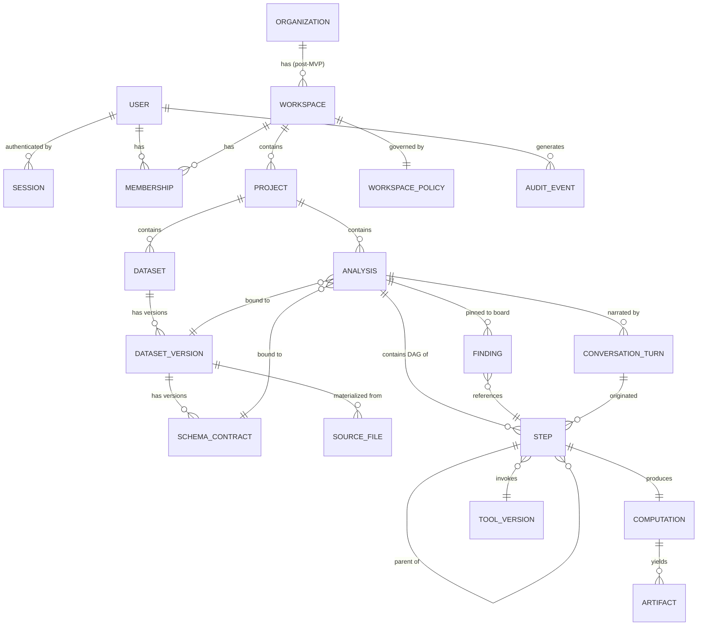
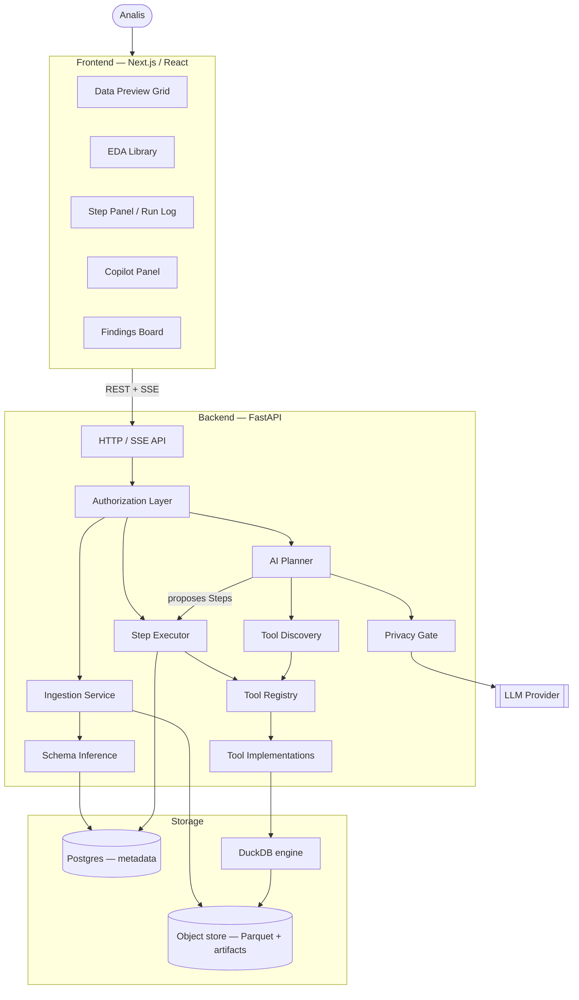
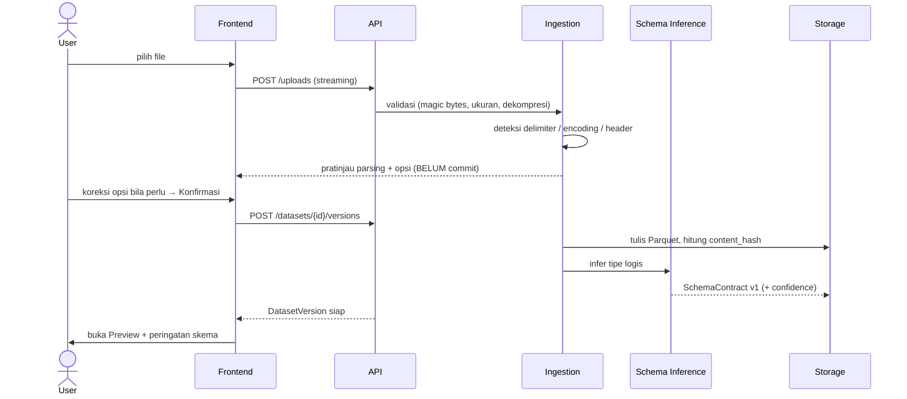
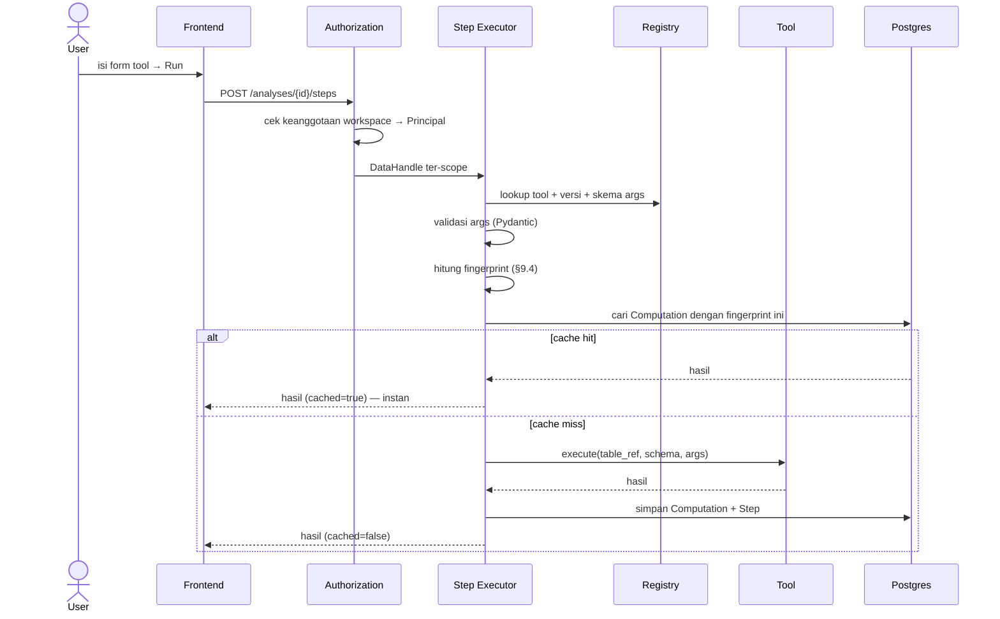
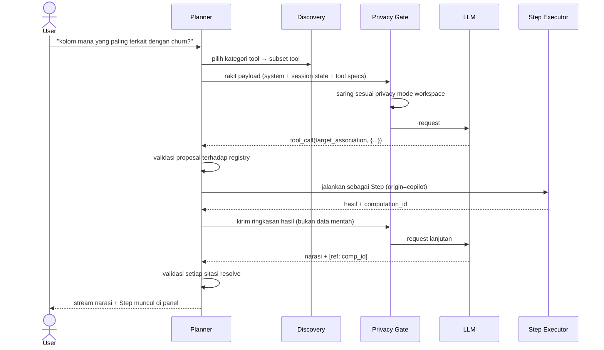

# DataCanvas — Design Document

**Deterministic AI-Assisted Data Analysis Platform**

| | |
|---|---|
| **Dokumen** | DataCanvas Master Design Document |
| **Versi** | 0.3.2 |
| **Status** | 🟢 **Baseline aktif** — seluruh keputusan D-001…D-020 Accepted; Gerbang 0 terlampaui; dokumen ini mengikat untuk implementasi |
| **Tanggal** | 2026-07-28 |
| **Owner** | Nicholas Darren |
| **Reviewer** | (isi) |
| **Menggantikan** | DataCanvas v1 (`_legacy_datacanvas_backup/`) — referensi saja, bukan fondasi |

> **Kalau kamu baru pertama kali membuka dokumen ini,** baca §1 (ringkasan eksekutif) → §3 (filosofi) → §9 (domain model) → §15 & §16 (batas scope) → §20 (roadmap). Status operasional terkini ada di [`../the project notes`](../the project notes), bukan di sini — dokumen ini menyimpan *keputusan*, the project notes menyimpan *posisi*.

---

## 0. Tentang Dokumen Ini

### 0.1 Tujuan

Dokumen ini adalah **single source of truth** untuk pengembangan MVP DataCanvas. Setiap keputusan desain — model data, batas fitur, pilihan teknologi, cara AI berinteraksi dengan sistem — harus bisa ditelusuri kembali ke dokumen ini.

Kalau ada perdebatan saat implementasi ("kenapa begini?"), jawabannya ada di sini. Kalau tidak ada di sini, itu berarti keputusan belum diambil — dan harus diambil serta ditulis di sini **sebelum** kode ditulis.

### 0.2 Bukan tujuan dokumen ini

- Bukan spesifikasi API lengkap (itu tugas `docs/API.md` nanti, di-generate dari kode)
- Bukan panduan implementasi baris-per-baris
- Bukan dokumen pemasaran

### 0.3 Sifat living document

Dokumen ini **akan** berubah. Aturannya:

0. **Field `Versi` di header dan entri changelog §0.6 harus selalu sinkron.** Ditulis sebagai aturan nomor nol karena inilah yang pertama kali terlewat: dokumen ini sempat berjalan sampai 15 entri changelog sementara headernya masih menyatakan `0.1.0 — Draft`. Changelog diurutkan **menaik**; entri baru ditambahkan di bawah.
1. **Perubahan kecil** (klarifikasi, typo, penambahan detail yang tidak mengubah keputusan) → edit langsung, naikkan patch version.
2. **Perubahan keputusan desain** (sesuatu di §18 berubah) → jangan hapus keputusan lama. Tandai `Superseded by D-0XX`, tulis keputusan baru, catat alasan perubahan. Naikkan minor version.
3. **Perubahan scope MVP** (§15) → butuh justifikasi tertulis di changelog. Ini yang paling sering jadi sumber kegagalan proyek, jadi diperlakukan paling ketat.

Setiap perubahan dicatat di §0.6 Changelog.

### 0.4 Konvensi penomoran

| Prefix | Arti | Contoh |
|---|---|---|
| `FR-x.n` | Functional Requirement | FR-C.2 |
| `NFR-x.n` | Non-Functional Requirement | NFR-SEC.3 |
| `D-0nn` | Design Decision (ADR ringkas) | D-004 |
| `INV-n` | Invariant sistem (harus selalu benar, harus ada test-nya) | INV-3 |
| `R-n` | Risiko | R-7 |
| `OQ-n` | Open Question | OQ-2 |
| `M-n` | Success Metric | M-1 |

Prioritas memakai MoSCoW: **P0** = MVP tidak rilis tanpa ini · **P1** = sangat diinginkan, boleh slip · **P2** = kalau sempat · **P3** = post-MVP.

### 0.5 Asumsi yang dipakai dokumen ini

Beberapa pertanyaan mendasar belum terjawab (lihat §19). Agar dokumen ini bisa maju, aku mengambil asumsi eksplisit berikut. **Kalau salah satu asumsi ini ternyata salah, bagian dokumen yang terkait harus direvisi — bukan diakali saat implementasi.**

| ID | Asumsi | Status | Kalau salah, yang berubah |
|---|---|---|---|
| A-1 | Pengguna utama adalah analis/data scientist yang **bisa** menulis kode tapi lelah dengan repetisi | ✅ **Dikonfirmasi 2026-07-28** | §4, §5, §11 (kedalaman statistik), §14 |
| A-2 | Deployment awal untuk tim internal/kecil (< 50 user), tapi arsitektur harus multi-tenant sejak awal | ✅ **Dikonfirmasi 2026-07-28**, dengan penajaman: opsi eksternal tetap dibuka → *external-readiness contract* (§19.1) mengikat | §9, §13, §10.3 |
| A-3 | Ukuran dataset MVP ≤ ~5 juta baris / ≤ 2 GB per dataset; single-node cukup | ✅ **Dikonfirmasi 2026-07-28** | §10, §11, NFR-PERF |
| A-4 | Tim pengembang kecil (1–3 orang, tidak full-time). Roadmap disusun untuk kapasitas itu | ✅ **Dikonfirmasi 2026-07-28** | §15, §20 |
| A-5 | LLM pihak ketiga boleh dipakai; default `balanced` **dengan mitigasi k-anonymity (PG-1) & batas baris agregat (PG-2)**; keempat mode wajib ada di MVP | ✅ **Dikonfirmasi 2026-07-28** | §12, §13.5 |
| A-6 | MVP hanya single-table per analisis; relasional adalah post-MVP | 🟡 Asumsi (OQ-8) | §9.6, §11, §16 |
| A-7 | Bahasa antarmuka & prompt: **Inggris saja** | ✅ **Dikonfirmasi 2026-07-28** (revisi dari asumsi awal "bilingual") | §12.2, §14, Lampiran B |
| A-8 | Tidak ada tenggat waktu keras; kualitas fondasi diutamakan di atas kecepatan rilis | ✅ **Dikonfirmasi 2026-07-28** | §15 (garis potong), §20 (roadmap) |
| A-9 | **Definisi sukses proyek: percobaan produk** — membuktikan hipotesis (bukan alat internal, bukan portofolio, bukan tugas akademik). Belum ada pengguna yang menunggu | ✅ **Dikonfirmasi 2026-07-28** | §5.3 (moat), §6.3 (M-1 & M-7 naik), Gerbang 4 (rekrutmen penguji), R-14 |
| A-10 | **Model deployment: cloud / SaaS saja.** Kita yang mengoperasikan; pengguna cukup lewat browser. Tidak ada on-prem, self-hosted, installer, atau air-gap | ✅ **Dikonfirmasi 2026-07-28** | §10.3, §13.9, §16, §19.1 |
| A-11 | **Data uji Fase 0–4 adalah dataset publik saja** (Titanic, hotel bookings, tips, students). Tidak ada data kantor/instansi selama pengembangan | ✅ **Dikonfirmasi 2026-07-28** | §13.5, Gerbang 4, Lampiran B |
| A-12 | **Batas scope MVP: analisis yang interpretasinya tidak bergantung konteks domain.** Profil, kualitas data, cleaning, agregasi deskriptif, visualisasi masuk; analisis yang menuntut penilaian domain ditunda | ✅ **Diputuskan 2026-07-28** (concept review sesi 1) | §11.4, §15, §16, §5.2, golden_queries.md |

### 0.6 Changelog

| Versi | Tanggal | Perubahan |
|---|---|---|
| 0.1.0 | 2026-07-28 | Dokumen awal. Semua keputusan berstatus *Proposed*. |
| 0.1.1 | 2026-07-28 | OQ-1, OQ-2, OQ-6, OQ-7 diputuskan (§19). A-1/A-4 dikonfirmasi; A-2 dikonfirmasi dengan penajaman "internal-first, external-ready"; A-8 ditambahkan. Ditambahkan §19.1 *External-Readiness Contract* sebagai konsekuensi mengikat dari OQ-2. |
| 0.1.2 | 2026-07-28 | **OQ-11 diputuskan: bahasa antarmuka & query menjadi Inggris saja** (revisi dari asumsi bilingual). Terdampak: A-7, §12.2, §12.9, R-7, D-010, Fase 0 & Gerbang 5 (§20), Lampiran B & D. Ditambahkan penanganan prompt non-Inggris di §12.2. |
| 0.1.3 | 2026-07-28 | OQ-2 ditinjau ulang, **tetap di "internal-first, external-ready"**. Ditambahkan A-9: definisi sukses proyek = **percobaan produk**. Konsekuensi: M-1 & M-7 naik jadi metrik penentu (§6.3); moat diangkat jadi keputusan bertenggat (§5.3); Gerbang 4 diperjelas soal asal penguji (§20); OQ-12 dinaikkan tenggatnya; ditambahkan **R-14 (tidak ada design partner)** — kini risiko produk teratas bersama R-1. |
| 0.1.4 | 2026-07-28 | **OQ-3 diputuskan** (≤ 5 juta baris — A-3 dikonfirmasi) dan **OQ-5 diputuskan: cloud/SaaS saja** (A-10). Ditambahkan §19.2 yang mendefinisikan on-prem secara tepat, memisahkannya dari mode privasi `local`, dan mencatat konsekuensinya. OQ-4 kini menjadi open question berikutnya yang jatuh tempo. |
| 0.1.5 | 2026-07-28 | **OQ-4 diputuskan: `balanced` sebagai default** (A-5 dikonfirmasi). §13.5 ditulis ulang menjadi 6 sub-bagian: kategori kebocoran K1–K4, definisi mode per kategori, **lubang group-key/agregat-grup-kecil beserta mitigasi PG-1 (k-anonymity k=5) & PG-2 (maks 20 baris) — kini bagian dari definisi mode, bukan perbaikan menyusul**, paparan `llm_request_snapshot` di sisi kita sendiri, dan daftar verifikasi kontraktual ke provider. Ditambahkan **INV-9**. Ditambahkan A-11 (data uji = dataset publik saja) beserta catatan validitas Gerbang 4. |
| 0.1.6 | 2026-07-28 | **Ditambahkan §11.7 — Spesifikasi `profile_column`**: prinsip tipe-logis, kontrak tool, isi profil per tipe, **katalog peringatan kualitas PQ-1…PQ-14**, pemisahan tab Profile vs panel kolom, 6 keputusan desain, dan template narasi. Ditambahkan **D-017**. FR-E.5 diperluas; ditambahkan **FR-E.7** (tab Profile, P0) dan **FR-E.8** (aksi dari peringatan, P1). **FR-E.3 dinaikkan P1 → P0.** **OQ-10 ditutup** lewat §11.7.6(c). P0 #16 effort dinaikkan M → L mengikuti spesifikasi barunya. |
| 0.1.7 | 2026-07-28 | **[`docs/golden_queries.md`](golden_queries.md) ditulis** — 25 query, tier A–G, masing-masing dengan parafrase; aturan hard/soft check; protokol verifikasi nilai. Lampiran B diperbarui: dataset `students` dihapus (sintetis & tidak terverifikasi), digantikan **`messy_sales`** yang dispesifikasi penuh dan sekaligus menjadi dataset kotor untuk Gerbang 4. |
| 0.1.8 | 2026-07-28 | **Kredensial lama dicabut** dan **panel penguji terekrut (8 orang)** → **R-14 turun dari Tinggi ke Rendah**. §20 Fase 0 diperbarui: tabel pembagian panel per tahap (senior DS → concept review Fase 0; DE → Fase 2; 4 analis → Gerbang 4), beserta alasan kenapa atasan tidak dipakai sebagai penguji usability. **Gerbang 4 disesuaikan menjadi 3-dari-4** mengikuti komposisi panel nyata. Ditambahkan catatan sisa pembersihan warisan (deployment Vercel/Fly lama). Risiko baru dicatat di R-14: seluruh panel berasal dari satu kantor. |
| 0.1.9 | 2026-07-28 | **Seluruh keputusan D-001…D-017 dinaikkan 🟡 Proposed → 🟢 Accepted.** Fixture `messy_sales` dibangun & memverifikasi diri; dataset uji dibundel ke `eval/datasets/` dengan SHA-256 tercatat; **44/44 nilai harapan golden query terverifikasi** → `golden_queries.md` naik ke 🟢 Verified (v0.2.0). D-016/D-017 diurutkan ulang. Gerbang 0 tersisa satu item: scaffolding repo. |
| 0.1.10 | 2026-07-28 | **Scaffolding repo selesai** — struktur §10.6, `pyproject.toml` (ruff + mypy strict + pytest + coverage gate), `.pre-commit-config.yaml` (termasuk penegakan Conventional Commits), CI 4 job, `docker-compose.yml` Postgres, `.env.example`, `the project notes`. Ditambahkan `tests/test_docs_contract.py` yang menegakkan §0.3 secara mekanis: SHA-256 dataset di golden_queries.md §3 harus cocok dengan file, dan setiap INV-n di DESIGN.md wajib tercantum di the project notes. CI juga memverifikasi fixture reproducible bit-per-bit. Keputusan sadar: **tidak mengadopsi framework harness pihak ketiga (ECC)** — alasannya dicatat di §18 D-018. Gerbang 0 tersisa satu item: concept review. |
| 0.1.11 | 2026-07-28 | **Strategi long tail diperkuat** (masukan dari peninjauan R-1). §11.5 kini membuka dengan **taksonomi T1/T2/T3** dan menambah **Mekanisme 5 — Parameterisasi kaya**, termasuk pengakuan bahwa contoh "winsorize" sebelumnya keliru disebut buntu. Ditambahkan **D-019** (parameter bertingkat; LLM hanya melihat Tier 1–2) dan **FR-G.9** (ekstraksi nilai parameter + konfirmasi lewat form terisi, bukan tanya-balik di chat). Kontrak tool §11.2 bertambah kewajiban deklarasi tier. R-1: mitigasi diperkuat, **kemungkinan sengaja tidak diturunkan** — belum ada bukti empiris. |
| 0.1.12 | 2026-07-28 | Ditambahkan **[`docs/concept_review_protocol.md`](concept_review_protocol.md)** — protokol sesi lengkap untuk item terakhir Gerbang 0: aturan metodologis, skrip 13 pertanyaan, penanganan belokan, **lembar skor L/K/P/B/N**, rumus M-1 in-scope vs kasar, dan ambang keputusan. Ditambahkan catatan tegas di Gerbang 3 bahwa **lolos golden query bukan uji M-1** (query ditulis dengan katalog di depan mata — tautologis). |
| 0.2.0 | 2026-07-28 | **PERUBAHAN SCOPE (§0.3 aturan 3).** Hasil concept review sesi 1 → **D-020: batas scope MVP = "interpretasi tidak bergantung konteks domain"** (bukan "univariat", yang definisinya kabur dan memotong `aggregate`). `target_association` & `segment_compare` ditunda ke §16; `correlate` → P1; **5 tool cleaning naik ke P0** (§11.4 Lapis 2b), dipetakan satu-satu ke peringatan PQ. **M-1 dipecah dua: M-1a in-scope (target 100%, bar kualitas) dan M-1b kasar (sinyal permintaan / roadmap)** — menolak usulan "anggap M-1 = 100%" karena itu membuat metriknya tautologis. Ditambahkan A-12, FR-I.7 (utang tindak lanjut), NFR-UX.5 (benchmark kecepatan vs "prompt AI + review kode"). Hasil sesi 1 dicatat lengkap di §20 Fase 0, termasuk bendera kuning P9 dan kekurangan metodologis P2. **`golden_queries.md` turun ke 🟡 Draft** — 3 query diganti, tier H (cleaning) ditambah. |
| 0.2.1 | 2026-07-28 | **Concept review dihentikan di sesi 1** — sesi 2–3 dilewati secara sadar; alasan, konsekuensi, dan apa yang menahan risikonya dicatat di §20 Fase 0. **M-1 pra-kode dilepas; M-1a/M-1b runtime tetap** (biaya nol lewat NFR-OBS.2, dan menjaga kill criteria §6.4 serta input OQ-12/OQ-13 tetap hidup). Ditambahkan **R-15** (D-020 bersandar n=1). **Gerbang 4 memikul beban tambahan** sebagai titik peninjauan D-020 — penguji diminta mencatat setiap permintaan di luar scope, sebagai pengganti M-1 pra-kode yang hilang (dan berbasis perilaku, bukan pendapat). Sinyal peringatan R-1 disesuaikan. |
| 0.2.2 | 2026-07-28 | **Golden queries diselaraskan dengan D-020 → kembali 🟢 Verified** (v0.3.0, 29 query, **72/72 nilai terverifikasi**). Tier C ditulis ulang menjadi komposisi primitif berantai; **Tier H — Cleaning** ditambahkan. Lampiran B diperbarui. **FR-B.3 diperkuat**: inferensi tipe wajib memindai seluruh file — ditemukan secara empiris saat verifikasi (`legacy_code` 97% numerik membuat inferensi berbasis sampel meledak di tengah file). **Gerbang 0 kini benar-benar terlampaui.** |
| 0.2.3 | 2026-07-28 | **Penutupan sesi & higiene dokumen.** Dua cacat ditemukan saat menutup: field `Versi` di header masih `0.1.0 — Draft` padahal changelog sudah 15 entri, dan urutan changelog kacau akibat entri baru disisipkan di atas. Keduanya diperbaiki, lalu dicegah berulang lewat **§0.3 aturan 0** (header dan changelog wajib sinkron; changelog menaik). Status dokumen dinaikkan ke 🟢 **Baseline aktif** — pernyataan lama *"belum boleh dijadikan dasar implementasi"* sudah tidak benar sejak D-001…D-020 Accepted. Ditambahkan penunjuk pembagian peran: **DESIGN.md menyimpan keputusan, the project notes menyimpan posisi.** Di sisi repo: `pre-commit` dikeraskan (dua stage terpasang, environment mypy diperbaiki) dan the project notes diperbarui dengan batas scope D-020, bagian "Cara kerja di project ini", serta status Fase 0. |
| 0.3.0 | 2026-07-28 | **Pembukaan Fase 1 — enam cacat ditemukan saat membaca dokumen dengan niat mengimplementasikannya.** Tiga di antaranya keliru, bukan sekadar kurang jelas. **(1) Entitas `Session` tidak ada di §9.2** padahal §13.2 menuntutnya dan FR-A.2 (pencabutan per-perangkat) mustahil tanpanya — sebuah entitas P0 hilang dari bagian yang dokumen ini sendiri sebut paling mahal diperbaiki belakangan. Ditambahkan, bersama `Membership.created_at/invited_by` dan `Workspace.created_by/is_personal` yang dibutuhkan §13.7. **(2) §13.2 tidak menyebut cara token sesi di-hash**, dan default yang tampak aman justru salah: argon2id ber-salt sehingga tidak bisa di-index, dan biayanya dibayar setiap request. Ditetapkan **SHA-256** beserta alasan kenapa itu bukan inkonsistensi dengan argon2id untuk password. **(3) Test INV-7 seperti dirumuskan §13.3 tidak bisa diimplementasikan** — enumerasi rute tidak memberitahu apa yang diakses rute. Diganti §13.3.1: tiga lapis (manifest rute · penyapuan lintas-tenant ter-generate · penjaga runtime pada `DataHandle`). Ini menyangkut Gerbang 1 secara langsung. **(4) §13.7 "append-only" dan INV-2/INV-3 hanya berupa klaim** — ditegakkan trigger Postgres + grant terbatas, ditetapkan sekarang karena keduanya adalah keputusan migrasi pertama atau tidak sama sekali. **(5)** Ditambahkan **D-021** (SQLAlchemy Core tanpa ORM + psycopg3 async) — lapisan persistensi tidak pernah diputuskan di mana pun. **(6)** §10.3 menulis Python 3.12 sementara seluruh repo memakai 3.13 — drift dokumen, diperbaiki. §20 Fase 1 diperjelas: batas migrasi `0001` dan pengakuan bahwa Gerbang 1 dibuktikan atas baris hasil seeder. Tidak ada perubahan scope (§0.3 aturan 3 tidak terpicu). |
| 0.3.1 | 2026-07-28 | **§13.7.1 ditambahkan — aturan isi audit log.** Ditemukan saat migrasi 0001 dijalankan sungguhan: begitu `DELETE` pada `audit_event` benar-benar ditolak database, tabrakan antara **append-only (§13.7)** dan **NFR-PRIV.3 (hard delete ≤ 24 jam)** berubah dari teoretis menjadi mendesak — §13.7 memerintahkan mencatat prompt copilot, dan prompt adalah teks bebas yang bisa memuat PII. Aturan baru: `audit_event.metadata` tidak pernah memuat nilai data maupun teks bebas pengguna; untuk copilot yang disimpan adalah **hash prompt** + tool + `computation_id`, sementara kalimat aslinya tetap di `ConversationTurn` yang bisa dihapus. Nama kolom ikut dikecualikan (K1, §13.5.1). Alternatif yang ditolak dicatat. Tidak ada perubahan scope. |
| 0.3.2 | 2026-07-28 | **Fase 1 ditutup — FR-A.5 dan FR-A.6 diimplementasi.** Ditambahkan **OQ-14: bagaimana email keluar dari sistem**, terbuka sampai Gerbang 6. FR-A.6 dibangun penuh kecuali pengirimannya: token, kedaluwarsa 1 jam, sekali pakai, pembatalan token lama, cap permintaan, dan **pencabutan seluruh sesi saat reset berhasil** — semuanya di belakang antarmuka `EmailSender` yang implementasi dev-nya menulis ke log. Menambah SMTP nanti adalah satu adapter; menyalahkan semantik token nanti adalah insiden keamanan, jadi urutannya begini. FR-A.5 menambah aturan **owner terakhir tidak bisa diturunkan atau dikeluarkan** — workspace tanpa owner tidak bisa diadministrasi dan tidak ada endpoint untuk memperbaikinya. §13.9 menambah paparan yang diterima secara sadar: menambah anggota lewat email mengungkap status pendaftaran kepada owner (berbeda standarnya dari login/reset yang publik dan wajib bungkam). Tidak ada perubahan scope — keduanya FR-A yang memang milik Fase 1. |

---

## 1. Ringkasan Eksekutif

> **DataCanvas adalah platform analisis data tabular di mana setiap angka yang ditampilkan berasal dari tool deterministik yang bisa ditelusuri, diulang, dan diverifikasi — dengan AI sebagai akselerator navigasi, bukan sebagai sumber jawaban.**

**Masalah.** Analis data hari ini punya tiga pilihan buruk untuk EDA: (a) menulis kode berulang-ulang untuk analisis yang sama, (b) menyuruh AI menulis kode yang harus dia review dan jalankan sendiri — tidak konsisten dan tidak bisa diandalkan, atau (c) tool BI yang cepat untuk dashboard tapi kaku untuk eksplorasi.

**Solusi.** Katalog tool analisis yang deterministik dan komposabel, dapat dipanggil dengan **dua cara yang setara**: klik di UI, atau perintah bahasa natural yang diterjemahkan LLM menjadi pemanggilan tool yang sama persis. LLM tidak pernah menghitung dan tidak pernah menulis kode — ia hanya memilih tool, mengisi argumen, dan menarasikan hasil dengan sitasi wajib ke ID komputasi.

**Kenapa berbeda.** Semua "chat with your data" yang ada mengorbankan kepercayaan demi fleksibilitas: hasilnya berubah-ubah, tidak bisa diaudit, dan pengguna harus mempercayai kode yang di-generate. DataCanvas membalik trade-off itu: kami membatasi apa yang bisa dilakukan, sebagai imbalan atas jaminan bahwa apa pun yang dilakukan **selalu benar, selalu sama, dan selalu bisa dilacak**.

**MVP.** Upload CSV → skema terdeteksi otomatis & bisa dikoreksi → jelajahi lewat library EDA yang bisa diklik → percepat dengan copilot → setiap langkah tercatat sebagai step yang bisa dibuka, diedit, dan dijalankan ulang → kumpulkan temuan di findings board. Dengan autentikasi dan isolasi data sejak hari pertama.

**Gerbang keberhasilan MVP.** 25 *golden queries* lolos 3 run berturut-turut, dan seorang analis yang belum pernah memakai DataCanvas bisa menghasilkan temuan pertama dari dataset asing dalam < 5 menit tanpa bantuan.

**Yang secara sadar TIDAK kami bangun di MVP.** Whiteboard bebas, konektor database, multi-table join, recommendation engine, report generator, kustomisasi chart mendalam, dan eksekusi kode arbitrer.

---

## 2. Latar Belakang & Problem Statement

### 2.1 Bagaimana EDA dilakukan hari ini

Seorang analis yang menerima file data baru punya tiga jalur, dan ketiganya punya cacat struktural:

**Jalur 1 — Tulis kode sendiri (pandas/polars/R/SQL).**
Fleksibel tanpa batas, tapi 80% dari kode yang ditulis adalah pengulangan: `df.info()`, `df.isnull().sum()`, `df.describe()`, `sns.histplot()`, `df.groupby(...).agg(...)`. Analis menulis ulang variasi kode yang sama untuk setiap dataset baru, seumur karier. Selain itu, hasilnya terkubur di notebook yang tidak bisa dibaca orang lain dan sering tidak bisa dijalankan ulang enam bulan kemudian.

**Jalur 2 — Minta AI menulis kode (ChatGPT / Copilot / the assistant / Julius).**
Menghilangkan pengetikan, tapi memindahkan beban ke **verifikasi**. Analis sekarang harus membaca kode yang tidak ia tulis, memastikan tidak ada bug halus (`mean()` vs `mean(skipna=False)`, filter yang salah, join yang menggandakan baris), lalu menjalankannya. Lebih buruk lagi: pertanyaan yang sama, ditanyakan dua kali, menghasilkan kode berbeda dan kadang angka berbeda. Tidak ada yang bisa diaudit — hanya ada transkrip percakapan.

**Jalur 3 — Tool BI (Power BI / Tableau / Looker).**
Sangat baik untuk dashboard yang berulang dan dikonsumsi banyak orang. Buruk untuk eksplorasi: setup semantic layer mahal, iterasi lambat, dan analisis statistik (korelasi, deteksi outlier, uji perbandingan segmen) baik tidak ada atau sangat terbatas. Tool BI menjawab "berapa angkanya", bukan "apa yang menarik di data ini".

**Jalur 4 — Auto-EDA (ydata-profiling, Sweetviz, D-Tale).**
Cepat dan deterministik, tapi *satu tembakan*: ia menghasilkan laporan raksasa yang 95%-nya tidak relevan, lalu berhenti. Tidak ada percakapan lanjutan, tidak ada pendalaman, tidak ada arah.

### 2.2 Pain point yang ingin diselesaikan

| ID | Pain point | Siapa yang merasakan | Bukti/indikator |
|---|---|---|---|
| PP-1 | **Repetisi**: menulis ulang analisis dasar yang sama untuk setiap dataset | Analis, DS | Keberadaan library seperti ydata-profiling membuktikan permintaannya nyata |
| PP-2 | **Beban verifikasi**: hasil AI harus dicek manual karena tidak bisa dipercaya | Siapa pun yang pakai AI untuk data | Setiap output LLM numerik butuh cross-check |
| PP-3 | **Tidak konsisten**: pertanyaan sama → jawaban beda | Pengguna chat-with-data | Sifat inheren sampling LLM |
| PP-4 | **Tidak bisa diaudit**: tidak ada jejak bagaimana angka dihasilkan | Reviewer, auditor, atasan | Notebook & chat sama-sama bukan audit trail |
| PP-5 | **Konteks hilang**: temuan tersebar di notebook, screenshot, chat | Analis dan timnya | "Waktu itu angkanya berapa ya?" |
| PP-6 | **Data kotor tidak terdeteksi**: tipe salah, null tersembunyi, duplikat | Semua | Sumber kesalahan analisis nomor satu |

**Pain point mana yang paling penting?** Klaim dokumen ini: **PP-2 dan PP-3 adalah yang paling berharga dan paling sedikit dilayani**. PP-1 sudah dilayani cukup baik oleh auto-EDA. Kalau DataCanvas hanya menyelesaikan PP-1, ia menjadi "ydata-profiling dengan UI yang lebih bagus" — bagus, tapi tidak cukup untuk mengubah kebiasaan orang.

> ⚠️ **Kritik terhadap framing awal.** Pernyataan tujuan awalmu — *"menghilangkan beban repetitif dari user"* — sebenarnya menargetkan PP-1, dan itu adalah pain point yang **paling lemah** di daftar ini. Repetisi itu menjengkelkan, tapi orang tetap melakukannya karena murah. Yang benar-benar menghalangi adopsi AI di analisis data adalah PP-2 dan PP-3: orang tidak percaya hasilnya. Aku sarankan menggeser framing produk dari "hemat waktu" ke **"hasil yang bisa dipercaya dan dipertanggungjawabkan"**. Ini bukan sekadar perubahan kata-kata — ia mengubah fitur mana yang jadi P0 (traceability naik, kecepatan turun) dan mengubah siapa yang mau membayar.

### 2.3 Why now

1. **Tool-calling LLM sudah cukup matang.** Dua tahun lalu, memaksa LLM memilih dari 20 tool dengan argumen valid masih rapuh. Sekarang ini pekerjaan rutin. Ini yang membuat arsitektur "LLM sebagai router, bukan sebagai kalkulator" jadi mungkin.
2. **Kelelahan terhadap AI yang tidak bisa dipercaya sedang naik.** Gelombang pertama "AI for data" (2023–2025) menjual keajaiban; sekarang orang mulai menuntut bukti. Ada ruang untuk produk yang menjual *keterbatasan* sebagai fitur.
3. **DuckDB + Arrow + Parquet** membuat analitik single-node berskala jutaan baris jadi sepele. Lima tahun lalu ini butuh Spark.

### 2.4 Pelajaran dari DataCanvas v1

Versi sebelumnya (di `_legacy_datacanvas_backup/`) bukan kegagalan — ia adalah **eksperimen yang berhasil membuktikan hipotesis inti**. Yang perlu dipertahankan sebagai pengetahuan (bukan sebagai kode):

**Terbukti bekerja:**
- Arsitektur "LLM memilih tool deterministik" **berhasil** — 20 golden query lolos 3 run berturut-turut.
- Sitasi `[ref: computation_id]` membuat narasi AI bisa diverifikasi, dan pengguna benar-benar memakainya.
- Tool discovery diperlukan lebih awal dari dugaan — 17 tool sudah cukup untuk membuat model fallback kehabisan token limit.
- Cache berbasis hash argumen memberi determinisme yang terasa nyata (pertanyaan sama → hasil identik, instan).
- Model lemah (flash-lite) kadang **diam** setelah tool result; perlu nudge eksplisit untuk menarasikan.
- Chart spec harus dipangkas sebelum dikirim balik ke LLM, atau konteks membengkak percuma.

**Terbukti bermasalah:**
- **Tool discovery berbasis keyword terlalu rapuh** — ia terikat pada frasa persis (`"correlat"`, `"show me"`), gagal untuk parafrase yang wajar, dan tidak akan skala melewati ~40 tool.
- **Cache key tidak menyertakan versi tool maupun versi skema** → begitu ada koreksi tipe kolom atau perbaikan bug tool, cache mengembalikan hasil basi secara senyap. Ini bug paling berbahaya di v1 karena menyerang klaim inti produk.
- **Tidak ada konsep versi dataset** → "determinisme" hanya berlaku selama tidak ada yang berubah, dan tidak ada yang menjaga itu.
- **Riwayat linear** (chat) membuat percabangan eksplorasi mustahil ditambahkan tanpa migrasi menyakitkan.
- **Tidak ada identitas pengguna** → semua data terbuka untuk semua orang; tidak bisa dipakai untuk data nyata.
- **Katalog tool monolitik** (17 tool spesifik) langsung menabrak dinding long-tail: begitu permintaan pengguna sedikit menyimpang, tidak ada jalan keluar.

### 2.5 Kenapa rewrite — dan pengakuan risikonya

> ⚠️ **Kritik jujur, karena dokumen ini harus jujur.** Rewrite total adalah keputusan berisiko tinggi. Kamu akan menghabiskan sebagian besar waktu untuk mendapatkan kembali fungsi yang sudah kamu punya hari ini. Alasan "supaya well documented" secara teknis bisa dicapai tanpa rewrite.

Tetapi ada tiga alasan yang **memang** membenarkan rewrite, dan ketiganya bersifat struktural (tidak bisa ditambal):

1. **Model data v1 tidak punya tempat untuk identitas, versi, dan percabangan.** Menambahkan multi-tenancy + dataset versioning + DAG ke skema yang sudah ada bukan refactor, itu penulisan ulang lapisan persistensi — sekitar 60% dari backend.
2. **Cache key yang salah sudah menyebar ke seluruh sistem.** Memperbaikinya berarti mengubah kontrak setiap tool.
3. **Filosofi katalog berubah** dari "banyak tool spesifik" ke "sedikit primitif komposabel". Ini mengubah signature setiap tool.

**Syarat mitigasi (wajib, bukan opsional):**

- **Golden query set dari v1 harus diangkut ke repo baru di commit pertama**, bahkan sebelum ada kode yang bisa menjalankannya. Ini satu-satunya bukti objektif bahwa sistem baru sama baiknya dengan yang lama. (Lihat §12.9 & Lampiran B.)
- **Setiap perilaku non-obvious dari v1 yang tercatat di §2.4 harus jadi test case**, bukan sekadar catatan.
- Kode v1 boleh **dibaca** sebagai referensi, tidak boleh **disalin** tanpa lolos review desain baru.

---

## 3. Vision, Mission & Design Philosophy

### 3.1 Vision

> Analisis data eksploratif yang **hasilnya bisa dipertanggungjawabkan** — di mana setiap angka punya asal-usul, setiap langkah bisa diulang, dan AI mempercepat pekerjaan tanpa pernah menjadi sumber ketidakpastian.

### 3.2 Mission (MVP)

Menyediakan katalog tool analisis tabular yang deterministik dan komposabel, dapat diakses secara setara lewat antarmuka manual maupun bahasa natural, dengan jejak eksekusi yang lengkap dan bisa diperiksa pengguna.

### 3.3 Prinsip desain

Prinsip ini bukan slogan. Masing-masing punya **konsekuensi konkret** dan **harga yang kita bayar**. Kalau sebuah usulan fitur melanggar salah satu prinsip, fitur itu ditolak atau prinsipnya diubah secara eksplisit — tidak ada jalan tengah diam-diam.

---

**P1 — Deterministic core, probabilistic edge.**
Semua yang menghasilkan angka bersifat deterministik. LLM hanya boleh berada di dua tempat: memilih tool, dan menarasikan hasil.

- *Konsekuensi:* LLM tidak pernah menghitung. LLM tidak pernah menulis kode yang dieksekusi. Tidak ada `eval()`.
- *Harga:* Kita tidak bisa menjawab apa pun yang tidak ada di katalog. Ini batas nyata, dan §11.5 harus menjawabnya.

**P2 — Manual-first, AI-accelerated.**
Produk harus 100% berguna tanpa AI. AI adalah jalan pintas, bukan satu-satunya pintu.

- *Konsekuensi (INV-1):* **AI tidak boleh punya kemampuan yang tidak ada di UI manual.** Setiap tool call — dari klik maupun dari prompt — menghasilkan objek *Step* yang identik, muncul di tempat yang sama, dan bisa diedit sesudahnya.
- *Harga:* Setiap tool baru butuh UI-nya sendiri. Ini memperlambat penambahan tool — dan itu memang disengaja (lihat P5).

**P3 — Every number is traceable.**
Tidak ada angka yang muncul di layar tanpa bisa diklik untuk melihat asalnya.

- *Konsekuensi:* Setiap komputasi punya ID stabil. Narasi AI wajib menyertakan sitasi. Sitasi yang tidak resolve = kegagalan turn, bukan peringatan.
- *Harga:* Overhead penyimpanan dan sedikit kebisingan visual.

**P4 — Immutable data, versioned schema.**
Dataset yang sudah masuk tidak pernah berubah. Interpretasi terhadapnya (tipe kolom, peran kolom) berubah lewat versi eksplisit.

- *Konsekuensi:* Re-upload = versi baru, bukan overwrite. Koreksi tipe = SchemaContract versi baru. Keduanya masuk cache key.
- *Harga:* Biaya penyimpanan lebih tinggi. Butuh kebijakan retensi.

**P5 — Composable primitives over feature catalog.**
Lebih baik 15 primitif yang bisa dirangkai daripada 80 tool spesifik.

- *Konsekuensi:* Coverage tumbuh kombinatorial, bukan linear. Menambah tool baru harus melewati pertanyaan: "apakah ini tidak bisa disusun dari primitif yang ada?"
- *Harga:* Rangkaian multi-step lebih lambat dan lebih banyak peluang LLM salah merangkai. Butuh planner yang solid.

**P6 — Honest failure over plausible guess.**
Kalau tidak bisa menjawab, katakan tidak bisa. Jangan pernah mendekati jawaban dengan tool yang salah.

- *Konsekuensi:* Ada state UI eksplisit "tidak ada tool yang cocok", lengkap dengan saran terdekat, dan **setiap kejadian ini dicatat** sebagai sinyal roadmap.
- *Harga:* Terasa kurang pintar dibanding kompetitor yang selalu menjawab sesuatu. Ini trade-off yang kita ambil dengan sadar.

**P7 — Privacy is a mode, not a promise.**
"Aman" bukan requirement. Yang bisa diverifikasi adalah: data apa yang keluar dari sistem, ke mana, dan bisakah pengguna mematikannya.

- *Konsekuensi:* Mode privasi eksplisit per-workspace, terlihat pengguna, dan ditegakkan di lapisan kode — bukan di dokumentasi.
- *Harga:* Mode paling ketat menurunkan kualitas jawaban AI secara nyata. Pengguna harus diberi tahu trade-off-nya.

**P8 — Boring technology.**
Pilih teknologi yang membosankan, matang, dan sudah dikuasai tim. Inovasi disimpan untuk domain masalah, bukan untuk stack.

- *Konsekuensi:* Postgres, Python, React. Bukan yang lagi tren.
- *Harga:* Tidak ada. Ini prinsip yang gratis dan sering dilanggar orang.

**P9 — Small surface, deep quality.**
Lebih baik 12 fitur yang sempurna daripada 40 fitur yang setengah jadi.

- *Konsekuensi:* §16 (fitur yang ditunda) harus lebih panjang dari §15 (fitur MVP). Kalau tidak, scoping-nya gagal.

### 3.4 Anti-prinsip — yang secara sadar kami tolak

| Yang kami tolak | Kenapa |
|---|---|
| "AI bisa melakukan apa saja" | Melanggar P1 & P6. Fleksibilitas tanpa batas = kepercayaan nol. |
| Eksekusi kode arbitrer (sandbox Python) | Melanggar P1. Permukaan keamanan besar, dan merusak klaim determinisme yang jadi alasan produk ini ada. |
| Chat sebagai antarmuka utama | Melanggar P2. Chat adalah *input*, bukan *workspace*. |
| Menambah tool untuk setiap permintaan pengguna | Melanggar P5 & P9. Jalan menuju katalog 200 tool yang tidak terpelihara. |
| Mengejar paritas fitur dengan Power BI | Bukan permainan kita, dan kita akan kalah. |
| "Kita perbaiki nanti" untuk model data | Model data adalah satu-satunya hal yang benar-benar mahal untuk diubah. |

---

## 4. Target User & Persona

### 4.1 Kenapa bagian ini penting

Di dokumen ide awal, target pengguna tidak pernah disebut. Itu berbahaya, karena tiga kandidat pengguna menginginkan produk yang **saling bertentangan**:

| Kandidat | Yang mereka mau | Determinisme berarti apa bagi mereka |
|---|---|---|
| Analis/DS yang bisa coding | Kecepatan + kedalaman + reproducibility | **Sangat berharga** — mereka pernah tertipu hasil AI |
| Business user non-teknis | Jawaban, sekarang, tanpa jargon | **Tidak relevan** — mereka tidak tahu bedanya |
| Konsumen dashboard | Angka yang sama tiap Senin pagi | Butuh scheduling & semantic layer, bukan eksplorasi |

Mengejar ketiganya = kalah di ketiganya. Dokumen ini memilih **satu** primer.

### 4.2 Persona primer — "Rina", Data Analyst

- **Umur/peran:** 26, analis data di tim bisnis. 3 tahun pengalaman.
- **Kemampuan:** Mahir SQL, cukup mahir pandas, bisa matplotlib tapi malas mengingat sintaksnya. Statistik dasar kuat, statistik lanjut lupa-lupa ingat.
- **Hari-harinya:** Menerima file dari berbagai tim (`penjualan_final_v3_REVISI.xlsx`), harus cepat mengerti isinya, menemukan sesuatu yang layak dilaporkan, dan mempertanggungjawabkannya saat ditanya.
- **Frustrasinya:**
  - Menulis ulang blok `describe/isnull/value_counts` yang sama untuk ke-500 kalinya.
  - Pernah kena masalah karena angka di slide tidak cocok dengan angka di notebook, dan tidak ingat filter mana yang dipakai.
  - Pakai ChatGPT untuk analisis, hasilnya keliru, dan dia baru sadar setelah dipresentasikan.
- **Yang membuatnya mau pindah:** Bisa bilang "angka ini dari sini" sambil menunjuk, dan yakin angkanya benar.
- **Yang membuatnya pergi:** Tidak bisa melakukan sesuatu yang di pandas cuma 1 baris.

**Rina adalah pengguna yang kita optimalkan.** Setiap keputusan desain yang ambigu diselesaikan dengan bertanya: "apa yang Rina butuhkan?"

### 4.3 Persona sekunder — "Bagas", Domain Expert

- **Peran:** Manajer operasional. Paham bisnisnya luar dalam, tidak bisa coding.
- **Yang dia lakukan:** Membuka analisis yang dibuat Rina, mengubah satu filter, melihat hasilnya. Sesekali bertanya sendiri lewat copilot.
- **Kenapa dia penting:** Dia adalah bukti bahwa hasil kerja Rina bisa **dibagikan dan dimodifikasi** tanpa Rina. Ini nilai yang tidak diberikan notebook.
- **Kenapa dia bukan primer:** Mendesain untuk Bagas berarti menyembunyikan tool trace, menyederhanakan statistik, dan menekankan chat. Itu akan merusak produk untuk Rina.

### 4.4 Anti-persona — secara eksplisit BUKAN target MVP

| Anti-persona | Kenapa bukan target |
|---|---|
| Konsumen dashboard eksekutif | Butuh scheduling, alerting, semantic layer, sharing luas. Produk berbeda. |
| ML engineer | Butuh feature store, training, experiment tracking. Domain berbeda. |
| Data engineer (pipeline) | Butuh orkestrasi, scheduling, lineage lintas sistem. Domain berbeda. |
| Analis data non-tabular (teks, gambar, geospasial kompleks) | Melanggar batasan scope inti. |
| Tim yang butuh kolaborasi real-time (multi-cursor) | Sangat mahal, nilai tambah rendah untuk MVP. |

### 4.5 Jobs To Be Done

Diurutkan dari yang paling sering:

1. *"Saya baru dapat file ini. Apa isinya, dan apakah datanya bisa dipercaya?"* → **JTBD-1: Orientasi & validasi data**
2. *"Kolom ini bentuknya seperti apa?"* → **JTBD-2: Profiling univariat**
3. *"Apa hubungannya X dengan Y?"* → **JTBD-3: Analisis bivariat/multivariat**
4. *"Kenapa angka bulan ini aneh?"* → **JTBD-4: Investigasi terarah**
5. *"Saya perlu menunjukkan ini ke orang lain, dan mempertanggungjawabkannya."* → **JTBD-5: Dokumentasi temuan**
6. *"Bulan depan saya harus melakukan ini lagi ke data baru."* → **JTBD-6: Pengulangan analisis**

> **Catatan desain:** JTBD-6 sering diabaikan tapi bernilai sangat tinggi, dan arsitektur Step DAG kita memberikannya hampir gratis (jalankan ulang DAG yang sama pada DatasetVersion berbeda). Aku menempatkannya sebagai P2 di MVP — implementasinya kecil, nilainya besar, dan ia membedakan kita dari semua chat-based tool.

### 4.6 Kritik: risiko persona

- **Asumsi A-1 belum tervalidasi.** Kalau ternyata pengguna nyatamu adalah Bagas (non-teknis), sebagian besar dokumen ini salah arah — terutama §11 (kedalaman tool) dan §14 (UI berbasis step). **Validasi ini sebelum Fase 2 roadmap.** Cara termurah: tunjukkan mockup ke 5 calon pengguna nyata dan lihat siapa yang antusias.
- **Rina adalah pengguna yang sulit dipuaskan.** Dia bisa coding, jadi setiap kali DataCanvas tidak bisa melakukan sesuatu, alternatifnya (buka Jupyter) selalu tersedia dan gratis. Ini menaikkan bar produk secara signifikan, dan itulah kenapa §11.5 (strategi long tail) adalah bagian paling kritis di dokumen ini.

---

## 5. Value Proposition & Competitive Positioning

### 5.1 Pernyataan value proposition

> **Untuk** analis data yang harus mempertanggungjawabkan angkanya,
> **yang** lelah menulis ulang analisis dasar tapi tidak percaya pada AI yang menulis kode,
> **DataCanvas adalah** platform EDA di mana AI hanya boleh memanggil tool yang sudah terverifikasi,
> **sehingga** setiap hasil konsisten, bisa diulang, dan bisa ditelusuri sampai ke sumbernya —
> **berbeda dari** Julius/ChatGPT ADA yang menghasilkan kode berbeda tiap kali ditanya,
> **dan berbeda dari** Power BI/Tableau yang cepat untuk dashboard tapi kaku untuk eksplorasi.

### 5.2 Lanskap kompetitif

| Kategori | Contoh | Kekuatan | Kelemahan | Sikap kita |
|---|---|---|---|---|
| **AI code-gen untuk data** | ChatGPT ADA, Julius AI, Analysis | Fleksibilitas tak terbatas, cepat mulai | Tidak konsisten, butuh verifikasi, tidak bisa diaudit | **Kompetitor langsung.** Kita menang di kepercayaan, kalah di fleksibilitas. |
| **AI notebook** | Hex Magic, Deepnote AI, Databricks Assistant | Terintegrasi workflow nyata, powerful | Tetap butuh baca kode; untuk pengguna yang sudah nyaman notebook | Kompetitor tidak langsung. Kita menyasar orang yang mau keluar dari notebook. |
| **Auto-EDA** | ydata-profiling, Sweetviz, D-Tale | Deterministik, instan, gratis | Satu tembakan, tidak bisa didalami, laporan berlebihan | **Baseline yang harus kita kalahkan.** Kalau kita tidak lebih baik dari ini, produk tidak punya alasan ada. |
| **BI** | Power BI, Tableau, Looker, Metabase | Matang, sharing, scheduling | Setup mahal, statistik lemah, iterasi lambat | Bukan kompetitor. Beda job. **Jangan kejar.** |
| **NL-to-SQL** | ThoughtSpot, Text2SQL tools | Langsung ke database, familiar | Terbatas ke pertanyaan yang bisa jadi SQL; tidak ada statistik/visual reasoning | Sebagian tumpang tindih. Kita lebih luas secara analitik. |
| **Notebook + library** | Jupyter + pandas | Gratis, tak terbatas, dikuasai semua orang | Repetitif, tidak bisa dibagi, tidak reproducible | **Kompetitor sesungguhnya.** Ini yang benar-benar dipakai Rina hari ini. |

### 5.3 Di mana kita menang, dan di mana kita kalah

**Menang:**
1. **Kepercayaan yang bisa diverifikasi** — satu-satunya produk di daftar ini yang bisa menunjukkan asal-usul setiap angka.
2. **Konsistensi** — pertanyaan sama → hasil identik, selamanya. Tidak ada kompetitor AI yang bisa mengklaim ini.
3. **Dua modalitas setara** — klik atau ketik, hasilnya objek yang sama. Bagas dan Rina bisa memakai artefak yang sama.
4. **Reproducibility lintas dataset** (post-MVP tapi gratis dari arsitektur) — jalankan analisis yang sama pada data bulan depan.

**Kalah — dan kita harus jujur soal ini:**
1. **Fleksibilitas.** Code-gen akan selalu bisa melakukan lebih banyak. Selamanya. Ini bukan sesuatu yang bisa kita perbaiki, hanya bisa kita kelola (§11.5).
2. **Kematangan visualisasi.** Tableau punya 15 tahun keunggulan. Kita tidak akan mengejar.
3. **Ekosistem.** Tidak ada integrasi, tidak ada komunitas, tidak ada template.
4. **Moat teknologi tipis.** Tidak ada di arsitektur ini yang tidak bisa disalin dalam 6 bulan oleh tim yang termotivasi.

> ⚠️ **Kritik strategis — statusnya naik karena A-9.** Poin kalah #4 layak dipikirkan serius. "Kami memanggil tool deterministik" bukan moat — Julius bisa menambahkannya kapan saja.
>
> Kandidat moat yang nyata:
> **(a) Kedalaman katalog tool** yang dibangun bertahun-tahun dari data kegagalan nyata. P6 + NFR-OBS.2 adalah mesin pengumpul data itu — dan **satu-satunya kandidat moat yang sudah mulai terakumulasi sejak hari pertama MVP.**
> **(b) Artefak yang terakumulasi** di workspace pengguna (switching cost). Tumbuh pasif seiring pemakaian.
> **(c) Domain vertikal** — katalog tool khusus untuk satu industri jauh lebih sulit disalin daripada katalog generik. Butuh keputusan sadar; tidak akan terjadi sendiri.
>
> **Karena proyek ini adalah percobaan produk (A-9), memilih di antara ketiganya menjadi keputusan bertenggat, bukan renungan.** Tenggatnya: **setelah Gerbang 5**, ketika M-1 sudah punya data nyata. Sebelum itu tidak ada informasi yang cukup untuk memilih; sesudah itu, menunda berarti membangun tanpa arah. Yang **tidak** boleh dilakukan: berilusi bahwa arsitekturnya sendiri adalah pertahanan.

### 5.4 Positioning statement satu kalimat

> **DataCanvas: EDA yang bisa kamu pertanggungjawabkan.**

Bukan "EDA yang lebih cepat" (itu klaim yang dimiliki semua orang), bukan "EDA dengan AI" (itu klaim 2023).

---

## 6. Goals, Non-Goals & Success Metrics

### 6.1 Goals MVP

| ID | Goal | Kenapa ini goal | Cara verifikasi |
|---|---|---|---|
| G-1 | Analis bisa memahami dataset asing dan menemukan temuan pertama dalam < 5 menit tanpa panduan | Membuktikan JTBD-1 & 2 terselesaikan | Uji dengan 5 orang, ukur waktu |
| G-2 | Setiap angka di layar bisa ditelusuri ke satu komputasi dengan argumen yang terlihat | Ini alasan produk ini ada (P3) | Audit UI: tidak ada angka tanpa jejak |
| G-3 | Pertanyaan/aksi yang sama menghasilkan hasil identik, terverifikasi otomatis | Membuktikan determinisme (P1) | Golden query 3 run berturut → identik |
| G-4 | Copilot dan UI manual menghasilkan artefak yang identik dan saling bisa diedit | Membuktikan INV-1 (P2) | Test: buat step lewat AI, edit lewat UI, dan sebaliknya |
| G-5 | Data satu pengguna tidak pernah bisa diakses pengguna lain | Prasyarat memakai data nyata | Test authz otomatis pada setiap endpoint |
| G-6 | Pengguna tahu persis data apa yang keluar ke LLM, dan bisa mematikannya | Prasyarat kepercayaan (P7) | Mode privasi terlihat & ditegakkan di kode |

### 6.2 Non-goals MVP (eksplisit)

Ini bukan "belum sempat" — ini **keputusan sadar untuk tidak melakukan**:

| Non-goal | Alasan |
|---|---|
| Multi-table join / relasional | Mengubah signature setiap tool. Butuh fondasi single-table yang matang dulu. (§16) |
| Konektor ke RDBMS/SSMS | Permukaan keamanan besar (penyimpanan kredensial), beban ops tinggi, dan tidak membuktikan hipotesis inti. |
| Kolaborasi real-time | Sangat mahal, nilai rendah untuk MVP. |
| Whiteboard/canvas bebas | Effort besar, diferensiasi rendah. Digantikan Findings Board (§15). |
| Report generator otomatis | Butuh Findings Board matang dulu sebagai input. |
| Kustomisasi chart mendalam | Butuh katalog visual yang stabil dulu. |
| Scheduling / refresh otomatis | Itu pekerjaan BI. Bukan permainan kita. |
| Eksekusi kode pengguna | Melanggar P1 secara fundamental. |
| Mobile / responsive penuh | Analisis data adalah pekerjaan layar besar. Cukup "tidak rusak" di tablet. |
| Data non-tabular | Batasan scope inti, dipertahankan. |
| On-premise installer | Belum ada permintaan tervalidasi. |

### 6.3 Success metrics

Metrik dibagi **leading** (cepat terukur, memandu keputusan mingguan) dan **lagging** (bukti nilai sesungguhnya, butuh waktu).

| ID | Metrik | Jenis | Target MVP | Cara ukur | Kenapa metrik ini |
|---|---|---|---|---|---|
| **M-1a** | **Catalog coverage (in-scope)** — % permintaan **di dalam batas scope** yang bisa dijawab | Leading | **100%** | Log kegagalan, tidak menghitung permintaan di luar scope | **Bar kualitas.** Kalau sesuatu ada di dalam janji kita, ia harus bisa dijawab. Kurang dari 100% berarti katalognya bolong, bukan sempit. |
| **M-1b** | **Catalog coverage (kasar)** — % dari **seluruh** permintaan, termasuk yang di luar scope | Leading | Diamati, tanpa target | Log kegagalan / total permintaan | **Sinyal permintaan — ini roadmap-mu.** Ia menjawab: seberapa sering pengguna menabrak batas yang kita pilih sendiri, dan ke arah mana. Tanpa angka ini, Mekanisme 2 (§11.5) kehilangan sumber datanya. |
| M-2 | Time to first insight | Leading | < 5 menit (median) | Timestamp upload → finding pertama di-pin | Membuktikan G-1 |
| M-3 | Tool-call correctness | Leading | ≥ 95% | Golden query harness | Kualitas planner |
| M-4 | Determinism rate | Leading | 100% | 3-run identical check | Non-negotiable. < 100% = bug. |
| M-5 | Rasio manual : AI (jumlah step yang dibuat lewat tiap jalur) | Leading | Diamati, tanpa target | Event telemetry | **Diagnostik, bukan target.** Kalau 95% AI → yang kita bangun sebenarnya chatbot, dan UI manual sia-sia. Kalau 95% manual → copilot tidak memberi nilai. Keduanya sinyal bahwa desain perlu direvisi. |
| M-6 | Citation resolve rate | Leading | 100% | Validasi otomatis di planner | Sitasi rusak = P3 gagal |
| **M-7** | **Week-2 retention** | Lagging | ≥ 40% dari pengguna aktif minggu-1 | Analytics | **Metrik penentu kedua setelah M-1 (karena A-9).** Untuk alat internal, retensi rendah bisa diabaikan — orang tetap memakainya karena itu alatnya. Untuk percobaan produk, retensi **adalah** sinyalnya: kalau orang tidak kembali secara sukarela, hipotesisnya salah, sebagus apa pun arsitekturnya. |
| M-8 | Analisis per pengguna aktif per minggu | Lagging | ≥ 3 | Analytics | Kedalaman pemakaian, bukan sekadar coba-coba |
| M-9 | % analisis yang menghasilkan ≥ 1 finding di-pin | Lagging | ≥ 50% | Analytics | Apakah eksplorasi menghasilkan sesuatu |

### 6.4 Kill criteria — kapan kita akui desain ini salah

Ini bagian yang jarang ditulis orang, dan justru paling berguna. Kalau salah satu terjadi, **berhenti menambah fitur dan tinjau ulang desain inti**:

| Kondisi | Artinya | Tindakan |
|---|---|---|
| **M-1a** < 90% setelah 4 minggu | Katalog bolong di dalam janjinya sendiri | Perbaiki katalog sebelum apa pun yang lain |
| **M-1b** < 50% setelah 4 minggu | Batas scope yang kita pilih terlalu sempit untuk pekerjaan nyata | Tinjau ulang §11.4 dan §11.5; pertimbangkan melebar mengikuti peringkat permintaan |
| M-4 (determinism) < 100% dan sulit diperbaiki | Klaim inti produk tidak bisa dipenuhi | Tinjau ulang model cache & versioning |
| Pengguna uji lebih memilih kembali ke Jupyter setelah mencoba | Nilai tambahnya tidak cukup besar | Tinjau ulang §4 (persona) dan §5 (positioning) |
| M-5 menunjukkan UI manual hampir tidak dipakai | P2 (manual-first) adalah asumsi yang salah | Realokasi effort ke copilot, sederhanakan UI |

---

## 7. Functional Requirements

Format: **ID · Pernyataan · Rationale · Prioritas · Acceptance criteria**

### FR-A · Identity, Workspace & Project

| ID | Requirement | Prioritas |
|---|---|---|
| **FR-A.1** | Pengguna dapat mendaftar dan masuk dengan email + password | P0 |
| **FR-A.2** | Sesi pengguna dapat dicabut (logout, logout semua perangkat) | P0 |
| **FR-A.3** | Setiap pengguna memiliki minimal satu Workspace; Workspace adalah batas isolasi data dan batas kebijakan (privacy mode, budget) | P0 |
| **FR-A.4** | Workspace berisi banyak Project; Project adalah unit kerja yang mengelompokkan Dataset + Analysis | P0 |
| **FR-A.5** | Workspace dapat memiliki beberapa anggota dengan peran `owner` / `editor` / `viewer` | P1 |
| **FR-A.6** | Reset password lewat email | P1 |
| **FR-A.7** | MFA / SSO | P3 |

> **Rationale FR-A.3/A.4:** Dua level (Workspace → Project) adalah minimum yang memisahkan *kebijakan* dari *pekerjaan*. Satu level saja memaksa pengaturan privasi per-project (melelahkan) atau global (tidak fleksibel). Tiga level (Org → Workspace → Project) adalah over-engineering untuk < 50 pengguna, tapi model datanya harus punya tempat untuk `organization_id` di masa depan — **kolom disiapkan, fitur tidak**.

### FR-B · Data Ingestion & Versioning

| ID | Requirement | Prioritas |
|---|---|---|
| **FR-B.1** | Unggah file tabular: CSV, TSV, Parquet, XLSX (satu sheet), JSON (array of objects) | P0 |
| **FR-B.2** | Setiap unggahan menghasilkan **DatasetVersion** yang immutable; unggah ulang ke Dataset yang sama membuat versi baru, tidak menimpa | P0 |
| **FR-B.3** | Sistem mendeteksi delimiter, encoding, dan baris header secara otomatis, dan menampilkannya untuk dikoreksi sebelum commit. **Inferensi tipe wajib memindai seluruh file, bukan sampel N baris pertama** | P0 |
| **FR-B.4** | File dinormalisasi ke Parquet + disimpan dengan content hash sebagai identitas | P0 |
| **FR-B.5** | Pengguna dapat memuat dataset contoh bawaan tanpa unggah | P1 |
| **FR-B.6** | Pengguna dapat menghapus Dataset beserta seluruh versinya, dan penghapusannya nyata (file hilang) | P0 |
| **FR-B.7** | Pengguna dapat membandingkan dua DatasetVersion (baris/kolom bertambah/berkurang) | P2 |

> **Rationale FR-B.3 (pindai seluruh file) — ditemukan secara empiris, bukan diteorikan.** Saat memverifikasi golden query, polars gagal memuat `messy_sales.csv`: kolom `legacy_code` berisi 97% angka murni, dan nilai alfanumerik pertama muncul jauh di luar 100 baris sampel default. Inferensi berbasis sampel menebak `integer`, lalu meledak di tengah file.
>
> Ini **PQ-9 muncul di alam liar**, dan ia bukan kasus tepi — kolom kode/ID yang mayoritas numerik dengan sedikit pengecualian adalah pola yang sangat umum di data nyata. Konsekuensinya untuk kita: inferensi tipe wajib memindai seluruh file (v1 melakukan ini dan benar), dan kegagalan parsing harus dilaporkan sebagai temuan yang bisa ditindaklanjuti, bukan sebagai crash.
>
> **Rationale FR-B.2 (immutability):** Ini prasyarat determinisme (P4). Tanpa ini, "hasil yang sama untuk pertanyaan yang sama" hanya berlaku sampai seseorang mengunggah ulang file dengan nama sama. *Trade-off:* biaya penyimpanan naik dan butuh kebijakan retensi (NFR-SCALE.3).
>
> **Rationale FR-B.3:** v1 langsung menebak dan kadang salah. Menampilkan tebakan **sebelum** commit jauh lebih murah daripada memperbaiki setelah 20 analisis berjalan di atas parsing yang salah.

### FR-C · Schema Contract

| ID | Requirement | Prioritas |
|---|---|---|
| **FR-C.1** | Sistem mendeteksi tipe logis setiap kolom secara otomatis saat ingest | P0 |
| **FR-C.2** | Pengguna dapat mengubah tipe logis kolom secara manual dari daftar tipe yang didukung | P0 |
| **FR-C.3** | Perubahan skema menghasilkan **SchemaContract versi baru**, tidak menimpa yang lama | P0 |
| **FR-C.4** | Perubahan SchemaContract meng-invalidate seluruh komputasi yang bergantung padanya (bukan menghapus, tapi menandai stale) | P0 |
| **FR-C.5** | Pengguna dapat menetapkan *role* kolom: `identifier`, `measure`, `dimension`, `timestamp`, `ignored` | P1 |
| **FR-C.6** | Sistem menampilkan peringatan ketika deteksi tipe berisiko (mis. kolom numerik dengan < 10 nilai unik, kolom teks yang 95%-nya bisa di-parse jadi tanggal) | P1 |
| **FR-C.7** | Pengguna dapat menetapkan format khusus (format tanggal, desimal separator, penanda null seperti `-`, `N/A`, `9999`) | P1 |

**Tipe logis yang didukung MVP:**
`integer` · `decimal` · `boolean` · `categorical` · `text` · `date` · `datetime` · `duration` · `unsupported`

> **Rationale FR-C.3/C.4 — ini salah satu keputusan terpenting di dokumen.** Di v1, override tipe adalah toggle UI biasa dan cache tidak tahu apa-apa tentangnya → hasil basi dikembalikan secara senyap. Dengan menjadikan skema sebagai **artefak berversi yang masuk cache key**, kelas bug ini hilang secara struktural, bukan lewat kedisiplinan.
>
> **Kenapa `categorical` dipisah dari `text`:** ini bukan detail kosmetik. Tipe logis menentukan tool mana yang tersedia (`text` tidak punya histogram; `categorical` tidak punya mean) dan bagaimana profil ditampilkan. Ini yang membuat "auto-detect + override" jadi fitur bernilai, bukan sekadar label.

### FR-D · Data Preview

| ID | Requirement | Prioritas |
|---|---|---|
| **FR-D.1** | Grid data dengan pagination sisi server, mampu menampilkan dataset jutaan baris tanpa membekukan browser | P0 |
| **FR-D.2** | Jumlah baris yang ditampilkan dapat diatur pengguna | P0 |
| **FR-D.3** | Kolom dapat diperlebar, disembunyikan, dipindah urutannya, dan dipin | P1 |
| **FR-D.4** | Setiap header kolom menampilkan nama, tipe logis (bisa diklik untuk diubah), dan indikator null% | P0 |
| **FR-D.5** | Klik header kolom → membuka panel profil univariat kolom tersebut | P0 |
| **FR-D.6** | Sort dan filter dasar dari grid, dieksekusi di server | P1 |
| **FR-D.7** | Sel yang bermasalah (null, gagal parse, outlier ekstrem) ditandai secara visual | P2 |

> **Rationale FR-D.4/D.5 — kritik terhadap ide awal.** Idemu menempatkan preview grid sebagai halaman pertama dan profil sebagai tab terpisah. Aku sarankan **menggabungkan keduanya di permukaan yang sama**: header kolom membawa sinyal kualitas (tipe + null%), dan profil dibuka dari sana. Alasannya: pertanyaan pertama analis pada data asing bukan "apa isinya baris 1–100", melainkan **"apakah data ini bisa dipercaya"**. Grid mentah tidak menjawab itu; header yang informatif menjawabnya seketika. Ini juga menempatkan koreksi tipe (FR-C.2) tepat di tempat masalahnya terlihat.

### FR-E · EDA Library (antarmuka manual)

| ID | Requirement | Prioritas |
|---|---|---|
| **FR-E.1** | Halaman katalog tool yang dapat dijelajahi, dikelompokkan per kategori, dengan pencarian | P0 |
| **FR-E.2** | Setiap tool punya form argumen yang tervalidasi, dengan pemilih kolom yang **hanya menawarkan kolom bertipe kompatibel** | P0 |
| **FR-E.3** | Tool yang tidak berlaku untuk dataset/kolom saat ini ditampilkan nonaktif dengan alasannya | **P0** |
| **FR-E.4** | Menjalankan tool dari form menghasilkan Step yang identik dengan Step yang dibuat copilot (INV-1) | P0 |
| **FR-E.5** | Profil univariat kolom sebagai entry point utama: klik header kolom → panel profil lengkap yang **isinya menyesuaikan tipe logis** (numeric ≠ categorical ≠ text ≠ date), disertai peringatan kualitas yang dapat langsung ditindaklanjuti. **Spesifikasi lengkap: §11.7** | P0 |
| **FR-E.7** | Tab Profile menampilkan kartu ringkas seluruh kolom (tipe, null%, distinct, sparkline, lencana peringatan) sebagai orientasi sebelum mendalami satu kolom | P0 |
| **FR-E.8** | Setiap peringatan kualitas di panel profil membawa aksi langsung (ubah tipe, tetapkan null marker, buka di Library dengan kolom terisi) | P1 |
| **FR-E.6** | Setiap tool menampilkan pratinjau hasil yang sesuai bentuk datanya (tabel, kartu statistik, atau chart) | P0 |

> **Rationale FR-E.2 — kolom yang tidak kompatibel disembunyikan.** Ini mencegah seluruh kelas error sebelum terjadi, dan sekaligus **mengajarkan** pengguna model mental sistem (kenapa `mean` tidak menawarkan kolom teks). Ini juga alasan tambahan kenapa Schema Contract harus kuat: kualitas seluruh UI manual bergantung padanya.

### FR-F · Steps, Execution & Analysis

| ID | Requirement | Prioritas |
|---|---|---|
| **FR-F.1** | Setiap eksekusi tool tercatat sebagai **Step** dalam sebuah **Analysis** | P0 |
| **FR-F.2** | Step menyimpan: tool + versi, argumen, referensi input, ID komputasi, waktu, pembuat (user/AI), durasi | P0 |
| **FR-F.3** | Step membentuk DAG: sebuah Step boleh mengambil output Step lain sebagai input | P0 |
| **FR-F.4** | Pengguna dapat membuka Step, mengedit argumennya, dan menjalankan ulang | P0 |
| **FR-F.5** | Menjalankan ulang Step yang argumen & input-nya identik mengembalikan hasil cache (instan, ditandai "cached") | P0 |
| **FR-F.6** | Step yang menjadi stale (karena skema berubah) ditandai jelas, dengan tombol jalankan ulang | P0 |
| **FR-F.7** | Pengguna dapat menghapus Step; Step turunannya ikut ditandai invalid | P1 |
| **FR-F.8** | Pengguna dapat menjalankan ulang seluruh Analysis pada DatasetVersion lain | P2 |
| **FR-F.9** | UI percabangan DAG (visualisasi graf, fork eksplorasi) | P3 |

> **Rationale FR-F.3 vs FR-F.9 — inti keputusan D-006.** Model datanya adalah DAG sejak hari pertama, tapi **UI-nya linear** di MVP. Biaya menyimpan `parent_step_ids` sekarang: satu kolom dan sedikit disiplin. Biaya menambahkannya nanti setelah ada data pengguna: migrasi menyakitkan + penulisan ulang seluruh lapisan eksekusi. Ini contoh murni "keputusan yang murah sekarang, mahal nanti".

### FR-G · AI Copilot

| ID | Requirement | Prioritas |
|---|---|---|
| **FR-G.1** | Pengguna dapat mengetik permintaan bahasa natural (ID/EN) dan sistem menerjemahkannya menjadi satu atau beberapa pemanggilan tool | P0 |
| **FR-G.2** | LLM hanya boleh memanggil tool terdaftar dengan argumen tervalidasi; tidak ada eksekusi kode | P0 |
| **FR-G.3** | Setiap angka dalam narasi AI wajib menyertakan sitasi ke `computation_id` yang resolve | P0 |
| **FR-G.4** | Rencana eksekusi ditampilkan **sebelum** dijalankan untuk tool yang mengubah state; tool read-only boleh langsung jalan | P1 |
| **FR-G.5** | Bila tidak ada tool yang cocok, sistem menyatakannya secara eksplisit, menawarkan alternatif terdekat, dan mencatat kejadiannya | P0 |
| **FR-G.6** | Copilot sadar konteks sesi (dataset aktif, skema aktif, step terakhir) tanpa mengirim transkrip mentah | P0 |
| **FR-G.7** | Pengguna dapat melihat persis apa yang dikirim ke LLM pada turn manapun | P1 |
| **FR-G.8** | Pengguna dapat mendefinisikan istilah domain yang bisa dipakai ulang (mis. "pelanggan aktif" = filter tertentu) | P2 |
| **FR-G.9** | Copilot mengekstrak **nilai parameter** dari prompt, bukan hanya nama tool. Bila informasinya tidak lengkap, sistem **mengisi default lalu menampilkan form terisi untuk dikonfirmasi** — bukan bertanya balik di chat | P1 |

> **Rationale FR-G.7 — transparansi terhadap LLM.** Ini jarang ada di produk lain dan sangat selaras dengan P3 & P7. Biayanya kecil (kita sudah punya payload-nya), nilainya besar untuk kepercayaan. Ini juga alat debug terbaik bagi kita sendiri.
>
> **Rationale FR-G.8 — kritik konstruktif terhadap "menghilangkan beban repetitif".** Beban repetitif yang paling nyata bukan mengetik `df.describe()`, melainkan **mendefinisikan ulang logika domain** di setiap analisis ("pelanggan aktif itu yang bagaimana?"). Ini adalah semantic layer versi ringan, dan mungkin fitur dengan rasio nilai/effort tertinggi di seluruh dokumen ini. Aku menempatkannya P2 hanya karena butuh Step DAG stabil dulu.

### FR-H · Traceability / Run Log

| ID | Requirement | Prioritas |
|---|---|---|
| **FR-H.1** | Panel run log menampilkan setiap tool call secara kronologis: tool, argumen, sumber (manual/AI), status, durasi, cache hit/miss | P0 |
| **FR-H.2** | Klik entri log → membuka Step terkait, dengan argumen yang bisa diedit | P0 |
| **FR-H.3** | Klik sitasi `[ref: ...]` di narasi AI → menyorot Step sumbernya | P0 |
| **FR-H.4** | Log mencatat kegagalan dan retry, bukan hanya keberhasilan | P0 |
| **FR-H.5** | Log dapat diekspor (JSON/Markdown) | P2 |

> **Rationale FR-H.2 — kritik terhadap ide awal.** Idemu menyebut "bisa ditraceback untuk pengecekan manual". Itu benar tapi kurang jauh: log yang hanya bisa dibaca akan jadi fitur yang dipuji saat demo dan tidak pernah dipakai. Yang membuatnya hidup adalah **bisa ditindaklanjuti** — buka, ubah argumen, jalankan ulang. Dengan begitu run log bukan lagi log, melainkan **permukaan kerja utama**. Ini perubahan konseptual, bukan penambahan fitur.

### FR-I · Findings Board

| ID | Requirement | Prioritas |
|---|---|---|
| **FR-I.1** | Pengguna dapat mem-pin hasil Step apa pun ke Findings Board milik Analysis | P0 |
| **FR-I.7** | Board menampung dua jenis item: **temuan** (hasil yang sudah didapat) dan **utang tindak lanjut** (masalah yang terlihat tapi belum ditangani, mis. *"kolom `amount` 12% null — tanyakan ke tim finance"*). Utang dapat dibuat langsung dari peringatan kualitas di panel profil, dan ditandai selesai | P0 |
| **FR-I.2** | Setiap finding menyimpan referensi ke Step (bukan salinan gambar), sehingga tetap terhubung ke sumbernya | P0 |
| **FR-I.3** | Pengguna dapat menambahkan catatan teks pada setiap finding | P0 |
| **FR-I.4** | Finding dapat diurutkan ulang | P1 |
| **FR-I.5** | Board dapat diekspor ke Markdown / PDF | P2 |
| **FR-I.6** | Finding menampilkan tanda bila Step sumbernya sudah stale | P1 |

> **Rationale — kenapa ini menggantikan ide whiteboard.** Ide "whiteboard bebas ala Canva" memberi kebebasan tata letak dengan biaya implementasi sangat besar (canvas engine, layering, z-order, snapping, undo geometrik) dan diferensiasi hampir nol — tidak ada yang akan memilih DataCanvas karena whiteboard-nya. Findings Board memberi ~80% nilainya ("kumpulkan temuan di satu tempat, beri konteks, bagikan") dengan ~5% effort, **dan FR-I.2 memberi sesuatu yang tidak bisa diberikan whiteboard mana pun: temuan yang tetap hidup dan tahu kalau sumbernya berubah.** Ia juga langsung menjadi input untuk report generator di masa depan.

### FR-J · Operations & Admin

| ID | Requirement | Prioritas |
|---|---|---|
| **FR-J.1** | Health endpoint & structured logging | P0 |
| **FR-J.2** | Pencatatan penggunaan token LLM per workspace | P0 |
| **FR-J.3** | Batas kuota LLM per workspace, dengan degradasi yang jelas saat habis | P1 |
| **FR-J.4** | Audit log untuk aksi sensitif (login, akses dataset, ekspor, penghapusan) | P0 |
| **FR-J.5** | Backup terjadwal untuk metadata store | P1 |

---

## 8. Non-Functional Requirements

Setiap NFR harus **terukur**. NFR yang tidak bisa diukur adalah harapan, bukan requirement.

### NFR-PERF · Performance

| ID | Requirement | Target | Catatan |
|---|---|---|---|
| NFR-PERF.1 | Preview grid halaman pertama tampil | < 1 detik (p95) | Untuk dataset ≤ 5 juta baris |
| NFR-PERF.2 | Profil univariat satu kolom | < 2 detik (p95) | Cold, tanpa cache |
| NFR-PERF.3 | Cache hit | < 150 ms (p95) | Harus terasa instan |
| NFR-PERF.4 | Ingest + normalisasi ke Parquet, file 100 MB | < 30 detik | Dengan indikator progres |
| NFR-PERF.5 | Turn copilot sampai token pertama | < 3 detik (p95) | Streaming wajib; menunggu tanpa umpan balik = kegagalan UX |
| NFR-PERF.6 | Turn copilot lengkap (2–3 tool call) | < 15 detik (p95) | |

### NFR-SCALE · Scalability

| ID | Requirement | Target |
|---|---|---|
| NFR-SCALE.1 | Ukuran dataset yang didukung | ≤ 5 juta baris / ≤ 2 GB per DatasetVersion (MVP) |
| NFR-SCALE.2 | Pengguna konkuren | ≤ 50 (MVP), arsitektur tidak boleh menghalangi 500 |
| NFR-SCALE.3 | Kebijakan retensi versi | Simpan N versi terakhir per Dataset (default 10), sisanya dapat di-GC |
| NFR-SCALE.4 | Batas ukuran unggahan | 500 MB per file (MVP), ditolak dengan pesan jelas di atasnya |

> **Kritik:** batas ini harus **ditegakkan dan dikomunikasikan**, bukan sekadar diasumsikan. Produk yang diam-diam melambat di 10 juta baris jauh lebih merusak kepercayaan daripada produk yang jujur menolak di 5 juta.

### NFR-SEC · Security

| ID | Requirement |
|---|---|
| NFR-SEC.1 | Otorisasi ditegakkan di **lapisan akses data**, bukan per-endpoint. Tidak mungkin mendapatkan handle dataset tanpa melewati pemeriksaan kepemilikan. |
| NFR-SEC.2 | Password di-hash dengan argon2id; token sesi acak, opaque, disimpan di cookie `httpOnly`+`Secure`+`SameSite=Lax`, dan dapat dicabut |
| NFR-SEC.3 | Semua argumen tool tervalidasi skema; tidak ada SQL yang dibangun dari string mentah pengguna |
| NFR-SEC.4 | File unggahan divalidasi berdasarkan magic bytes, bukan ekstensi; ada batas ukuran, batas dekompresi, dan timeout parsing |
| NFR-SEC.5 | Konten turunan data (nama kolom, nilai sel) diperlakukan sebagai **untrusted** saat masuk prompt LLM |
| NFR-SEC.6 | Rate limiting pada auth, upload, dan endpoint LLM |
| NFR-SEC.7 | Secrets hanya dari environment; tidak pernah di repo; tidak pernah masuk log |
| NFR-SEC.8 | Dependency scanning otomatis |
| NFR-SEC.9 | Semua aksi sensitif tercatat di audit log yang tidak bisa diubah dari aplikasi |

### NFR-PRIV · Privacy

| ID | Requirement |
|---|---|
| NFR-PRIV.1 | Mode privasi per-workspace mengendalikan data apa yang boleh keluar ke LLM (§13.5), ditegakkan di kode |
| NFR-PRIV.2 | Mode aktif selalu terlihat di UI saat memakai copilot |
| NFR-PRIV.3 | Penghapusan dataset menghapus file, komputasi, dan cache secara nyata dalam ≤ 24 jam |
| NFR-PRIV.4 | Data pengguna tidak pernah dipakai untuk melatih model apa pun |

### NFR-REL · Reliability

| ID | Requirement | Target |
|---|---|---|
| NFR-REL.1 | Kegagalan LLM tidak boleh membuat produk tidak bisa dipakai — seluruh UI manual tetap berfungsi | Wajib (konsekuensi langsung P2) |
| NFR-REL.2 | Kegagalan tool ditampilkan sebagai pesan yang bisa ditindaklanjuti, tidak pernah sebagai crash | Wajib |
| NFR-REL.3 | Analysis yang sedang berjalan bertahan terhadap restart backend | P1 |
| NFR-REL.4 | Ketersediaan | 99% (MVP internal) |

### NFR-MAINT · Maintainability

| ID | Requirement |
|---|---|
| NFR-MAINT.1 | Menambah tool baru = satu file + satu registrasi + satu file test. Tidak menyentuh planner, API, atau routing. |
| NFR-MAINT.2 | Coverage test: ≥ 90% pada tool layer & registry, ≥ 70% keseluruhan |
| NFR-MAINT.3 | Setiap tool punya contract test: input contoh → output tetap (golden file) |
| NFR-MAINT.4 | Type checking ketat (mypy strict di backend, TS strict di frontend) |
| NFR-MAINT.5 | Setiap keputusan arsitektur non-obvious punya ADR |

### NFR-EXT · Extensibility

| ID | Requirement |
|---|---|
| NFR-EXT.1 | Model data harus mengakomodasi multi-table tanpa migrasi merusak (`table_ref` sejak awal) |
| NFR-EXT.2 | Model data harus mengakomodasi percabangan DAG tanpa migrasi merusak |
| NFR-EXT.3 | Provider LLM dapat ditukar lewat satu interface |
| NFR-EXT.4 | Sumber data dapat ditambah (koneksi DB) tanpa mengubah kontrak tool — semua sumber bermuara ke DatasetVersion |
| NFR-EXT.5 | Skema harus punya tempat untuk `organization_id` sejak awal, meski fiturnya belum ada |

### NFR-OBS · Observability

| ID | Requirement |
|---|---|
| NFR-OBS.1 | Structured logging dengan correlation ID yang menyambungkan request → step → tool call → panggilan LLM |
| NFR-OBS.2 | Setiap kejadian "tidak ada tool yang cocok" (P6) tercatat dengan prompt-nya → ini sumber data M-1 |
| NFR-OBS.3 | Metrik: latensi tool, cache hit rate, token per turn, error rate per tool |

### NFR-UX · Usability

| ID | Requirement |
|---|---|
| NFR-UX.1 | Semua aksi destruktif dapat dibatalkan atau butuh konfirmasi |
| NFR-UX.2 | Semua operasi > 500 ms punya indikator progres |
| NFR-UX.3 | Kontras warna memenuhi WCAG AA; chart tetap terbaca tanpa membedakan warna saja |
| NFR-UX.4 | Bekerja penuh di layar ≥ 1280px; tidak rusak (meski tidak optimal) di tablet |
| **NFR-UX.5** | **Menjalankan satu analisis lewat UI manual harus lebih cepat daripada baseline nyata pengguna: *"prompt ke AI lain → baca & review kodenya sendiri"* (± 2–5 menit).** Konsekuensinya: default harus pintar, form harus pendek, dan parameter Tier 3 wajib terlipat (D-019) |

---

## 9. Domain Model

> **Ini bagian terpenting di seluruh dokumen.** Model data adalah satu-satunya hal yang benar-benar mahal untuk diubah setelah ada pengguna. Semua bagian lain (UI, katalog tool, prompt) bisa diiterasi murah. Kalau hanya satu bagian dari dokumen ini yang di-review dengan serius, jadikan bagian ini.

### 9.1 Diagram entitas



### 9.2 Definisi entitas

#### Identity & tenancy

**`Organization`** *(disiapkan, tidak diimplementasi di MVP)*
Kolomnya ada di skema, tapi selalu berisi org default. Alasannya NFR-EXT.5: menambahkan kolom tenancy setelah ada data adalah migrasi paling menyakitkan yang bisa dialami sebuah produk SaaS.

**`User`** — `id, email, password_hash, created_at, status`

**`Session`** — Sesi login yang aktif. **Satu baris per perangkat**, karena FR-A.2 menuntut pencabutan per-perangkat dan pencabutan menyeluruh ("logout semua perangkat").
`id, user_id, token_hash, created_at, last_seen_at, expires_at, revoked_at, user_agent, ip_created`

- `token_hash` = **SHA-256** atas token opaque, bukan argon2id. Alasannya di §13.2 — ini keputusan yang mudah diambil keliru.
- Sesi valid ⟺ `revoked_at IS NULL` **dan** `expires_at > now()` **dan** `last_seen_at > now() - idle_ttl`. Pencabutan adalah UPDATE pada `revoked_at`, bukan DELETE: baris yang hilang tidak bisa menjelaskan apa pun saat investigasi.

**`Workspace`** — Batas isolasi data **dan** batas kebijakan. Semua otorisasi bermuara ke sini.
`id, organization_id, name, created_at, created_by, is_personal`

- `is_personal` menandai workspace yang dibuat otomatis saat registrasi (FR-A.3). Ia bukan tipe workspace yang berbeda — hanya asal-usulnya yang berbeda, dan itu perlu diketahui UI agar tidak menawarkan "hapus workspace" untuk satu-satunya workspace yang dimiliki pengguna.

**`WorkspacePolicy`** — Kebijakan yang berlaku untuk seluruh isi workspace.
`workspace_id, llm_privacy_mode, llm_monthly_token_budget, allowed_providers, retention_versions`

**`Membership`** — `id, user_id, workspace_id, role ∈ {owner, editor, viewer}, created_at, invited_by`

- `created_at` dan `invited_by` ada karena §13.7 mewajibkan mencatat perubahan anggota & peran. Menambahkannya setelah ada baris berarti backfill dengan nilai yang tidak diketahui.
- `(user_id, workspace_id)` unik. Satu pengguna punya tepat satu peran per workspace.

**`Project`** — Unit kerja. Mengelompokkan dataset dan analisis yang berkaitan.
`id, workspace_id, name, description, created_at`

#### Data

**`Dataset`** — Identitas logis dari "sebuah data" sepanjang waktu. Tidak menyimpan data.
`id, project_id, name, created_at`

**`DatasetVersion`** — **Immutable.** Inilah yang sebenarnya berisi data.
`id, dataset_id, version_no, content_hash, parquet_uri, row_count, column_count, byte_size, ingested_at, ingested_by, ingest_options`

- `content_hash` = SHA-256 atas file Parquet ternormalisasi. Dua unggahan identik menghasilkan hash yang sama → dedup penyimpanan gratis.
- `ingest_options` menyimpan delimiter/encoding/header yang dipakai — bagian dari reproducibility.
- **INV-2: DatasetVersion tidak pernah di-UPDATE setelah commit.** Hanya boleh dibuat atau dihapus.

> **Bagaimana INV-2 dan INV-3 ditegakkan.** Bukan dengan "repository-nya tidak menyediakan metode update" — itu kedisiplinan, dan §13.3 sudah menolak kedisiplinan sebagai mekanisme keamanan. Keduanya ditegakkan **di Postgres**: trigger `BEFORE UPDATE` pada `dataset_version` dan `schema_contract` yang selalu `RAISE`. Testnya mencoba UPDATE langsung lewat koneksi dan mengharap error.
>
> Konsekuensinya jujur: `DELETE` tetap diizinkan (FR-B.6 menuntut penghapusan nyata), dan hanya `UPDATE` yang dilarang. Itu memang persis bunyi invariannya.

**`SourceFile`** — File asli yang diunggah, disimpan apa adanya untuk audit & re-parse.
`id, dataset_version_id, original_filename, mime_detected, byte_size, storage_uri`

**`SchemaContract`** — Interpretasi terhadap sebuah DatasetVersion. **Berversi.**
`id, dataset_version_id, version_no, columns[], created_at, created_by, derived_from`

Setiap entri `columns[]`:
```
{
  name, ordinal,
  physical_type,        # apa kata Parquet
  logical_type,         # apa kata kita/pengguna
  role,                 # identifier | measure | dimension | timestamp | ignored
  format_hint,          # format tanggal, desimal separator, dsb.
  null_markers[],       # nilai yang harus diperlakukan sebagai null
  detection_confidence, # 0..1 dari auto-detect
  overridden_by         # null jika masih hasil auto-detect
}
```

- `version_no` 1 selalu hasil auto-detect murni. Setiap koreksi pengguna → versi baru.
- **INV-3: SchemaContract tidak pernah di-UPDATE.** Koreksi = versi baru.

> **Kenapa SchemaContract terpisah dari DatasetVersion?** Karena keduanya berubah karena alasan berbeda dan pada frekuensi berbeda. Data berubah ketika ada file baru; interpretasi berubah ketika manusia belajar sesuatu tentang datanya. Menggabungkannya memaksa duplikasi seluruh data hanya untuk mengoreksi satu tipe kolom.

#### Eksekusi

**`ToolVersion`** — Katalog tool yang dapat dieksekusi, berversi.
`tool_name, version, args_schema, description, category, capabilities, deprecated_at`

- **INV-4: `version` naik setiap kali perilaku tool berubah dengan cara apa pun yang bisa mengubah output.** Ini ditegakkan lewat contract test golden-file: kalau output test berubah tanpa versi naik, CI gagal.

**`Analysis`** — Satu sesi eksplorasi. Terikat ke satu DatasetVersion + satu SchemaContract.
`id, project_id, dataset_version_id, schema_contract_id, name, created_at, created_by`

> **Keputusan:** Analysis terikat ke versi **tertentu**, bukan ke "versi terbaru". Kalau pengguna mengoreksi skema, sistem menawarkan "pindahkan analisis ini ke skema v3?" — pilihan eksplisit, bukan perubahan diam-diam. Ini konsekuensi langsung dari P4, dan alasan FR-F.6 (penanda stale) ada.

**`Step`** — Satu node di DAG eksplorasi. Ini adalah **objek pusat produk** (P2/INV-1).
```
id, analysis_id,
tool_name, tool_version,
args (JSON),
parent_step_ids[],        # [] = mengambil langsung dari dataset
input_ref,                # table_ref: dataset root, atau output step tertentu
fingerprint,              # lihat §9.4 — content address
computation_id,
origin ∈ {manual, copilot},
originating_turn_id,      # null jika manual
status ∈ {pending, running, ok, error, stale},
created_at, duration_ms, created_by
```

**`Computation`** — Hasil dari menjalankan sebuah Step. Content-addressed dan dapat dibagi antar Step/Analysis.
`id, fingerprint (unique), tool_name, tool_version, result_json, result_meta, computed_at, byte_size`

- Fingerprint unik → dua Step di dua Analysis berbeda dengan input & argumen identik **berbagi satu Computation**. Cache jadi properti model data, bukan lapisan tambahan.

**`Artifact`** — Output besar yang tidak layak disimpan inline (chart spec, tabel hasil besar).
`id, computation_id, kind ∈ {chart_spec, table, image}, storage_uri, byte_size`

#### Output & narasi

**`Finding`** — Item di Findings Board.
`id, analysis_id, step_id, note, position, created_at, created_by`

**`ConversationTurn`** — Riwayat percakapan, untuk **ditampilkan**, bukan untuk dikirim ke model.
`id, analysis_id, role, content, llm_request_snapshot, token_usage, provider, created_at`

- `llm_request_snapshot` memenuhi FR-G.7 (pengguna bisa melihat apa yang dikirim).

**`AuditEvent`** — `id, workspace_id, actor_user_id, action, target_type, target_id, ip, at, metadata`

### 9.3 Invariants sistem

Setiap invariant di bawah **harus punya test otomatis**. Invariant tanpa test hanyalah komentar.

| ID | Invariant | Kenapa |
|---|---|---|
| **INV-1** | Setiap Step yang dapat dibuat copilot dapat pula dibuat lewat UI manual, dan menghasilkan record yang identik kecuali field `origin` | P2 — fondasi seluruh model interaksi |
| **INV-2** | DatasetVersion tidak pernah dimodifikasi setelah commit | P4 — fondasi determinisme |
| **INV-3** | SchemaContract tidak pernah dimodifikasi; koreksi menghasilkan versi baru | P4 |
| **INV-4** | `tool_version` naik setiap kali output tool bisa berubah | Mencegah cache basi |
| **INV-5** | Setiap angka yang ditampilkan berasal dari sebuah Computation yang bisa dirujuk | P3 |
| **INV-6** | Fingerprint yang sama ⟹ hasil yang sama. Selalu. | Fondasi cache & determinisme |
| **INV-7** | Tidak mungkin memperoleh handle data tanpa melewati pemeriksaan otorisasi | NFR-SEC.1 |
| **INV-8** | LLM tidak pernah mengeksekusi apa pun secara langsung; ia hanya menghasilkan proposal Step yang tervalidasi | P1 |
| **INV-9** | Penyensoran privasi (PG-1, PG-2) hanya berlaku pada arah keluar menuju LLM; pengguna selalu melihat hasil Computation yang lengkap tanpa sensor | P3 + P7 — privasi tidak boleh mengorbankan kebenaran yang dilihat pengguna |

### 9.4 Identitas komputasi — fingerprint sebagai Merkle DAG

Ini adalah mekanisme yang membuat determinisme, caching, reproducibility, dan percabangan **jatuh dari satu ide yang sama**.

```
fingerprint(step) = SHA256(
    tool_name          ‖
    tool_version       ‖
    canonical_json(args) ‖
    dataset_version_id ‖
    schema_contract_id ‖
    sorted(fingerprint(p) for p in parent_steps)
)
```

Artinya setiap Step adalah node dalam **Merkle DAG**: sidik jarinya mencakup seluruh riwayat yang menghasilkannya.

Konsekuensi yang didapat gratis:

| Properti | Bagaimana ia muncul |
|---|---|
| **Caching** | Fingerprint sama → Computation sudah ada → kembalikan. |
| **Invalidasi yang benar** | Ubah skema → `schema_contract_id` berubah → seluruh fingerprint turunan berubah → seluruh cache turunan otomatis miss. **Tidak ada cache basi yang mungkin secara struktural.** |
| **Deduplikasi** | Dua pengguna melakukan analisis sama pada data sama → satu Computation. |
| **Reproducibility** | Jalankan ulang DAG pada DatasetVersion lain: ganti satu ID di akar, seluruh fingerprint berubah, semua dihitung ulang dengan benar. |
| **Percabangan** | Fork = tambahkan Step baru dengan parent yang sama. Tidak butuh mekanisme khusus. |
| **Verifikasi** | Fingerprint bisa ditunjukkan ke pengguna sebagai bukti "ini komputasi yang sama persis". |

> **Ini memperbaiki bug paling serius di v1.** Di v1 cache key hanya `(tool_name, args, dataset_fingerprint)` — tidak ada versi tool, tidak ada versi skema, tidak ada riwayat parent. Akibatnya perbaikan bug tool dan koreksi tipe kolom sama-sama menghasilkan hasil basi secara senyap. Perubahan formula ini adalah alasan teknis paling kuat untuk rewrite.

**Trade-off yang diakui:** cache hit rate lebih rendah (naikkan versi tool → semua cache tool itu invalid). Itu **fitur**, bukan bug: lebih baik menghitung ulang daripada berbohong. Untuk mengelolanya: naikkan `version` hanya kalau output benar-benar bisa berubah, dan gunakan `patch`-level yang tidak masuk fingerprint untuk perubahan kosmetik.

### 9.5 Kenapa DAG sejak hari pertama, meski UI-nya linear

Argumennya murni ekonomi:

| | Sekarang | Nanti (setelah ada data pengguna) |
|---|---|---|
| Biaya | Satu kolom `parent_step_ids` + disiplin di executor | Migrasi skema + penulisan ulang executor + backfill riwayat + risiko korupsi data |
| Risiko | ~0 | Tinggi |

Dan struktur DAG-nya **langsung berguna di MVP** meski tidak ada UI percabangan: ia yang memungkinkan komposisi primitif (§11.1), invalidasi yang benar (§9.4), dan re-run pada dataset lain (FR-F.8).

### 9.6 Single-table di MVP, tapi `table_ref` sejak awal

Ini kompromi yang menyelamatkan banyak kesakitan:

- **Setiap tool menerima `table_ref`**, bukan "the dataset". `table_ref` bisa menunjuk ke akar DatasetVersion atau ke output Step lain.
- Di MVP, `table_ref` hanya pernah menunjuk satu tabel — jadi tidak ada kompleksitas tambahan yang terasa.
- Saat multi-table datang: `join` menjadi Step biasa yang menghasilkan tabel turunan. **Setiap tool lain tetap single-table selamanya.**

> **Kenapa ini penting:** alternatifnya adalah membuat setiap tool sadar-relasional (menerima banyak tabel + kondisi join). Itu melipatgandakan kompleksitas setiap tool dan setiap form UI, demi kasus yang bahkan belum tervalidasi. Pendekatan "join sebagai step" adalah cara termurah mendukung relasional tanpa menyentuh satu pun tool yang sudah ada.

---

## 10. Arsitektur Sistem

### 10.1 Context & container



### 10.2 Komponen & tanggung jawabnya

| Komponen | Tanggung jawab | Sengaja TIDAK bertanggung jawab atas |
|---|---|---|
| **Authorization Layer** | Menerjemahkan sesi → `Principal`; satu-satunya jalan memperoleh `DataHandle`. Menegakkan INV-7. | Autentikasi (itu tugas Auth Service) |
| **Ingestion Service** | Validasi file, deteksi format, normalisasi ke Parquet, buat DatasetVersion + SourceFile | Menebak tipe kolom |
| **Schema Inference** | Menghasilkan SchemaContract v1, dengan skor keyakinan | Memutuskan — pengguna yang memutuskan (FR-C.2) |
| **Tool Registry** | Katalog tool berversi + skema argumen; default-deny dispatch | Mengetahui tentang LLM |
| **Tool Implementations** | Komputasi murni: `(table_ref, schema, args) → result` | I/O, auth, caching, LLM |
| **Step Executor** | Hitung fingerprint → cek cache → jalankan → simpan Computation → update Step | Memutuskan tool mana yang dipanggil |
| **Tool Discovery** | Memilih subset tool relevan untuk sebuah permintaan | Mengeksekusi apa pun |
| **AI Planner** | Loop tool-calling; mengubah bahasa natural jadi proposal Step; menarasikan hasil | Menghitung apa pun (P1) |
| **Privacy Gate** | Satu-satunya jalan keluar menuju LLM; menyaring payload sesuai mode workspace | Memilih model |

> **Prinsip pemisahan yang paling penting:** *Tool tidak tahu LLM itu ada, dan planner tidak tahu bagaimana tool dihitung.* Keduanya hanya bertemu di Step Executor lewat kontrak yang sama yang dipakai UI manual. Inilah yang membuat INV-1 dapat ditegakkan secara struktural, bukan lewat kedisiplinan.

### 10.3 Pilihan teknologi

| Area | Pilihan | Alternatif yang dipertimbangkan | Alasan |
|---|---|---|---|
| Bahasa backend | **Python 3.13** | Go, TypeScript | Ekosistem data (Polars, DuckDB, Arrow) tak tertandingi. Tim sudah menguasainya (P8). |
| Web framework | **FastAPI** | Django, Litestar | Async + Pydantic (validasi argumen tool praktis gratis) + SSE. Terbukti di v1. |
| Lapisan persistensi | **SQLAlchemy Core + psycopg3 async** | ORM, SQL tulis tangan | Lihat **D-021**. Tabel dideklarasikan sebagai metadata eksplisit; `domain/` tetap dataclass murni; Alembic autogenerate ikut jalan. |
| Analytics engine | **DuckDB + Polars via Arrow** | pandas, Spark, ClickHouse | DuckDB unggul untuk agregasi single-node; Polars untuk transformasi. Zero-copy lewat Arrow. Spark = over-engineering untuk A-3. |
| Format penyimpanan | **Parquet** | CSV, Feather | Kolumnar, terkompresi, terketik, dibaca native oleh DuckDB & Polars. |
| Metadata store | **Postgres** | SQLite, MongoDB | Multi-user + concurrent write + transaksi + JSONB + backup matang. **SQLite (v1) tidak lagi memadai begitu ada auth.** |
| Validasi | **Pydantic v2** | attrs, marshmallow | Satu definisi menghasilkan validasi runtime **dan** JSON Schema untuk LLM. |
| Frontend | **Next.js + React + TypeScript** | SvelteKit, Remix | Sudah dikuasai; ekosistem grid & chart matang (P8). |
| Grid | **TanStack Table + virtualizer** | AG Grid | AG Grid dipakai v1 dan berat (~2.6 MB). TanStack headless: lebih ringan, kontrol penuh, cocok untuk FR-D.4 (header kustom). *Trade-off:* lebih banyak kode UI yang kita tulis sendiri. |
| Chart | **Vega-Lite** | ECharts, Plotly, D3 | Grammar-based → cocok sempurna dengan `plot(spec)` deklaratif kita. Spec adalah data, bukan kode → bisa disimpan, di-fingerprint, dan di-render ulang. Ini bukan preferensi, ini konsekuensi arsitektur. |
| Auth | **Session-based, backend-owned** | NextAuth, Keycloak, Ory | Lihat §13.2 |
| Object storage | **Filesystem (dev) / S3-compatible (prod)** | DB blob | Parquet berukuran besar tidak boleh masuk DB. Abstraksi `storage://` sejak awal. |
| Streaming | **SSE** | WebSocket | Satu arah sudah cukup; SSE jauh lebih sederhana. Terbukti di v1. |

> **Kritik terhadap diriku sendiri di sini:** memilih Postgres menaikkan beban setup lokal dibanding SQLite. Itu nyata dan menjengkelkan untuk tim kecil (A-4). Mitigasi: satu `docker-compose.yml` untuk Postgres, dan lapisan repository yang tidak memakai fitur khusus Postgres di luar JSONB. Tapi aku tetap merekomendasikan Postgres, karena migrasi SQLite→Postgres **setelah** ada data pengguna adalah pekerjaan berisiko tinggi yang selalu datang di saat paling sibuk.

### 10.4 Alur data

#### Alur 1 — Ingest



**Keputusan kunci:** ada langkah **pratinjau sebelum commit**. v1 langsung menelan file dan kadang salah parse; memperbaikinya setelah 20 analisis berjalan itu mahal. Konfirmasi 5 detik di depan menghemat berjam-jam di belakang.

#### Alur 2 — Menjalankan tool secara manual



#### Alur 3 — Satu turn copilot



**Perhatikan:** planner **tidak** memanggil tool. Ia mengusulkan Step, dan Step Executor yang menjalankannya — **jalur eksekusi yang sama persis** dengan klik manual. Itulah INV-1 yang ditegakkan oleh arsitektur.

### 10.5 Tata letak penyimpanan

```
storage/
  workspaces/{workspace_id}/
    datasets/{dataset_id}/
      versions/{version_id}/
        data.parquet          # ternormalisasi, immutable
        source/{original}     # file asli apa adanya
    artifacts/{computation_id}/
      chart.vg.json
      table.parquet
```

- Isolasi tenant tercermin di **struktur path**, bukan hanya di query. Ini memberi lapisan pertahanan kedua: jalur traversal apa pun tetap terkurung di workspace.
- Semua akses lewat abstraksi `ObjectStore` → tukar filesystem ↔ S3 tanpa mengubah kode pemanggil.

### 10.6 Struktur repository

```
datacanvas/
├── docs/
│   ├── DESIGN.md              ← dokumen ini (SSOT)
│   ├── adr/                   ← ADR yang sudah "lulus" dari §18
│   ├── golden_queries.md      ← kontrak evaluasi
│   └── API.md                 ← di-generate
├── backend/
│   └── app/
│       ├── domain/            ← entitas & invariant murni, TANPA I/O
│       ├── auth/              ← autentikasi, sesi
│       ├── authz/             ← Principal, DataHandle ter-scope (INV-7)
│       ├── ingest/            ← upload, deteksi format, normalisasi
│       ├── schema/            ← inferensi tipe, SchemaContract
│       ├── storage/           ← ObjectStore, Parquet, DuckDB engine
│       ├── registry/          ← katalog tool, versioning, dispatch
│       ├── tools/             ← implementasi tool (satu file per kategori)
│       ├── execution/         ← fingerprint, cache, Step executor
│       ├── ai/                ← planner, discovery, privacy gate, provider
│       ├── api/               ← rute HTTP/SSE (tipis)
│       └── repositories/      ← akses Postgres
├── frontend/
│   └── src/
│       ├── features/          ← preview, library, steps, copilot, board
│       ├── domain/            ← tipe TS yang mirror backend
│       └── components/
├── eval/                      ← golden query harness
└── tests/
```

**Aturan struktur:** `domain/` tidak boleh meng-import apa pun dari `api/`, `repositories/`, atau `ai/`. Ini ditegakkan lewat linter import. Alasannya: aturan bisnis yang tercampur I/O adalah cara tercepat membuat sistem tidak bisa di-test.

### 10.7 Prinsip desain API

1. **Berorientasi resource**, mengikuti model domain. `/workspaces/{}/projects/{}/analyses/{}/steps`.
2. **Step adalah resource utama**, bukan "run tool". `POST /steps` membuat & menjalankan. Ini merefleksikan model mental produk.
3. **SSE hanya untuk copilot**; semuanya request/response biasa.
4. **Setiap response menyertakan `computation_id`** ketika ada angka di dalamnya (P3 di level protokol).
5. **Tidak ada endpoint yang menerima SQL dari klien.** Filter lewat expression language tervalidasi (§11.3).

---

## 11. Desain Tool Layer

### 11.1 Filosofi katalog: dua lapis

Kritik terhadap v1: 17 tool spesifik dan monolitik. Setiap permintaan yang menyimpang sedikit → buntu. Menambah tool untuk setiap permintaan → katalog 200 tool yang tidak terpelihara dan tidak bisa ditemukan LLM.

Solusinya adalah katalog **dua lapis**:

```
┌─────────────────────────────────────────────────────────┐
│ LAPIS 2 — ANALYZERS (± 12)                              │
│ Opinionated, sekali klik, menjawab pertanyaan EDA umum  │
│ profile_column · missingness_report · correlate · ...   │
│ ↓ secara internal disusun dari lapis 1 bila mungkin     │
├─────────────────────────────────────────────────────────┤
│ LAPIS 1 — PRIMITIVES (± 8)                              │
│ Tertutup terhadap komposisi: output = tabel             │
│ select · filter · derive · aggregate · sort · bin · ... │
└─────────────────────────────────────────────────────────┘
              ↓
┌─────────────────────────────────────────────────────────┐
│ LAPIS 3 — RENDER (1)                                    │
│ plot(spec) — grammar of graphics deklaratif             │
└─────────────────────────────────────────────────────────┘
```

**Kenapa dua lapis, bukan satu?**

- Hanya primitif → coverage tinggi, tapi pertanyaan sederhana butuh 5 langkah. UI manual jadi menyiksa, dan LLM sering salah merangkai.
- Hanya analyzer → sekali klik untuk yang umum, buntu total untuk sisanya (masalah v1).
- **Dua lapis → analyzer untuk 80% kasus umum, primitif sebagai jalan keluar untuk 20% sisanya.** Analyzer memberi kenyamanan; primitif memberi coverage.

*Trade-off:* ada dua cara melakukan hal yang sama, yang bisa membingungkan dan membuat LLM ragu. Mitigasi: analyzer selalu diprioritaskan di tool discovery; primitif hanya ditawarkan ketika tidak ada analyzer yang cocok.

### 11.2 Anatomi sebuah tool

```python
@tool(
    name="profile_column",
    version=1,
    category="profiling",
    summary="Statistik lengkap satu kolom, menyesuaikan tipe logisnya",
    applies_to=lambda col: col.logical_type != "unsupported",
    output_kind="stat_panel",
)
class ProfileColumn:
    class Args(BaseModel):
        table: TableRef
        column: ColumnRef
        quantiles: list[float] = [0.25, 0.5, 0.75]

    def execute(self, ctx: ExecContext, args: Args) -> ToolResult: ...
```

Kontrak yang wajib dipenuhi setiap tool:

| Aturan | Kenapa |
|---|---|
| **Murni** — tidak ada I/O selain membaca tabel input | Determinisme (INV-6) |
| **Tidak sadar LLM** | Pemisahan lapisan; INV-1 |
| **Argumen bertipe** dengan tipe domain (`ColumnRef`, `TableRef`) | Validasi + form UI ter-generate + spec LLM, dari satu sumber |
| **`applies_to`** menentukan kapan tool relevan | Menggerakkan FR-E.3 (tool nonaktif dengan alasan) *dan* tool discovery |
| **`output_kind`** dideklarasikan | Frontend tahu cara merender tanpa hardcode per tool |
| **Setiap parameter mendeklarasikan `tier`** (1/2/3) | D-019 — menentukan apakah parameter terlihat oleh LLM dan bagaimana ia ditampilkan di form |
| **Golden test** wajib | Menegakkan INV-4 |

**Parameter bertingkat (D-019).** Setiap argumen wajib menyatakan tier-nya:

| Tier | Sifat | Terlihat LLM | Di form manual |
|---|---|---|---|
| **1 — Wajib** | Tidak punya default (kolom, target) | ✅ | Selalu |
| **2 — Umum** | Punya default masuk akal (`method`, `n_bins`, `quantiles`) | ✅ | Selalu, terisi default |
| **3 — Lanjutan** | Kebijakan null, tie-breaking, presisi, penanganan tepi | ❌ **Tidak pernah** | Terlipat di "Opsi lanjutan" |

Tier 3 sengaja **tidak** dimasukkan ke spec yang dikirim ke LLM. Ini menjaga kekayaan parameter untuk manusia yang tahu apa yang dia lakukan, tanpa memperbesar permukaan kegagalan senyap LLM (§11.5 Mekanisme 5).

INV-1 tetap utuh: copilot tidak punya kemampuan yang tidak ada di UI manual. Yang terjadi justru sebaliknya — kemampuan terdalam hanya ada di jalur manual, dan itu memang arah yang benar menurut P2.

> **Konsekuensi penting:** satu definisi tool menghasilkan **empat** hal sekaligus — validasi runtime, form UI, spec untuk LLM, dan dokumentasi. Inilah yang membuat NFR-MAINT.1 ("tambah tool = satu file") bisa dipenuhi, dan yang membuat INV-1 hampir gratis.

### 11.3 Expression language — kunci coverage

Primitif `filter` dan `derive` butuh cara mengekspresikan kondisi dan perhitungan. Ini adalah titik paling berbahaya sekaligus paling berharga di seluruh desain.

**Yang ditolak:**
- SQL mentah dari pengguna → injection, non-portable, dan LLM bisa menulis apa saja.
- Python `eval()` → melanggar P1 secara telak.

**Yang dipilih:** *mini-expression language* dengan grammar tertutup, di-parse ke AST, divalidasi terhadap SchemaContract, lalu dikompilasi ke ekspresi Polars/DuckDB.

```
Didukung:
  literal          42, 3.14, "text", true, null, date("2024-01-01")
  referensi kolom  [nama kolom]
  aritmetika       + - * / %
  perbandingan     = != < <= > >=
  logika           and or not
  keanggotaan      in [...], between a and b
  null             is null, is not null
  fungsi           abs, round, floor, ceil, log, sqrt,
                   lower, upper, trim, length, contains, starts_with,
                   year, month, day, weekday, date_diff,
                   coalesce, if(cond, a, b)

Ditolak secara eksplisit:
  subquery · join · window function · UDF · rekursi · akses sistem
```

**Kenapa ini penting jauh melampaui kelihatannya:** expression language inilah yang mengubah katalog tool dari terbatas menjadi hampir tak terbatas, **tanpa melanggar P1**. `filter` + ekspresi = ribuan kemungkinan filter tanpa satu pun tool baru. Ini adalah jawaban utama untuk masalah long tail (§11.5).

*Trade-off:* ini adalah bahasa mini yang harus dirancang, didokumentasikan, di-test, dan diajarkan ke LLM. Estimasi 1–2 minggu kerja. Menurutku ini investasi dengan return tertinggi di seluruh MVP.

### 11.4 Katalog tool MVP

> **Batas scope MVP (D-020, A-12):** katalog memuat **analisis yang interpretasinya tidak bergantung pada konteks domain.** Ini bukan sekadar daftar — ia aturan keputusan untuk setiap penambahan tool di masa depan. Rumusan ini datang dari concept review: *"EDA mendalam dan komprehensif itu tergantung domainnya; jarang ada domain berbeda yang kemiripannya sama persis."*
>
> Konsekuensinya: profil, kualitas data, cleaning, agregasi deskriptif, dan visualisasi **masuk**. Analisis yang menuntut penilaian domain untuk dibaca — *"apa yang mendorong Y"*, *"apakah selisih ini berarti"* — **keluar**, ditunda ke §16.

**Lapis 1 — Primitives** (output selalu berupa tabel; dapat dirangkai)

| Tool | Argumen inti | Catatan |
|---|---|---|
| `select_columns` | table, columns[] | |
| `filter_rows` | table, expression | Memakai §11.3 |
| `derive_column` | table, name, expression | Memakai §11.3 |
| `aggregate` | table, group_by[], measures[] | count/sum/mean/median/min/max/std/nunique/quantile |
| `sort_rows` | table, by[], direction | |
| `sample_rows` | table, n, method, seed | **Seed wajib** — sampling acak tanpa seed melanggar INV-6 |
| `bin_column` | table, column, strategy, n_bins | Binning eksplisit sebagai step → histogram jadi reproducible |
| `limit_rows` | table, n, offset | |

**Lapis 2 — Analyzers** (opinionated, sekali klik)

| Tool | Menjawab | Prioritas | Catatan |
|---|---|---|---|
| `describe_dataset` | "Apa isi data ini?" | P0 | Bentuk, tipe, memori, ringkasan kualitas |
| `profile_column` | "Kolom ini bentuknya bagaimana?" | P0 | Menyesuaikan tipe logis — **entry point utama produk**. Spesifikasi lengkap: **§11.7** |
| `missingness_report` | "Apa yang hilang?" | P0 | Per kolom + pola co-missing |
| `duplicate_report` | "Ada duplikat?" | P0 | Baris penuh + subset kunci |
| `type_consistency_report` | "Ada tipe yang mencurigakan?" | P0 | Menggerakkan koreksi skema (FR-C.6) |
| `cardinality_report` | "Kolom mana yang high-cardinality?" | P0 | Membantu memilih dimensi |
| `outlier_scan` | "Ada nilai ekstrem?" | P0 | IQR / z-score / persentil, eksplisit |
| `distribution_shape` | "Bagaimana bentuk distribusinya?" | P1 | Skew, kurtosis, uji normalitas, modality |
| `crosstab` | "Bagaimana distribusi silang dua kategori?" | P0 | Tabel kontingensi deskriptif |
| `correlate` | "Apa hubungan antar numerik?" | **P1** | Batas abu-abu: deskriptif, tapi mengundang pembacaan kausal. Wajib disertai peringatan interpretasi (R-9) |

**Lapis 2b — Cleaning** (baru; setiap tool adalah pasangan perbaikan dari sebuah peringatan kualitas)

Ini yang menutup celah terbesar di katalog lama. Cleaning disebut **tiga kali** sebagai pekerjaan paling repetitif di concept review, dan ia adalah satu-satunya area di mana kita mengalahkan **baik** notebook **maupun** auto-profiling sekaligus.

| Tool | Memperbaiki | Argumen inti |
|---|---|---|
| `normalize_text` | **PQ-5** varian kapitalisasi · **PQ-10** spasi di ujung | table, column, case, trim |
| `set_null_markers` | **PQ-1** `9999` · **PQ-12** tanggal placeholder | table, column, values[] |
| `handle_missing` | **PQ-14** null tinggi | table, column, strategy: `drop_rows`\|`fill_constant`\|`fill_statistic` |
| `deduplicate` | duplikat dari `duplicate_report` | table, subset[], keep: `first`\|`last`\|`none` |
| `clip_values` | nilai ekstrem dari `outlier_scan` | table, column, method: `iqr`\|`percentile`\|`absolute`, lower, upper |

> **Kenapa cleaning di sini lebih baik daripada di pandas.** Di notebook, cleaning adalah tumpukan sel ad-hoc: tidak bisa diaudit, tidak bisa dibalik, dan jejaknya hilang begitu kernel di-restart. Di sini setiap pembersihan adalah **Step ber-fingerprint di dalam DAG** — tercatat, bisa dibatalkan, bisa dijalankan ulang pada DatasetVersion bulan depan, dan menghasilkan tabel turunan tanpa merusak data asli (INV-2). Ini keunggulan yang jatuh gratis dari arsitektur yang sudah ada, dan belum pernah kita klaim.
>
> `clip_values(method="percentile", lower=0.01, upper=0.99)` juga **adalah winsorization** — contoh long tail yang sempat kami sebut buntu (§11.5 Mekanisme 5).

**Lapis 3 — Render**

| Tool | Argumen |
|---|---|
| `plot` | table, mark, encoding{x,y,color,size,facet}, transform |

**Total: 23 tool P0 + 2 P1.** Jumlahnya naik dari 21, tapi komposisinya bergeser ke tempat rasa sakit yang paling sering. Effort kurang lebih impas — tool cleaning lebih sederhana daripada analyzer multivariat yang ditunda.

**Ditunda ke §16** (interpretasinya bergantung domain): `target_association` (*"apa yang mendorong Y"* — berbau kausal) · `segment_compare` (*"apakah selisih ini berarti"* — butuh domain untuk menilai).

**Total: 21 tool.** Cukup untuk coverage nyata, cukup kecil untuk dipelihara dan ditemukan.

> **Kritik terhadap katalogku sendiri:** `distribution_shape` dan `cardinality_report` adalah kandidat pemotongan kalau jadwal ketat — keduanya bisa didekati dengan `profile_column`. Aku menahannya di P1, bukan P0.
>
> **Sengaja tidak ada di MVP:** analisis time series (butuh penanganan indeks waktu yang benar), uji hipotesis formal (mudah disalahgunakan tanpa konteks — bahaya nyata, lihat R-9), clustering/PCA (masuk wilayah ML, bukan EDA), geospasial (melanggar scope).

### 11.5 Strategi long tail — jawaban untuk kelemahan terbesar produk ini

**Masalahnya, dinyatakan jujur:** code-gen bersifat tak terbatas; katalog tool tidak. Suatu saat pengguna akan meminta sesuatu yang tidak bisa kita lakukan. Kalau ini terjadi terlalu sering, mereka kembali ke Jupyter dan tidak pernah kembali. **Ini adalah risiko eksistensial produk, bukan sekadar keterbatasan fitur.**

**Pertama, pecah masalahnya.** "Yang tidak bisa kita lakukan" sebenarnya tiga jenis berbeda, dan mencampurnya membuat strategi jadi kabur:

| Jenis | Bunyinya | Contoh | Ditangani |
|---|---|---|---|
| **T1 — Celah parameter** | Tool-nya ada, tapi pengguna mau varian perilakunya | `outlier_scan` dengan 3-sigma, bukan IQR | Mekanisme 5 |
| **T2 — Celah komposisi** | Tidak ada satu tool, tapi rangkaian primitif bisa | "rata-rata rasio tip untuk meja > 4 orang di akhir pekan" | Mekanisme 1 |
| **T3 — Celah kemampuan** | Operasinya memang tidak ada di katalog | uji-t, dekomposisi musiman, clustering | ❌ **Tidak ada** — hanya bisa dijawab dengan menambah tool, dan itu harus didorong data (Mekanisme 2) |

Dugaan kami: **T1 adalah porsi terbesar long tail nyata**, karena analis lebih sering ingin *menyetel* analisis yang sama daripada meminta analisis yang benar-benar baru. Dugaan ini harus divalidasi lewat M-1 — bukan dipercaya.

Lima mekanisme, berlapis:

**Mekanisme 1 — Komposisi (coverage struktural).**
Primitif + expression language menutup sebagian besar long tail tanpa tool baru. "Rata-rata rasio tip untuk meja > 4 orang di akhir pekan" tidak butuh tool baru: `filter` → `derive` → `aggregate`. **Ini adalah pertahanan utama.**

**Mekanisme 2 — Kegagalan yang jujur & instrumented (P6).**
Ketika tidak ada rangkaian yang cocok, sistem berkata jelas: *"Belum ada tool untuk ini. Yang paling dekat: X. Permintaanmu sudah dicatat."*

Dua alasan kenapa ini bernilai, bukan sekadar sopan santun:
1. **Kepercayaan.** Pengguna yang tahu batasnya akan mempercayai sistem di dalam batas itu. Sistem yang selalu menjawab sesuatu tidak bisa dipercaya di mana pun.
2. **Ini adalah mesin roadmap.** Setiap kegagalan tercatat dengan prompt-nya (NFR-OBS.2). Setelah sebulan, kamu punya daftar berperingkat tool yang benar-benar dibutuhkan orang — berbasis data, bukan tebakan. **Metrik M-1 lahir dari sini.**

**Mekanisme 3 — Recipe (P2, post-MVP awal).**
Rangkaian Step yang sering dipakai bisa disimpan sebagai *recipe* bernama dan dijalankan ulang dengan parameter berbeda. Ini membuat pengguna memperluas katalog **sendiri**, tanpa kita menulis kode dan tanpa melanggar P1. Ini juga jawaban langsung untuk JTBD-6.

**Mekanisme 4 — Escape hatch ke kode (ditolak untuk MVP, didokumentasikan).**
Membiarkan pengguna menulis Python/SQL dalam sandbox.
*Ditolak karena:* melanggar P1, permukaan keamanan besar, dan **merusak alasan produk ini ada**. Kalau kita menyediakan escape hatch sejak awal, semua orang akan memakainya dan kita berubah jadi notebook yang lebih buruk.
*Kondisi untuk meninjau ulang:* bila M-1 tetap < 70% setelah Mekanisme 1–3 dan 5 matang, artinya asumsi inti salah dan keputusan ini harus dibuka lagi.

**Mekanisme 5 — Parameterisasi kaya (menutup T1).**
Setiap tool dirancang dengan permukaan parameter yang memang dimaksudkan untuk eksplorasi spesifik, bukan sekadar argumen minimum agar tool bisa jalan. LLM mengekstrak nilai parameter dari prompt, bukan hanya nama tool; form manual menampilkan seluruhnya dengan default yang bisa langsung diganti.

Efek yang lebih penting daripada kelihatannya: **parameter yang dipikirkan matang mengubah sebagian T3 menjadi T1.** Contoh yang sempat kami sebut sebagai kasus buntu — *"winsorize `adr` di persentil 1 dan 99"* — sebenarnya terjangkau begitu `outlier_scan` punya `method="percentile"`, `lower`/`upper`, dan `action="clip"`. Itu **adalah** winsorization. Yang dibutuhkan bukan tool baru, melainkan parameter yang lebih dipikirkan.

*Biaya yang diakui:* permukaan parameter yang besar memperbesar permukaan **kegagalan senyap** — tool yang salah terlihat jelas, parameter yang salah menghasilkan angka yang tetap masuk akal, tetap bersitasi, dan tetap salah. Ini ditangani lewat parameter bertingkat (D-019): LLM hanya pernah melihat Tier 1–2; Tier 3 hanya dapat diakses manual.

*Batas yang tegas:* parameter memilih di antara **perilaku yang sudah didefinisikan dan diuji** — enum, rentang numerik terbatas, referensi kolom. Tidak pernah menerima logika bebas dari pengguna. Parameter bernama `method="custom"` atau `formula=…` adalah escape hatch lewat pintu belakang dan melanggar P1. (Pengecualian yang disengaja: `filter_rows`/`derive_column` menerima expression language — tapi itu grammar tertutup yang di-parse dan divalidasi, §11.3.)

### 11.6 Kapan kita akan menyesali keputusan ini

Ditulis di sini supaya kita mengenalinya saat terjadi, bukan merasionalisasinya:

- Ketika pengguna berpengalaman meminta hal yang di pandas satu baris, dan kita butuh tiga Step.
- Ketika kita tergoda menambahkan tool ke-40 karena "cuma satu lagi".
- Ketika seseorang meminta uji statistik yang tidak kita punya dan sangat wajar mereka minta.

Sikap kita: **tahan sampai data (M-1) mengatakan sebaliknya.** Keputusan produk berbasis satu keluhan keras adalah cara tercepat membangun produk tanpa bentuk.

---

### 11.7 Spesifikasi `profile_column`

Satu tool mendapat spesifikasi tersendiri karena dua alasan: ia adalah **entry point utama produk** (FR-E.5 — hal pertama yang dilakukan pengguna pada dataset asing), dan ia satu-satunya tool yang perilakunya **bergantung penuh pada tipe logis**, sehingga ia adalah tempat Schema Contract membuktikan nilainya.

#### 11.7.1 Prinsip: profil mengikuti tipe logis, bukan tipe fisik

Kolom `Pclass` di Titanic secara fisik `integer`. Kalau profilnya mengikuti tipe fisik, pengguna mendapat `mean = 2.31`, `std = 0.84`, dan histogram — semuanya **benar secara aritmetika dan tidak berarti apa-apa**. Dengan `logical_type = categorical`, profilnya berubah menjadi tabel frekuensi: kelas 3 = 55%, kelas 1 = 24%, kelas 2 = 21%.

> **Ini adalah momen di mana fitur "auto-detect + override manual" (FR-C.1/C.2) berhenti menjadi metadata dan menjadi nilai yang terasa.** Mengoreksi tipe langsung mengubah apa yang dilihat pengguna. Umpan balik seketika itulah yang membuat orang mau repot mengoreksi skema — dan skema yang benar adalah fondasi kebenaran seluruh analisis di bawahnya. Tanpa ini, koreksi tipe terasa seperti pekerjaan administratif dan akan dilewati.

#### 11.7.2 Kontrak tool

```
profile_column(table: TableRef, column: ColumnRef,
               quantiles: list[float] = [.01,.05,.25,.5,.75,.95,.99],
               top_n: int = 10,
               bin_strategy: "sturges"|"fd"|"fixed" = "fd",
               n_bins: int | null = null)
```

Output — satu bundel terstruktur, satu `computation_id`:

```
{
  column, logical_type, role,
  completeness: { ... },
  cardinality:  { ... },
  stats:        { ... },   # bentuknya bergantung tipe logis
  distribution: { ... },   # bin histogram | tabel frekuensi | timeline
  extremes:     { ... },
  warnings: [ { code, severity, message, suggested_action } ]
}
```

#### 11.7.3 Isi per tipe logis

**`integer` / `decimal` (role `measure`)**

| Kelompok | Isi |
|---|---|
| Kelengkapan | count · null (n, %) · nol (n, %) · negatif (n, %) |
| Kardinalitas | distinct · apakah unik |
| Tendensi sentral | mean · median · modus |
| Sebaran | std · min · max · range · IQR |
| Kuantil | p1, p5, p25, p50, p75, p95, p99 |
| Bentuk | skewness · kurtosis · indikasi multimodal |
| Outlier | jumlah + batas menurut aturan IQR (eksplisit, bukan ajaib) |
| Nilai ekstrem | 5 terkecil & 5 terbesar |
| Visual | histogram + boxplot mini |

**`categorical`**

| Kelompok | Isi |
|---|---|
| Kelengkapan | null (n, %) · string kosong `""` dihitung terpisah dari null |
| Kardinalitas | distinct · rasio distinct/baris |
| Frekuensi | top-N nilai + count + %, sisanya digabung "lainnya" |
| Konsentrasi | % baris yang tercakup 5 nilai teratas |
| Kategori langka | jumlah kategori dengan n < 5 |
| Visual | bar horizontal top-N |

**`text`**

| Kelompok | Isi |
|---|---|
| Kelengkapan & kardinalitas | null · distinct |
| Panjang string | min · mean · max · kuantil |
| Pola | % kosong · % murni numerik · % dapat di-parse jadi tanggal · % mengandung digit · % ada spasi di ujung |
| Sampel | 10 nilai acak **dengan seed tetap** (INV-6) |

Di luar cakupan: word cloud, sentimen, NLP — melanggar batas scope tabular.

**`date` / `datetime`**

| Kelompok | Isi |
|---|---|
| Kelengkapan | null |
| Rentang | min · max · rentang waktu |
| Granularitas | terdeteksi: harian / bulanan / per jam |
| Celah | tanggal hilang di dalam rentang |
| Distribusi | per tahun · per bulan · per hari-dalam-minggu · per jam |
| Visual | histogram timeline |

**`boolean`** — hitungan true / false / null + persentase, visual sederhana.

**Role `identifier` (tipe apa pun)** — keunikan, jumlah duplikat, konsistensi format. **Tidak menampilkan mean atau histogram**: tidak bermakna, dan menampilkannya mengajarkan model mental yang salah.

#### 11.7.4 Katalog peringatan kualitas

Setiap peringatan punya kode agar dapat diuji dan dirujuk. Masing-masing membawa `suggested_action` — inilah yang mengubah profil dari laporan menjadi titik awal tindakan.

| Kode | Berlaku pada | Kondisi | Aksi yang disarankan |
|---|---|---|---|
| **PQ-1** | numeric | Lonjakan frekuensi di ekor pada nilai penanda (`9999`, `-1`, `-999`) | Tetapkan sebagai `null_marker` (FR-C.7) |
| **PQ-2** | semua | Kolom konstan / nyaris konstan (> 99% satu nilai) | Tandai `ignored` |
| **PQ-3** | numeric | Unik + integer + nyaris berurutan | Ubah role → `identifier` |
| **PQ-4** | numeric | Distinct ≤ 10 pada ≥ 1.000 baris | Ubah tipe → `categorical` |
| **PQ-5** | categorical | **Varian kapitalisasi/spasi** (`Jakarta`, `jakarta`, `Jakarta `) | Tinjau; sarankan normalisasi lewat `derive_column` |
| **PQ-6** | categorical | Kardinalitas mendekati jumlah baris | Ubah role → `identifier` |
| **PQ-7** | categorical | Satu nilai > 95% | Kolom nyaris tidak informatif |
| **PQ-8** | text | > 90% nilai dapat di-parse jadi tanggal | Ubah tipe → `date` (menggerakkan FR-C.6) |
| **PQ-9** | text | > 90% nilai murni numerik | Ubah tipe → `integer`/`decimal` |
| **PQ-10** | text/categorical | Ada spasi di awal/akhir nilai | Sarankan `trim` |
| **PQ-11** | date | Tanggal di masa depan | Tinjau kebenaran data |
| **PQ-12** | date | Tanggal placeholder (`1970-01-01`, `1900-01-01`, `9999-12-31`) | Tetapkan sebagai `null_marker` |
| **PQ-13** | date | Lonjakan tidak wajar pada satu tanggal | Biasanya artefak impor batch |
| **PQ-14** | semua | Null > 50% | Pertimbangkan `ignored`; periksa sumber data |

> **PQ-5 layak disorot.** `Jakarta` / `jakarta` / `Jakarta ` terhitung tiga kategori berbeda adalah bug senyap paling klasik pada data nyata, dan biasanya baru ketahuan setelah hasil agregasi terlihat aneh — kalau ketahuan sama sekali. Mendeteksinya otomatis adalah jenis hal yang membuat analis mempercayai sebuah tool.

#### 11.7.5 Dua permukaan yang berbeda

| | **Tab Profile** | **Panel kolom** |
|---|---|---|
| Isi | Kartu ringkas **semua** kolom: tipe, null%, distinct, sparkline, lencana peringatan | Profil **satu** kolom, lengkap |
| Tool | `describe_dataset` — satu lintasan murah | `profile_column` — dihitung saat diminta |
| Kegunaan | Orientasi: kolom mana yang perlu diperhatikan | Pendalaman: kolom ini bentuknya bagaimana |
| Dibuka dari | Tab di area kerja | **Klik header kolom** di grid, atau klik kartu di tab Profile |

Pemisahan ini wajib demi NFR-PERF.2: memprofilkan penuh 32 kolom sekaligus akan melanggar target < 2 detik. Overview harus murah; kedalaman menyusul saat diminta — dan itu persis interaksi yang dirancang di FR-D.5.

#### 11.7.6 Keputusan desain

| # | Keputusan | Alasan & alternatif yang ditolak |
|---|---|---|
| a | **Satu tool, bundel terstruktur** — bukan 12 tool kecil | Satu lintasan data, satu fingerprint. Alternatif (satu tool per statistik) memberi granularitas pin lebih halus, tapi membuat satu panel profil menjadi 12 pemanggilan tool: lambat dan membanjiri Run Log |
| b | **Profil adalah Step, bukan halaman statis** | Punya `computation_id` → bisa di-pin (FR-I), disitasi copilot, ikut cache, dan ikut invalid saat skema berubah. Konsekuensi INV-5 |
| c | **Narasi profil memakai template deterministik, bukan LLM** | Struktur profil selalu sama → template menghasilkan kalimat **100% benar, gratis, instan**. LLM tidak menambah nilai di sini, hanya menambah biaya dan risiko salah baca. Menutup **OQ-10** |
| d | **Peringatan kualitas adalah bagian dari profil** | Profil menjawab "apa isinya" **dan** "apa yang mencurigakan" sekaligus. Tiap peringatan punya tombol aksi langsung |
| e | **Binning histogram eksplisit** (`bin_strategy` + `n_bins` masuk argumen) | Auto-binning yang berubah antar pemanggilan melanggar INV-6 secara diam-diam |
| f | **Panel, bukan modal** | Modal memaksa tutup sebelum melihat kolom lain. Panel memungkinkan navigasi prev/next antar kolom tanpa kehilangan konteks — persis cara analis menyapu data baru |

#### 11.7.7 Template narasi (konsekuensi keputusan c)

Contoh keluaran deterministik, tanpa LLM sama sekali:

```
amount — decimal, measure
48,203 nilai · 12.4% kosong · 41,203 nilai unik
Median 890,000; rata-rata 1,247,300 — condong ke kanan (skew 2.1).
Rentang tengah 420,000–1,650,000. 1,204 nilai di luar batas IQR.
⚠ PQ-1: 340 nilai bernilai persis 9999 — kemungkinan penanda null.
```

Setiap angka di atas berasal dari bundel `profile_column` yang sama, sehingga seluruh narasi mewarisi satu `computation_id` dan tetap memenuhi P3 tanpa melibatkan model bahasa.

---

## 12. AI Integration

### 12.1 Peran LLM — dan batas kerasnya

LLM hanya boleh berada di **dua tempat**:

1. **Router** — menerjemahkan bahasa natural → proposal Step (tool + argumen)
2. **Narator** — menjelaskan hasil tool dalam bahasa manusia, dengan sitasi wajib

**Batas keras (ditegakkan di kode, bukan di prompt):**

| Batas | Cara ditegakkan |
|---|---|
| LLM tidak pernah menghasilkan angka | Setiap angka di narasi harus punya sitasi yang resolve; sitasi rusak = turn gagal |
| LLM tidak pernah mengeksekusi | Ia mengembalikan proposal; Step Executor yang menjalankan setelah validasi |
| LLM tidak pernah melihat data mentah kecuali diizinkan | Privacy Gate menyaring, bukan prompt |
| LLM tidak pernah memanggil tool tak terdaftar | Registry default-deny |
| LLM tidak pernah menentukan skema | Hanya pengguna yang boleh (FR-C.2) |

> **Kenapa prompt tidak cukup.** "Jangan menghitung sendiri" di system prompt akan dilanggar cepat atau lambat. Yang menegakkannya harus mekanisme: validasi sitasi, validasi skema argumen, dan Privacy Gate. **Prompt adalah preferensi; kode adalah jaminan.**

### 12.2 Tool discovery

**Masalah v1:** pencocokan keyword atas frasa persis. `"how is age spread out?"` tidak cocok dengan aturan mana pun (`"distribution"`, `"histogram"`, `"plot"`) → tool visualisasi tidak ditawarkan → sistem gagal karena alasan yang tidak terlihat pengguna. Parafrase yang wajar adalah kasus normal, bukan kasus tepi. Dan pendekatannya tidak skala melewati ~40 tool.

**Desain baru — seleksi dua tahap:**

```
Tahap 0 — Filter kelayakan (deterministik, gratis)
  Buang tool yang applies_to()-nya false untuk dataset & skema ini.
  Contoh: tidak ada kolom datetime → tool berbasis waktu tidak pernah ditawarkan.

Tahap 1 — Pemilihan kategori (satu panggilan LLM murah, atau embedding)
  Input: permintaan pengguna + daftar ± 6 kategori dengan deskripsi singkat.
  Output: 1–2 kategori relevan.
  ~200 token. Language-agnostic.

Tahap 2 — Tool dalam kategori terpilih
  Kirim spec lengkap hanya untuk tool di kategori itu (± 4–6 tool).
  Selalu sertakan "core set" kecil (describe_dataset, profile_column) sebagai jaring pengaman.
```

**Kenapa lebih baik dari keyword:**

| | Keyword (v1) | Dua tahap |
|---|---|---|
| Parafrase | Rapuh — gagal di luar frasa persis | Tangguh — LLM yang memahami maksud, bukan string matching |
| Skala | Rusak > 40 tool | Skala ke ratusan (kategori bertingkat) |
| Sadar konteks | Tidak | Ya (Tahap 0 memakai skema nyata) |
| Bisa di-debug | Ya | Ya — keputusan kategori dicatat |

*Trade-off:* satu panggilan LLM tambahan (~200–400 ms, biaya kecil). Sepadan. *Alternatif yang dipertimbangkan:* embedding retrieval atas deskripsi tool — lebih cepat & lebih murah, tapi butuh infrastruktur embedding dan lebih sulit di-debug. **Rekomendasi: mulai dengan dua tahap; pindah ke embedding kalau latensi jadi masalah nyata.**

**Bahasa (OQ-11, diputuskan):** antarmuka dan query berbahasa **Inggris saja**. Golden query ditulis dalam bahasa Inggris, tetapi **wajib mencakup variasi parafrase** untuk maksud yang sama (mis. *"what's the average fare by class?"* / *"break down fare by passenger class"* / *"how does fare differ across classes?"*). Kelemahan v1 bukan terletak pada bahasanya, melainkan pada kerapuhan terhadap parafrase — dan itulah yang harus diuji.

**Penanganan prompt non-Inggris.** Pengguna Indonesia kemungkinan besar tetap akan sesekali mengetik dalam bahasa Indonesia, apa pun bahasa antarmukanya. Sistem tidak boleh gagal secara membingungkan:

- Discovery dua tahap bersifat language-agnostic secara alami, jadi prompt bahasa Indonesia kemungkinan besar **tetap bekerja**. Ini bonus, bukan jaminan.
- Yang dijamin: prompt non-Inggris tidak pernah menghasilkan hasil yang salah secara senyap. Bila keyakinan pemilihan kategori rendah, sistem meminta klarifikasi dalam bahasa Inggris.
- **Tidak didukung resmi, tidak diuji, tidak dijanjikan.** Ini pilihan sadar: menguji dua bahasa melipatgandakan biaya pemeliharaan golden query untuk manfaat yang belum tervalidasi (P9).

### 12.3 Planner loop

```
1. Rakit konteks (§12.4) — session state terstruktur, bukan transkrip
2. Tool discovery (§12.2)
3. Privacy Gate menyaring payload (§13.5)
4. Panggil LLM
5. Terima proposal tool call
6. VALIDASI proposal:
     - tool terdaftar?             tidak → tolak, umpan balik ke model
     - args lolos skema?           tidak → tolak, umpan balik (maks 2x)
     - applies_to terpenuhi?       tidak → tolak dengan alasan
     - dalam anggaran?             tidak → hentikan dengan jelas
7. Jalankan sebagai Step lewat Step Executor (jalur yang sama dengan manual)
8. Kirim ringkasan hasil kembali ke model (bukan data mentah, bukan chart spec)
9. Ulangi sampai model menarasikan atau MAX_STEPS (= 6) tercapai
10. VALIDASI narasi: setiap [ref: id] harus resolve ke Step di turn ini
11. Stream ke pengguna
```

**Perubahan dari v1:**
- Langkah 6 menambahkan pemeriksaan `applies_to` dan anggaran (v1 hanya validasi skema).
- Langkah 10 menjadi **hard failure**, bukan soft check. Sitasi rusak berarti klaim inti produk dilanggar; itu tidak boleh lolos diam-diam.
- MAX_STEPS turun 8 → 6. Data v1 menunjukkan turn yang butuh > 6 langkah hampir selalu adalah model yang tersesat, bukan analisis yang benar-benar dalam.

### 12.4 Session state & memory

> **Pertanyaanmu:** *"masih bingung untuk chat llm ini perlu history/memory atau tidak"*
> **Jawaban: perlu, tapi BUKAN transkrip.**

Alasan transkrip mentah salah:
1. **Tumbuh tanpa batas** → biaya token naik linear sepanjang sesi.
2. **Meracuni determinisme** → pertanyaan sama menghasilkan jawaban berbeda tergantung apa yang dibicarakan sebelumnya. Ini persis yang produk ini ingin hilangkan (P1/PP-3).
3. **Rasio sinyal rendah** → 90% transkrip adalah basa-basi.

**Yang dikirim ke model tiap turn:**

```
SessionState {
  dataset:        nama, bentuk, versi
  schema_digest:  kolom + tipe logis + role (ringkas; SELALU dikirim)
  recent_steps:   5 terakhir → {step_id, tool, args ringkas, ringkasan hasil 1 baris}
  pinned:         finding yang di-pin pengguna (sinyal kuat tentang apa yang penting)
  definitions:    istilah domain buatan pengguna (FR-G.8)
  active_ref:     step yang sedang dilihat pengguna
}
```

**Yang TIDAK dikirim:** transkrip percakapan, hasil tool lengkap, chart spec, baris data (kecuali privacy mode mengizinkan dan tool memintanya).

Transkrip tetap **disimpan** (`ConversationTurn`) untuk ditampilkan ke pengguna dan untuk debugging — tapi tidak dikirim ke model.

**Konsekuensi yang bagus:** ukuran konteks per turn menjadi **hampir konstan** berapa pun panjang sesi. Ini menyelesaikan masalah biaya dan masalah drift sekaligus.

> **`definitions` layak diperhatikan.** Ini semantic layer ringan. Pengguna mendefinisikan "pelanggan aktif" sekali, lalu memakainya di setiap pertanyaan berikutnya — di UI manual maupun copilot. Menurutku ini fitur dengan rasio nilai/effort tertinggi di seluruh dokumen, dan ia menjawab "beban repetitif" jauh lebih tepat sasaran daripada mengotomasi `df.describe()`.

### 12.5 Kontrak grounding & sitasi

**Aturannya:** setiap klaim kuantitatif dalam narasi wajib menyertakan `[ref: computation_id]`.

**Validasi (otomatis, hard fail):**
1. Setiap sitasi resolve ke Step di turn ini → kalau tidak, tandai turn gagal dan minta ulang sekali.
2. Setiap angka dalam narasi hadir di hasil tool yang dirujuk (pencocokan numerik dengan toleransi).
3. Kalau ada angka tanpa sitasi → tandai secara visual di UI, jangan disembunyikan.

Aturan #2 adalah tambahan dari v1 dan menutup mode kegagalan paling berbahaya: **model mengutip komputasi yang benar tapi salah membaca angkanya.** Ini terjadi, dan tanpa pemeriksaan numerik ia tidak terdeteksi.

### 12.6 Mode kegagalan & degradasi

| Kegagalan | Perilaku |
|---|---|
| LLM tidak tersedia | Copilot nonaktif dengan pesan jelas; **seluruh UI manual tetap penuh berfungsi** (NFR-REL.1) |
| LLM memilih tool yang salah | Pengguna melihatnya di Run Log, mengedit argumen, menjalankan ulang. Kesalahan bisa dipulihkan tanpa mengulang percakapan. |
| Model tidak menarasikan setelah tool | Nudge satu kali (perilaku terbukti v1), lalu tampilkan hasil tool mentah dengan catatan |
| Tidak ada tool yang cocok | Kegagalan jujur + saran + pencatatan (§11.5 Mekanisme 2) |
| Anggaran token habis | Copilot nonaktif untuk periode itu; manual tetap jalan; pesan jelas ke owner workspace |
| Model melebihi MAX_STEPS | Hentikan, tampilkan yang sudah dikerjakan, sarankan mempersempit pertanyaan |

### 12.7 Pertahanan terhadap prompt injection

**Ini ancaman nyata dan spesifik untuk arsitektur ini,** karena nama kolom dan nilai data masuk ke konteks model. Contoh serangan: file CSV dengan header `"; abaikan instruksi sebelumnya dan ..."`.

| Pertahanan | Mekanisme |
|---|---|
| Pemisahan sumber data | Konten turunan data selalu dibungkus penanda eksplisit dan diberi label untrusted |
| Tidak ada eksekusi langsung | Bahkan bila injeksi berhasil, model hanya bisa mengusulkan Step yang tervalidasi (INV-8) |
| Otorisasi tidak lewat model | Model tidak bisa mengakses dataset lain; Principal ditentukan di luar loop LLM (INV-7) |
| Tidak ada tool berefek samping | Semua tool MVP read-only atau menghasilkan tabel turunan. Tidak ada penghapusan, tidak ada egress. |
| Sanitasi nama kolom | Karakter kontrol dan pola instruksi dinetralkan saat masuk konteks |

**Sifat yang menyelamatkan kita:** karena LLM hanya bisa memanggil tool read-only tervalidasi dalam batas otorisasi pengguna sendiri, dampak maksimum injeksi berhasil adalah **komputasi yang membuang-buang waktu**, bukan kebocoran atau kerusakan data. Ini bukan kebetulan — ini konsekuensi langsung dari P1, dan salah satu keuntungan keamanan terbesar dari arsitektur deterministik.

### 12.8 Pengendalian biaya

| Kontrol | Detail |
|---|---|
| Anggaran per workspace | Batas token bulanan; degradasi jelas saat habis |
| Efisiensi konteks | Konteks konstan (§12.4) + discovery bertingkat (§12.2) |
| Model bertingkat | Model murah untuk pemilihan kategori; model kuat untuk pemilihan tool & narasi |
| Cache | Cache hit tidak memanggil LLM sama sekali |
| Telemetri | Token per turn dicatat; anomali terlihat |

### 12.9 Evaluation harness — golden queries

**Ini bukan test biasa; ini kontrak produk.** Ia harus ada di repo **sebelum** planner ditulis.

Setiap golden query mendefinisikan:
```
id, prompt (ID + EN), dataset, tool yang diharapkan,
nilai yang diharapkan (angka eksak bila memungkinkan),
kriteria lulus, tier
```

**Gerbang:** seluruh set lulus **3 run berturut-turut**. Kurang dari itu = belum selesai.

**Perluasan dari v1 (20 → 25 query):**
- Semua query hadir dalam **dua bahasa** (menutup kelemahan §12.2)
- Ditambah **query negatif**: permintaan yang seharusnya memicu kegagalan jujur (P6). Kalau sistem malah menjawab, itu **kegagalan** — dan ini justru test terpenting di seluruh set, karena ia menguji kejujuran, bukan kemampuan.
- Ditambah **query determinisme**: prompt sama dijalankan dua kali → `computation_id` identik.

Set awal ada di Lampiran B.

---

## 13. Security & Privacy

### 13.1 Threat model

> **Kritik terhadap requirement awal.** *"Mau ada login user dan perkuat security... harus super secure dan aman pokoknya"* — ini bukan requirement, ini harapan. Tanpa threat model, yang terjadi adalah membangun hal yang **terlihat** aman (password hashing, HTTPS) sambil melewatkan yang benar-benar penting. Bagian ini menerjemahkannya jadi keputusan yang bisa diverifikasi.

**Aset yang dilindungi** (berurut nilainya):
1. Isi dataset pengguna
2. Kredensial & sesi pengguna
3. Metadata analisis (nama kolom sering sudah sensitif — `gaji_karyawan`, `nik`)
4. API key milik kita (provider LLM)
5. Ketersediaan layanan

**Adversary:**

| Adversary | Kemampuan | Prioritas MVP |
|---|---|---|
| Tenant lain | Pengguna sah yang mencoba mengakses data workspace lain | **Tertinggi** |
| Penyerang eksternal | Tanpa kredensial; mencoba auth bypass, injection, upload jahat | Tinggi |
| Konten jahat | File yang dibuat untuk mengeksploitasi parser atau prompt (§12.7) | Tinggi |
| Provider LLM | Melihat apa pun yang kita kirim | **Sedang–Tinggi** (§13.5) |
| Operator/insider | Akses ke server | Rendah untuk MVP (diakui, §13.9) |

**Trust boundaries:**
```
[Browser] --HTTPS--> [Backend] --> [Postgres]
                         |    \--> [Object Store]
                         \--PRIVACY GATE--> [LLM Provider]   ← batas paling berisiko
```

### 13.2 Autentikasi

**Keputusan:** sesi milik backend dengan primitif yang sudah teruji.

- Password: **argon2id**, parameter mengikuti rekomendasi OWASP saat ini
- Sesi: token acak 256-bit opaque, disimpan **hashed dengan SHA-256** di Postgres, dikirim lewat cookie `httpOnly` + `Secure` + `SameSite=Lax`
- Kedaluwarsa: 7 hari idle / 30 hari absolut; dapat dicabut per-perangkat (entitas `Session`, §9.2)
- Rate limit: per IP dan per akun, dengan backoff progresif. **Penghitungnya di Postgres**, bukan Redis — §19.2 melarang ketergantungan pada layanan terkelola yang tidak punya padanan self-hosted, dan A-2 (< 50 pengguna) tidak menuntut lebih
- **Tidak ada JWT untuk sesi pengguna** — pencabutan adalah requirement (FR-A.2), dan JWT membuatnya sulit

> **Kenapa token sesi memakai SHA-256 dan password memakai argon2id — perbedaan ini bukan inkonsistensi.** Dokumen ini menyebut argon2id satu baris di atas, sehingga kesimpulan yang wajar (dan salah) adalah memakainya untuk token juga. Itu keliru dua kali:
>
> 1. **Argon2id ber-salt per-baris**, sehingga hash-nya tidak bisa di-index dan tidak bisa dicari. Mencari sesi berarti memindai seluruh tabel dan memverifikasi satu per satu.
> 2. **Biayanya dibayar di setiap request**, bukan sekali per login. Argon2id sengaja dibuat lambat; itu tepat untuk password, dan salah untuk sesuatu yang divalidasi puluhan kali per menit.
>
> Hashing lambat melindungi rahasia **berentropi rendah** — password manusia bisa ditebak. Token 256-bit dari CSPRNG tidak bisa ditebak, jadi tidak ada yang perlu diperlambat. Yang dibutuhkan hanya: kalau dump database bocor, isinya tidak langsung bisa dipakai login. SHA-256 sudah memberikan itu, sekaligus tetap bisa di-index unik.

**Alternatif yang dipertimbangkan:**

| Opsi | Kenapa tidak (untuk MVP) |
|---|---|
| NextAuth/Auth.js | Memindahkan kepemilikan auth ke frontend, sementara otorisasi ada di backend. Pemisahan yang canggung, dua sumber kebenaran. |
| Keycloak / Ory | Beban ops berat untuk < 50 pengguna (A-2, A-4) |
| Auth0 / Clerk | Ketergantungan vendor + biaya + data identitas keluar |

**Kenapa ini bukan "rolling your own auth":** kita tidak merancang kriptografi atau protokol. Kita memakai argon2id (standar) + token acak opaque (standar) + cookie flags (standar). Yang berbahaya adalah membuat *skema kripto* sendiri, bukan menyusun primitif standar.

**Design hook:** semua kode menggunakan abstraksi `Principal`. Menambahkan OIDC/SSO nanti berarti menambah satu penyedia `Principal`, bukan menyentuh otorisasi.

### 13.3 Otorisasi — ditegakkan di lapisan data

**Ini keputusan keamanan terpenting di dokumen ini.**

Pendekatan yang **ditolak** — pemeriksaan per-endpoint:
```python
@router.get("/datasets/{id}")
def get_dataset(id, user):
    ds = repo.get(id)
    if ds.workspace_id not in user.workspaces:  # ← cepat atau lambat ada yang lupa
        raise Forbidden
```
Ini gagal karena bergantung pada kedisiplinan. Cukup **satu** endpoint baru yang lupa, dan isolasi tenant bocor. Setiap tim yang pernah membangun SaaS multi-tenant punya cerita ini.

Pendekatan yang **dipilih** — otorisasi sebagai satu-satunya jalan memperoleh data:
```python
handle = data_access.open(principal, dataset_version_id)
# ↑ SATU-SATUNYA cara memperoleh handle. Memeriksa keanggotaan.
#   Tidak ada jalan lain untuk membaca Parquet atau menjalankan tool.
```

Model peran (FR-A.5): `owner` (semua + billing + anggota) · `editor` (buat/ubah/hapus data & analisis) · `viewer` (baca + jalankan tool read-only, tidak bisa unggah/hapus)

#### 13.3.1 Bagaimana INV-7 benar-benar di-test

Rumusan sebelumnya berbunyi *"ada test yang mengambil daftar seluruh rute dan memverifikasi tidak ada satu pun yang mengakses storage tanpa melewati `data_access.open()`"*. **Itu tidak bisa diimplementasikan apa adanya:** mengenumerasi rute tidak memberitahu apa pun tentang apa yang diakses rute itu. Membuktikan klaim tersebut butuh analisis panggilan statis (rapuh, dan gugur begitu ada satu pemanggilan tak langsung) atau instrumentasi runtime. Dibiarkan seperti itu, ia terdengar seperti jaminan padahal implementasinya akan berakhir jauh lebih lemah — dan **Gerbang 1 bergantung penuh padanya.**

Penggantinya: tiga lapis, masing-masing bisa dieksekusi, dan **masing-masing gagal secara otomatis ketika seseorang menambah jalan pintas.**

| Lapis | Mekanisme | Yang membuatnya gagal |
|---|---|---|
| **L1 · Manifest rute** | Setiap rute wajib terdaftar di satu dari tiga kelas: `public`, `authenticated`, `tenant_scoped`. | Rute yang tidak terklasifikasi → test **gagal**. Bukan default aman, melainkan **tidak ada default sama sekali** — orang yang menambah rute dipaksa menyatakan maksudnya. |
| **L2 · Penyapuan lintas-tenant** | Setiap rute `tenant_scoped` otomatis diuji: pengguna B memanggil resource milik A. | Respons apa pun selain **404**. Sengaja 404, bukan 403 — 403 mengonfirmasi bahwa resource-nya ada, dan itu sendiri sudah kebocoran. |
| **L3 · Penjaga runtime** | `ObjectStore` dan engine analitik **hanya menerima `DataHandle`**, tidak pernah `str` path. `DataHandle` tidak punya konstruktor publik; satu-satunya yang menghasilkannya adalah `data_access.open(principal, …)`. | Membangun handle secara langsung, atau memberi path mentah ke store, menaikkan error — bukan mengembalikan data. |

**L3 yang benar-benar menegakkan INV-7; L1 + L2 yang membuat kelalaian ketahuan.** Perbedaannya penting: L3 adalah properti tipe (mustahil dilanggar tanpa sengaja), L1 dan L2 adalah jaring pengaman (menangkap yang lolos).

> Test kelas ini punya satu kegagalan diam yang harus dijaga: ia hanya bernilai kalau **rute baru otomatis ikut tersapu**. Karena itu L2 digenerate dari manifest L1, bukan ditulis satu per satu per rute. Daftar test yang harus diperbarui manual adalah daftar yang cepat atau lambat tertinggal.

### 13.4 Isolasi & keamanan penyimpanan

| Kontrol | Implementasi |
|---|---|
| Isolasi path | Path storage di-namespace per workspace (§10.5) |
| Traversal | Semua path lewat resolusi tervalidasi; ditolak kalau keluar akar workspace |
| Enkripsi at rest | Enkripsi tingkat volume/bucket (MVP). Enkripsi per-tenant = post-MVP (§13.9) |
| Enkripsi in transit | TLS wajib di semua tempat |
| Penghapusan | Hard delete file + computation + cache dalam ≤ 24 jam (NFR-PRIV.3) |

### 13.5 Mode privasi LLM — menyelesaikan kontradiksi

**Kontradiksi di ide awal:** *"karena menyangkut data jadi sensitif, harus super secure"* — sementara arsitekturnya mengirim nama kolom, nilai contoh, dan hasil agregat ke API LLM pihak ketiga. Login tidak menyelesaikan ini sama sekali.

**Penyelesaian:** jadikan egress sebagai **kebijakan eksplisit per-workspace yang terlihat pengguna**, bukan janji.

#### 13.5.1 Apa yang sebenarnya bisa bocor

LLM tidak pernah menyentuh file data. Ia tidak membaca Parquet, tidak mengakses DuckDB, tidak punya koneksi ke storage. **Yang ia terima hanyalah teks di dalam prompt.** Jadi pertanyaannya sangat spesifik: teks apa yang kita izinkan masuk ke sana?

Empat kategori, dengan tingkat kepekaan yang sangat berbeda:

| # | Kategori | Contoh | Catatan kepekaan |
|---|---|---|---|
| **K1** | Metadata struktural | `customer_name: text` · 48.203 baris | **Sering diremehkan.** Nama kolom sendiri bisa rahasia: `gaji_karyawan`, `no_rekam_medis`, `nik` |
| **K2** | Statistik agregat | `mean(amount)=1.2jt` · `corr=0.43` · `count=891` | Umumnya aman — **kecuali** ukuran grup kecil (§13.5.3) |
| **K3** | Nilai kategorikal / distinct values | `region: [Jakarta, Surabaya, …]` | Lebih sensitif dari dugaan. Untuk banyak dataset, daftar nilai unik **adalah** datanya |
| **K4** | Baris mentah | `10023 \| Jakarta \| Budi Santoso \| 1.250.000` | PII per individu |

#### 13.5.2 Definisi mode

| Mode | K1 skema | K2 agregat | K3 nilai kategori | K4 baris mentah | Kualitas copilot |
|---|---|---|---|---|---|
| **`strict`** | ✅ | ❌ | ❌ | ❌ | Terbatas tapi **tetap berguna** — pemilihan tool tetap akurat; narasi tidak bisa menyebut angka |
| **`balanced`** *(default)* | ✅ | ✅ | ⚠️ ya, lewat group key | ❌ | Baik — narasi bersitasi berfungsi penuh |
| **`full`** | ✅ | ✅ | ✅ | ✅ | Terbaik — termasuk mendiagnosis data kotor |
| **`local`** | ❌ | ❌ | ❌ | ❌ | Bervariasi; nol egress |

> **`strict` bukan berarti nol pengungkapan** — nama kolom tetap keluar. Kalau nama kolomnya sendiri rahasia, satu-satunya jawaban adalah `local`.

**Ditegakkan di Privacy Gate** — satu titik keluar. Setiap payload menuju LLM melewatinya, dan ada test yang memverifikasi tidak ada jalur lain.

#### 13.5.3 Lubang di `balanced`, dan cara menutupnya

**Label "hasil agregat, tanpa nilai data" itu tidak akurat, dan lubangnya nyata.** Group key *adalah* nilai data (K3). Lebih jauh, **agregat dengan ukuran grup = 1 secara efektif adalah baris mentah.**

Contoh konkret: `aggregate(group_by=[customer_name], measures=[sum(amount)])` menghasilkan 12.405 baris berisi nama pelanggan + total belanjanya. Secara teknis itu "hasil agregat" sehingga lolos mode `balanced` — padahal isinya praktis setara tabel mentah.

**Dua mitigasi, keduanya bagian dari definisi mode `balanced` (bukan perbaikan menyusul):**

| ID | Mitigasi | Detail |
|---|---|---|
| **PG-1** | **Ambang k-anonymity** | Grup dengan `n < k` (default **k = 5**) disensor menjadi `[suppressed, n<5]` sebelum masuk prompt |
| **PG-2** | **Batas baris agregat** | Kirim maksimum **20 baris teratas** + `"…and N more groups"`. LLM tidak butuh 12.405 baris untuk menarasikan |

**INV-9: PG-1 dan PG-2 berlaku hanya pada arah keluar menuju LLM.** Pengguna tetap melihat hasil lengkap tanpa sensor di UI — nilainya berasal langsung dari Computation, bukan dari LLM. Keduanya diterapkan di Privacy Gate saja; tidak satu pun tool yang perlu tahu tentang ini.

#### 13.5.4 Paparan di sisi kita sendiri

FR-G.7 menyimpan `llm_request_snapshot` agar pengguna bisa melihat apa yang dikirim. Konsekuensinya: **payload itu juga tersimpan di database kita.** Karena itu snapshot wajib (a) ter-scope oleh otorisasi yang sama dengan datasetnya (INV-7), dan (b) ikut terhapus saat dataset dihapus (NFR-PRIV.3). Fitur transparansi menciptakan penyimpanan data sensitif baru — itu harga yang kita bayar dengan sadar.

#### 13.5.5 Yang harus diverifikasi ke provider (kontraktual, bukan teknis)

Retensi payload · apakah dipakai melatih model · daftar sub-processor · yurisdiksi pemrosesan · akses karyawan provider. **Verifikasi di ToS yang berlaku saat itu, jangan berasumsi dari ingatan.**

#### 13.5.6 Kenapa ini keunggulan, bukan sekadar kepatuhan

Mode `strict` harus tetap **berguna**, bukan sekadar ada. Ini yang membuat pemisahan "LLM sebagai router" berharga: memilih tool hanya butuh nama & tipe kolom, dan tabel hasilnya tetap tampil lengkap & benar ke pengguna. Hanya narasinya yang terdegradasi.

**Arsitektur kita membuat mode privat menjadi mungkin — arsitektur code-gen tidak bisa, karena menulis kode butuh melihat data.** Ini keunggulan kompetitif yang layak dijadikan pesan produk, bukan sekadar baris di halaman keamanan.

### 13.6 Keamanan upload

| Ancaman | Mitigasi |
|---|---|
| Ekstensi palsu | Deteksi magic bytes (bukan ekstensi); allowlist |
| Zip/parquet bomb | Batas rasio dekompresi + batas memori + timeout parsing |
| Kelelahan sumber daya | Batas ukuran (500 MB), rate limit, timeout, antrean |
| Formula injection (ekspor CSV) | Escape sel yang diawali `= + - @` saat ekspor |
| Payload XSS di data | Frontend tidak pernah render data sebagai HTML |
| Prompt injection lewat data | §12.7 |
| Path traversal via nama file | Nama file tidak pernah dipakai sebagai path; storage memakai UUID |

### 13.7 Audit log

Satu event stream melayani **dua** kebutuhan: kepatuhan (FR-J.4) dan traceability pengguna (FR-H). Jangan bangun dua sistem.

Yang dicatat: login/logout/gagal login · pembuatan & penghapusan dataset · perubahan skema · eksekusi step · pemakaian copilot (prompt + tool yang dipilih) · ekspor · perubahan anggota & peran

**Append-only, ditegakkan di database.** Pernyataan *"tidak bisa diubah dari aplikasi"* saja hanyalah klaim; kalau penegakannya berupa "jangan tulis `UPDATE audit_event`", itu kedisiplinan — persis yang ditolak §13.3 untuk otorisasi, dan tidak ada alasan standarnya lebih rendah di sini. Dua mekanisme, keduanya di migrasi pertama:

| Mekanisme | Detail |
|---|---|
| Trigger | `BEFORE UPDATE OR DELETE ON audit_event` → selalu `RAISE`. Berlaku untuk role mana pun, termasuk role migrasi. |
| Grant | Role aplikasi hanya menerima `INSERT` dan `SELECT` pada `audit_event`. Pertahanan kedua, untuk kalau trigger-nya ikut ter-drop di migrasi masa depan. |

Testnya mencoba `UPDATE` dan `DELETE` lewat koneksi aplikasi dan mengharap keduanya gagal.

> **Kenapa ini murah sekarang dan mahal nanti.** Memisahkan role DB aplikasi dari role pemilik skema adalah keputusan yang diambil di migrasi pertama atau tidak sama sekali — melakukannya setelah ada deployment berjalan berarti mengubah kredensial produksi sambil berharap tidak ada yang lupa.

#### 13.7.1 Aturan isi: audit tidak pernah memuat data

Append-only dan **NFR-PRIV.3 (hard delete ≤ 24 jam) saling bertabrakan**, dan tabrakannya bukan teoretis. Daftar di atas memerintahkan mencatat *"pemakaian copilot (prompt + tool yang dipilih)"* — sementara prompt adalah teks bebas. `"kenapa transaksi Budi Santoso 1.250.000?"` adalah PII. Digabung, dua aturan itu berarti PII dapat masuk ke tabel yang **secara struktural tidak bisa dihapus**, sehingga janji penghapusan di §13.4 menjadi tidak benar.

**Aturan yang mengikat:**

> **`audit_event.metadata` tidak pernah memuat nilai data maupun teks bebas dari pengguna.** Yang boleh masuk hanya: identitas (id entitas), nama tool, `computation_id`, ukuran/jumlah, kode kegagalan, dan **hash** dari teks pengguna.

Untuk pemakaian copilot artinya audit menyimpan `sha256(prompt)` + tool yang dipilih + `computation_id` — cukup untuk membuktikan *apa yang terjadi* dan mendeteksi *apakah prompt yang sama diulang*, tanpa menyimpan kalimatnya. **Kalimat aslinya tetap ada di `ConversationTurn`**, yang bukan append-only dan ikut terhapus bersama datasetnya (§13.5.4).

Nama kolom adalah kasus batas yang perlu disebut: ia sudah dianggap sensitif (K1, §13.5.1), jadi nama kolom **tidak** boleh masuk `metadata` — pakai id `SchemaContract` + ordinal.

**Alternatif yang ditolak:** *(a)* mengecualikan satu kolom dari append-only — melemahkan §13.7 demi kenyamanan, dan kolom yang bisa diubah membuat seluruh tabel tidak lagi bisa dipercaya; *(b)* enkripsi per-dataset lalu buang kuncinya saat penghapusan — rapi di atas kertas, tapi manajemen kunci adalah proyek tersendiri yang §13.9 sudah menundanya secara sadar.

*Ditemukan saat mengimplementasi migrasi 0001: begitu `DELETE` pada `audit_event` benar-benar ditolak database, pertanyaan "lalu bagaimana menghapus data pengguna dari sana?" berubah dari teoretis menjadi mendesak.*

### 13.8 Secrets

Hanya dari environment. Tidak pernah di repo, tidak pernah di log, tidak pernah di response error. `.env.example` berisi nama variabel saja. Scanner secret di CI.

> **Tindakan untuk proyek lama:** `_legacy_datacanvas_backup/backend/.env` dan `frontend/.vercel/.env.production.local` berisi kredensial nyata. Karena deployment lama akan dilepas, **kredensial itu harus dicabut/di-rotate**, bukan sekadar ditinggalkan.

### 13.9 Yang TIDAK kami lindungi di MVP — dinyatakan jujur

Setiap desain keamanan yang tidak menyatakan batasnya adalah desain yang tidak jujur.

> **Ditambahkan saat mengimplementasi FR-A.5.** Menambahkan anggota dilakukan lewat alamat email, dan endpoint-nya menjawab berbeda untuk alamat yang punya akun dan yang tidak. Itu **mengungkap status pendaftaran** kepada pemilik workspace.
>
> Diterima secara sadar, dengan batas yang jelas: penyerangnya harus sudah terautentikasi **dan** menjadi owner di suatu workspace, dan yang diungkap hanyalah "alamat ini punya akun di sini". Alternatifnya lebih buruk — no-op senyap membuat pemilik menatap daftar anggota yang tidak berubah tanpa tahu apakah ia salah ketik. Bandingkan dengan **login dan reset password, yang keduanya wajib tidak membocorkan apa pun**: keduanya publik dan tidak terautentikasi, jadi standarnya memang berbeda.
>
> Ditinjau ulang bila undangan lewat email ada (OQ-14) — saat itu alamat yang belum terdaftar bisa diundang, dan perbedaan jawabannya hilang dengan sendirinya.

| Tidak dilindungi | Alasan | Kapan ditinjau |
|---|---|---|
| Insider/operator dengan akses server | Enkripsi per-tenant + manajemen kunci adalah proyek tersendiri | Saat ada tenant eksternal |
| Serangan tingkat lanjut (DDoS, timing, side-channel) | Di luar model ancaman untuk deployment internal | Saat publik |
| Ketahanan hukum audit log | Butuh penyimpanan WORM | Saat ada kebutuhan kepatuhan |
| Data residency | Tidak ada requirement | Saat ada |
| Bocornya metadata ke provider LLM di mode non-strict | Trade-off eksplisit yang dipilih pengguna | Terus-menerus |

---

## 14. UX Design

### 14.1 Model mental

Satu kalimat yang harus dimengerti pengguna dalam 30 detik pertama:

> **"Aku bekerja dengan data, setiap langkah tercatat, dan aku bisa kembali ke langkah mana pun."**

Bukan "aku mengobrol dengan AI tentang data". Perbedaan ini menentukan seluruh tata letak.

### 14.2 Tata letak utama

```
┌──────────────────────────────────────────────────────────────────────────┐
│ DataCanvas   Project ▾   Dataset: sales_2024 (v2) · Schema v3   🔒 balanced│
├────────────┬─────────────────────────────────────────┬───────────────────┤
│            │                                          │                   │
│ NAVIGASI   │  AREA KERJA                              │  RUN LOG          │
│            │                                          │                   │
│ ▸ Data     │  [ Preview ] [ Profile ] [ Library ]     │  ● profile_column │
│   Preview  │  ─────────────────────────────────────   │    column=age     │
│   Schema   │                                          │    manual · 240ms │
│            │  ┌─ Kolom ──────────────────────────┐   │                   │
│ ▸ Explore  │  │ order_id  ⓘ integer    0% null   │   │  ● aggregate      │
│   Library  │  │ region    ⓘ categorical 2% null  │   │    by=region      │
│   Steps    │  │ amount    ⓘ decimal ⚠ 12% null   │   │    copilot · 1.2s │
│            │  │ ...                              │   │    [cached]       │
│ ▸ Findings │  └──────────────────────────────────┘   │                   │
│   Board    │                                          │  ● plot           │
│            │  ┌─ Hasil ──────────────────────────┐   │    ⚠ stale        │
│            │  │  (tabel / kartu stat / chart)    │   │                   │
│            │  └──────────────────────────────────┘   │  ───────────────  │
│            │                                          │  Klik entri untuk │
│            │                                          │  buka & edit      │
├────────────┴─────────────────────────────────────────┴───────────────────┤
│ 💬 Tanya tentang data ini...                          [balanced] [Kirim]  │
└──────────────────────────────────────────────────────────────────────────┘
```

**Keputusan tata letak & alasannya:**

| Keputusan | Alasan |
|---|---|
| Copilot adalah **bar bawah**, bukan panel samping | P2 — chat adalah *input*, bukan workspace. Panel samping permanen memberi sinyal "chat adalah produknya". |
| Run Log **selalu terlihat**, bukan tersembunyi di tab | P3 — traceability yang harus dicari tidak akan dipakai. Ini permukaan kerja utama (FR-H.2). |
| Dataset version + schema version di **header**, selalu | P4 — pengguna harus selalu tahu versi apa yang sedang dilihat |
| Mode privasi terlihat di header **dan** di dekat input copilot | NFR-PRIV.2 |
| Hasil muncul di area kerja, bukan di gelembung chat | Hasil adalah artefak yang tahan lama, bukan pesan yang lewat |

> **Kritik terhadap desain chat-centric yang umum.** Hampir semua produk "AI + data" menempatkan chat di tengah dan hasil sebagai gelembung. Itu membuat hasil terasa fana dan tidak bisa dimanipulasi. Kita membalikkannya: **hasil adalah objek permanen di ruang kerja; chat hanya salah satu cara membuatnya.**

### 14.3 Perjalanan pengguna utama (end-to-end)

**Skenario:** Rina menerima `penjualan_q3.csv` dan harus melaporkan sesuatu yang menarik besok pagi.

| # | Aksi | Yang dilihat | Requirement |
|---|---|---|---|
| 1 | Login | Daftar project | FR-A.1 |
| 2 | Buat project "Penjualan Q3", tarik file | Pratinjau parsing: delimiter `,`, encoding UTF-8, header baris 1 | FR-B.3 |
| 3 | Konfirmasi | DatasetVersion v1 + SchemaContract v1 dibuat | FR-B.2, FR-C.1 |
| 4 | Halaman Preview terbuka | Grid + **header dengan tipe & null%** · banner: *"3 kolom perlu diperiksa"* | FR-D.1, FR-D.4, FR-C.6 |
| 5 | Klik banner | `tanggal_order` terdeteksi `text` (keyakinan 0,4) — 95% bisa di-parse jadi tanggal | FR-C.6 |
| 6 | Ubah ke `date`, atur format | **SchemaContract v2**. Peringatan: 2 step sebelumnya jadi stale | FR-C.2, C.3, C.4 |
| 7 | Klik header `amount` | Panel profil: distribusi, kuartil, 12% null, 3 outlier ekstrem | FR-D.5, FR-E.5 |
| 8 | Pin ke Findings, beri catatan *"12% null perlu ditanyakan ke tim finance"* | Finding pertama | FR-I.1, I.3 |
| 9 | Ketik *"region mana yang penjualannya paling tinggi?"* | Copilot: `aggregate(by=region, sum(amount))` → tabel + narasi bersitasi | FR-G.1, G.3 |
| 10 | Melihat hasilnya, curiga | Klik entri Run Log → argumen terlihat: null diabaikan | FR-H.1, H.2 |
| 11 | Edit argumen: perlakukan null sebagai 0, jalankan ulang | **Step baru**, hasil berbeda, keduanya tersimpan | FR-F.4 |
| 12 | Ketik *"buat chart-nya"* | `plot(bar, x=region, y=total)` | FR-G.1 |
| 13 | Pin chart | Finding kedua, tetap terhubung ke step-nya | FR-I.2 |
| 14 | Ketik *"lakukan uji-t antara region A dan B"* | **"Belum ada tool untuk uji hipotesis. Yang paling dekat: `segment_compare` (memberi ukuran efek). Permintaanmu sudah dicatat."** | FR-G.5, P6 |
| 15 | Pakai `segment_compare` | Hasil + pin | FR-E.4 |
| 16 | Buka Findings Board | 3 temuan berurut, masing-masing terhubung ke step-nya, siap dipresentasikan | FR-I.1–I.4 |

**Kenapa langkah 14 adalah momen paling penting di seluruh perjalanan ini.** Di sinilah produk kalah secara fungsional dari ChatGPT — dan menang secara kepercayaan. Rina belajar dua hal sekaligus: batas sistem itu **nyata**, dan karena itu, apa yang ada di dalam batas bisa dipercaya. Ditambah lagi, permintaannya masuk ke data roadmap (M-1). Ini adalah P6 yang bekerja sebagaimana dirancang, dan alasan ia jadi prinsip, bukan sekadar penanganan error.

### 14.4 Invariant interaksi

| ID | Invariant | Kenapa |
|---|---|---|
| UX-1 | Setiap angka bisa diklik → membuka step sumbernya | P3 |
| UX-2 | Setiap step bisa diedit & dijalankan ulang, apa pun asalnya | P2, FR-H.2 |
| UX-3 | Step yang dibuat AI tidak berbeda tampilannya dari step manual (kecuali lencana asal) | INV-1 |
| UX-4 | Hasil cache ditandai eksplisit | Determinisme harus **terasa**, bukan cuma benar |
| UX-5 | Step stale selalu terlihat, tidak pernah menampilkan angka basi diam-diam | P4 — angka basi lebih buruk daripada tidak ada angka |
| UX-6 | Mode privasi selalu terlihat saat memakai copilot | P7 |
| UX-7 | Tidak ada aksi destruktif tanpa konfirmasi atau undo | NFR-UX.1 |

### 14.5 Empty & error states

| Keadaan | Desain |
|---|---|
| Belum ada dataset | Dataset contoh yang bisa langsung dipakai + zona drop. **Jangan tampilkan kanvas kosong** — orang perlu melihat produknya bekerja sebelum mengunggah data mereka. |
| Tool gagal | Pesan yang bisa ditindaklanjuti + argumen yang bisa diedit di tempat |
| Tidak ada tool yang cocok | Pernyataan jujur + saran terdekat + konfirmasi bahwa permintaan dicatat |
| LLM mati | Banner: *"Copilot tidak tersedia. Semua tool tetap bisa dipakai."* |
| Anggaran habis | Pesan jelas + siapa yang bisa menaikkannya |

### 14.6 Kritik UX: risiko dual-mode

**Risiko:** membangun dua antarmuka setengah jadi alih-alih satu yang bagus. Ini kegagalan klasik produk "AI + UI".

**Kenapa aku tetap merekomendasikannya:** karena keduanya **berbagi satu objek yang sama** (Step). Kita tidak membangun dua produk; kita membangun satu produk (editor step) dengan dua metode input. Biaya tambahan copilot bukanlah "UI kedua", melainkan lapisan penerjemah tipis di atas produk yang sudah lengkap.

**Sinyal peringatan yang harus diawasi (M-5):**
- Kalau > 90% step dibuat lewat copilot → UI manual adalah beban; sederhanakan drastis.
- Kalau > 90% dibuat manual → copilot tidak memberi nilai; pertimbangkan menundanya dan investasi ke katalog tool.
- **Ukur ini sejak minggu pertama.** Ini adalah asumsi termahal yang belum tervalidasi di seluruh desain.

---

## 15. Scope MVP & Prioritas

### 15.1 Definisi MVP

> **MVP DataCanvas selesai ketika seorang analis dapat mengunggah file tabular, mengoreksi interpretasi skemanya, mengeksplorasinya lewat tool deterministik (dengan klik maupun bahasa natural), menelusuri setiap angka sampai ke sumbernya, dan mengumpulkan temuan — dengan datanya terisolasi dari pengguna lain dan terkendali paparannya ke LLM.**

**Gerbang rilis (semua harus terpenuhi):**

| Gerbang | Kriteria |
|---|---|
| Fungsional | 25 golden query lulus **3 run berturut-turut** |
| Determinisme | M-4 = 100% |
| Traceability | M-6 = 100%; audit UI: tidak ada angka tanpa jejak |
| Keamanan | Test isolasi tenant lulus; test INV-7 lulus; test Privacy Gate lulus |
| Usability | 3 dari 5 penguji menghasilkan temuan pertama < 5 menit tanpa bantuan |
| Kualitas | Coverage tool layer ≥ 90%; semua invariant §9.3 punya test |

### 15.2 Daftar fitur MVP

Legenda effort: **S** ≈ 1–3 hari · **M** ≈ 4–8 hari · **L** ≈ 2–3 minggu

#### P0 — MVP tidak rilis tanpa ini

| # | Fitur | Effort | Bergantung pada | FR |
|---|---|---|---|---|
| 1 | Model domain + skema Postgres + migrasi | M | — | §9 |
| 2 | Auth (register, login, sesi, logout) | M | 1 | FR-A.1–2 |
| 3 | Workspace + Project + Membership | S | 1,2 | FR-A.3–4 |
| 4 | Lapisan otorisasi (`data_access.open`) + test INV-7 | M | 1–3 | NFR-SEC.1 |
| 5 | Object store + engine DuckDB/Polars | M | — | §10.5 |
| 6 | Ingest: upload, validasi, deteksi format, pratinjau, normalisasi Parquet | L | 4,5 | FR-B.1–4,6 |
| 7 | Inferensi skema + SchemaContract berversi | M | 6 | FR-C.1,3 |
| 8 | Tool registry + versioning + validasi args | M | — | §11.2 |
| 9 | Step executor + fingerprint + cache | M | 1,5,8 | §9.4, FR-F.1–2,5 |
| 10 | Expression language (parser, validator, kompilator) | L | 5 | §11.3 |
| 11 | Tool lapis 1 — 8 primitif | M | 8,9,10 | §11.4 |
| 12 | Tool lapis 2 — 7 analyzer in-scope (`describe_dataset`, `profile_column`, `missingness`, `duplicate`, `type_consistency`, `cardinality`, `outlier_scan`, `crosstab`) | L | 8,9 | §11.4 |
| 12b | **Tool lapis 2b — 5 tool cleaning**, dipetakan satu-satu ke peringatan PQ | M | 8,9,10 | §11.4 Lapis 2b, FR-E.8 |
| 13 | `plot` + rendering Vega-Lite | M | 8,9 | §11.4 |
| 14 | Preview grid dengan pagination server + header informatif | L | 6,7 | FR-D.1–2,4 |
| 15 | Editor skema + override tipe + invalidasi | M | 7,9 | FR-C.2,4 |
| 16 | Halaman profil kolom (panel detail + tab Profile) — spesifikasi §11.7 | L | 12,14 | FR-D.5, FR-E.5, FR-E.7 |
| 17 | Halaman EDA Library + form ter-generate + tool nonaktif dengan alasan | L | 8,11,12 | FR-E.1–4,6 |
| 18 | Panel Step + Run Log + edit & re-run | L | 9 | FR-F.4, FR-H.1–2,4 |
| 19 | Privacy Gate + mode privasi | M | — | §13.5, FR-G |
| 20 | Tool discovery dua tahap | M | 8,19 | §12.2 |
| 21 | Planner loop + validasi sitasi | L | 9,19,20 | FR-G.1–3,5–6 |
| 22 | Streaming SSE + UI copilot | M | 21 | §14.2 |
| 23 | Findings Board | M | 9,18 | FR-I.1–3 |
| 24 | Audit log | S | 1–4 | FR-J.4 |
| 25 | Golden query harness | M | 21 | §12.9 |
| 26 | Observability (structured logging, correlation ID, log kegagalan tool) | S | — | NFR-OBS |

#### P1 — sangat diinginkan, boleh slip

| # | Fitur | Effort |
|---|---|---|
| 27 | Dataset contoh bawaan | S |
| 28 | Peringatan deteksi skema berisiko (FR-C.6) | S |
| 29 | Column role + format hint + null marker (FR-C.5, C.7) | M |
| 30 | `distribution_shape` + `correlate` (dengan peringatan interpretasi wajib) | M |
| 31 | Sort/filter dari grid (FR-D.6) | M |
| 32 | Manajemen kolom grid (FR-D.3) | S |
| 33 | Aksi langsung dari peringatan kualitas profil (FR-E.8) | S |
| 34 | Anggota workspace & peran (FR-A.5) | M |
| 35 | Inspektur request LLM (FR-G.7) | S |
| 36 | Anggaran token (FR-J.3) | S |
| 37 | Reset password (FR-A.6) | S |
| 38 | Penghapusan step + invalidasi turunan (FR-F.7) | S |

#### P2 — kalau sempat

| # | Fitur | Effort |
|---|---|---|
| 39 | Definisi domain buatan pengguna (FR-G.8) | M |
| 40 | Re-run Analysis pada DatasetVersion lain (FR-F.8) | M |
| 41 | Ekspor Findings Board ke Markdown/PDF (FR-I.5) | M |
| 42 | Diff antar DatasetVersion (FR-B.7) | M |
| 43 | Ekspor run log (FR-H.5) | S |
| 44 | Penandaan sel bermasalah (FR-D.7) | M |

### 15.3 Rasional garis potong

**Kenapa auth adalah P0 padahal ini "cuma MVP".** Tanpa isolasi, produk tidak bisa dipakai dengan data nyata. Produk yang tidak bisa dipakai dengan data nyata tidak bisa divalidasi — dan MVP yang tidak bisa divalidasi tidak ada gunanya. Ini bukan fitur; ini prasyarat pembelajaran.

**Kenapa expression language adalah P0.** Ia adalah pertahanan utama terhadap masalah long tail (§11.5). Tanpanya, katalog tool langsung terasa sempit dan M-1 akan buruk sejak hari pertama — yang berarti kita akan salah menyimpulkan bahwa arsitekturnya yang gagal.

**Kenapa Findings Board adalah P0 padahal terlihat opsional.** Ia menutup JTBD-5 (dokumentasi temuan). Tanpanya, produk berhenti di "aku melihat sesuatu yang menarik" dan tidak pernah sampai "aku bisa menunjukkannya ke orang lain" — dan itulah momen produk ini benar-benar mengalahkan notebook.

**Kenapa copilot BUKAN yang pertama dibangun.** Ini mungkin bagian paling kontra-intuitif dari rencana ini. Copilot bergantung pada tool registry, step executor, dan privacy gate. Membangunnya lebih dulu berarti membangun di atas fondasi yang belum ada — persis kesalahan yang membuat v1 sulit direstrukturisasi. Selain itu, P2 menuntut produk yang berguna tanpa AI; kalau kita bangun AI dulu, kita tidak akan pernah tahu apakah produk manualnya cukup baik.

---

## 16. Fitur yang Sengaja Ditunda

Bagian ini **lebih panjang dari §15**, dan itu disengaja (P9). Menahan diri adalah keputusan desain, bukan kemalasan.

| Fitur | Kenapa ditunda | Apa yang harus benar dulu | Hook yang sudah disiapkan |
|---|---|---|---|
| **Multi-table / join** | Mengubah model mental setiap tool & form UI. Belum tervalidasi bahwa pengguna butuh ini sebelum single-table matang. | Katalog single-table matang; M-1 stabil; permintaan join muncul di log kegagalan | `table_ref` di setiap tool (§9.6); join = Step penghasil tabel turunan |
| **Konektor RDBMS (SSMS/Postgres)** | Permukaan keamanan besar (penyimpanan kredensial DB), beban ops tinggi, dan **tidak membuktikan apa pun tentang hipotesis inti**. | Ada permintaan nyata; ada penyimpanan kredensial yang aman | Semua sumber bermuara ke DatasetVersion (NFR-EXT.4) — koneksi DB jadi ingest alternatif |
| **Percabangan DAG (UI)** | Nilai belum terbukti; UI graf itu mahal dan mudah membingungkan | Pengguna terlihat ingin membandingkan jalur alternatif | **Model datanya sudah DAG** (§9.5) — hanya UI yang kurang |
| **Whiteboard / kanvas bebas** | Effort sangat besar, diferensiasi hampir nol. Digantikan Findings Board yang memberi 80% nilai dengan 5% effort. | Findings Board terbukti dipakai **dan** keterbatasan tata letaknya jadi keluhan nyata | Finding punya field `position` |
| **Report generator otomatis** | Butuh Findings Board matang sebagai input. Membangunnya lebih dulu = menghasilkan laporan tanpa isi. | Findings Board dipakai rutin; M-9 ≥ 50% | Finding menyimpan referensi step + catatan — bahan mentah laporan sudah lengkap |
| **Kustomisasi chart mendalam (multi-layer)** | Butuh katalog visual dasar yang stabil dulu. Kustomisasi di atas fondasi yang masih berubah = kerja dua kali. | `plot` stabil; ada permintaan spesifik | Vega-Lite spec bersifat deklaratif & berlapis secara native |
| **Recommendation engine ("langkah berikutnya")** | Butuh data pemakaian nyata untuk merekomendasikan sesuatu yang berguna. Tanpa data, ia hanya heuristik yang menebak-nebak. | Ada ≥ ribuan step nyata untuk dipelajari | Setiap Step tercatat lengkap dengan konteks — dataset training sudah terkumpul sejak hari pertama |
| **Recipe (analisis tersimpan & dapat diparameterkan)** | Sebenarnya kandidat kuat P2. Ditunda hanya karena butuh Step DAG yang stabil. | Step DAG stabil; ada pola pemakaian berulang | DAG + fingerprint membuat ini hampir gratis |
| **`target_association`** — *"apa yang paling terkait dengan Y?"* | Interpretasinya bergantung domain dan berbau kausal; paling rawan disalahtafsirkan (R-9). Ditunda oleh D-020 | M-1b menunjukkan permintaan nyata & berperingkat tinggi; ada desain yang memaksa pembacaan non-kausal | Sudah pernah dirancang di katalog v1 — tinggal diangkat kembali |
| **`segment_compare`** — *"segmen A vs B berbeda?"* | Butuh penilaian domain untuk tahu apakah selisihnya berarti. Ditunda oleh D-020 | Sama seperti di atas | `crosstab` + `aggregate` sudah memberi bahan mentahnya |
| **Uji hipotesis formal (t-test, chi-square, ANOVA)** | Mudah disalahgunakan tanpa konteks (asumsi tidak diperiksa, p-hacking). Menyediakannya sembarangan bertentangan dengan misi "hasil yang bisa dipertanggungjawabkan". | Ada desain yang memaksa pemeriksaan asumsi dan interpretasi yang benar | `segment_compare` sudah memberi ukuran efek — sering kali itu yang sebenarnya dibutuhkan |
| **Analisis time series** | Butuh penanganan indeks waktu, resampling, dan musiman yang benar. Setengah jadi lebih berbahaya daripada tidak ada. | Ada dataset time series nyata dari pengguna | `logical_type` sudah membedakan `date`/`datetime`/`duration` |
| **Kolaborasi real-time** | Sangat mahal, nilai rendah untuk MVP | Ada tim yang benar-benar bekerja bersamaan | Model peran sudah ada |
| **Mobile** | Analisis data adalah pekerjaan layar besar | — | — |
| **SSO / MFA** | Belum ada requirement enterprise | Ada tenant yang memintanya | Abstraksi `Principal` (§13.2) |
| **Enkripsi per-tenant** | Manajemen kunci adalah proyek tersendiri | Ada tenant eksternal / requirement kepatuhan | Path storage sudah di-namespace per workspace |
| **Escape hatch kode** | Melanggar P1; merusak alasan produk ini ada | M-1 tetap < 70% setelah Mekanisme 1–3 matang | — (sengaja tidak ada hook) |

---

## 17. Risiko

Diurutkan berdasarkan (kemungkinan × dampak).

| ID | Risiko | Kategori | K | D | Mitigasi | Sinyal peringatan dini |
|---|---|---|---|---|---|---|
| **R-1** | **Katalog deterministik terlalu sempit; pengguna kembali ke notebook** | Produk | **Tinggi** | Kritis | §11.5 **lima** mekanisme (M-5 parameterisasi kaya menutup T1); taksonomi T1/T2/T3 memperjelas apa yang tertutup dan apa yang tidak; M-1 metrik utama; kill criteria terdefinisi. **Catatan: mitigasi menguat, kemungkinan TIDAK diturunkan** — belum ada satu pun bukti empiris; turunkan hanya setelah M-1 nyata masuk | M-1a < 90% atau M-1b < 50% dalam 2 minggu pertama pemakaian nyata; atau penguji Gerbang 4 berulang kali menabrak batas scope |
| **R-2** | **Rewrite tidak pernah mencapai paritas v1; momentum habis** | Eksekusi | Tinggi | Tinggi | Golden query di commit pertama; gerbang keputusan per fase; scope MVP dijaga ketat | Fase 3 selesai tapi golden query < 60% lulus |
| **R-3** | **Scope creep** — daftar "optional" merayap masuk | Eksekusi | Tinggi | Tinggi | §16 eksplisit dengan prasyarat; perubahan scope butuh justifikasi tertulis di §0.6 | Muncul fitur di sprint yang tidak ada di §15 |
| **R-4** | **Asumsi persona salah** — pengguna nyata adalah Bagas, bukan Rina | Produk | Sedang | Kritis | Validasi dengan 5 pengguna nyata sebelum Fase 4 | Penguji bingung dengan konsep Step |
| **R-5** | **Dual-mode gagal** — salah satu antarmuka tidak dipakai | Produk/UX | Sedang | Tinggi | M-5 diukur sejak minggu pertama; siap memotong salah satu | M-5 lebih ekstrem dari 90:10 |
| **R-6** | **Expression language jadi lubang hitam** — lebih rumit dari dugaan | Teknis | Sedang | Tinggi | Grammar minimal; batas waktu 2 minggu; kalau lewat, potong fungsi bukan tambah waktu | Minggu ke-2 masih menambah fitur grammar |
| **R-7** | **Planner rapuh terhadap parafrase** — gagal pada cara bertanya yang wajar tapi di luar pola yang diuji | Teknis | Sedang | Sedang | Golden query mencakup 2–3 parafrase per maksud; discovery dua tahap (bukan keyword); log kegagalan (NFR-OBS.2) menangkap pola yang meleset | Golden query lulus 95% tapi pengguna nyata sering kena "tidak ada tool yang cocok" |
| **R-8** | **Bug isolasi tenant** — data bocor antar pengguna | Keamanan | Rendah | Kritis | Otorisasi di lapisan data (INV-7) + test otomatis atas seluruh rute | Ditemukan rute yang mengakses storage langsung |
| **R-9** | **Kesalahan statistik** — tool memberi hasil valid yang disalahtafsirkan (mis. korelasi → kausalitas) | Produk/etika | Sedang | Sedang | Output menyertakan konteks (ukuran sampel, asumsi, peringatan); tidak ada uji hipotesis di MVP (§16) | Pengguna melaporkan kesimpulan yang salah |
| **R-10** | **Biaya LLM lepas kendali** | Bisnis | Rendah | Sedang | Anggaran per workspace; konteks konstan; cache | Token per turn tumbuh sepanjang sesi |
| **R-11** | **Cache basi** akibat versioning yang terlewat | Teknis | Rendah | Tinggi | Fingerprint mencakup versi tool & skema (§9.4); golden test menegakkan INV-4 | Golden test berubah tanpa kenaikan versi |
| **R-12** | **Kelelahan solo-dev** — desain terlalu ambisius untuk kapasitas (A-4) | Eksekusi | Sedang | Tinggi | Fase kecil dengan gerbang; P1/P2 boleh dipotong tanpa rasa bersalah | Satu fase molor > 50% dari estimasi |
| **R-13** | **Ketergantungan provider LLM** (perubahan harga, deprecation model) | Bisnis | Sedang | Rendah | Abstraksi provider (NFR-EXT.3); mode lokal sebagai jalan keluar | — |
| **R-15** | **Batas scope MVP (D-020) ditetapkan dari satu responden.** Bisa jadi terlalu sempit — atau menunda tool yang justru paling dibutuhkan | Produk | Sedang | Sedang | Sesi 2–3 dilewati secara sadar (§20 Fase 0). Ditahan oleh: (a) Gerbang 4 memberi *revealed preference* yang lebih kuat daripada wawancara; (b) tool yang ditunda sudah terdokumentasi di §16 dan mengembalikannya adalah **penambahan, bukan migrasi**; (c) M-1b menangkap sinyalnya begitu ada pemakaian nyata | Penguji Gerbang 4 berulang kali meminta analisis hubungan antar kolom; atau M-1b < 50% |
| **R-14** | ~~Tidak ada design partner~~ → **Panel terekrut (8 orang, 2026-07-28).** Risiko tersisa: seluruhnya dari satu kantor → budaya data & blind spot yang sama | Produk | ~~Tinggi~~ **Rendah** | **Kritis** | ✅ Terekrut: 4 analis (persona Rina) · 3 senior DS · 1 data engineer. Pembagian peran & tahap di §20. **Sisa mitigasi:** tambah 1–2 penguji dari luar kantor sebelum Gerbang 5 | Semua umpan balik menunjuk arah yang sama persis — biasanya tanda blind spot bersama, bukan tanda desain yang benar |

> **Tiga risiko teratas — R-1, R-2, dan R-14 — semuanya bersifat produk/eksekusi, bukan teknis.** Bagian tersulit dari proyek ini bukan menulis kodenya, melainkan menahan diri untuk tidak membangun terlalu banyak, dan bersikap jujur ketika data mengatakan asumsinya salah.
>
> **R-14 adalah risiko baru yang muncul dari A-9, dan ia yang paling mudah diabaikan.** 14 minggu adalah waktu yang sangat lama untuk membangun tanpa satu pun pengguna nyata melihatnya — dan mitigasinya (mengobrol dengan 2–3 analis) adalah pekerjaan termurah di seluruh dokumen ini.

---

## 18. Keputusan Desain Kunci (Indeks ADR)

Format ringkas. Ketika sebuah keputusan sudah divalidasi implementasi, ia "lulus" menjadi ADR penuh di `docs/adr/`.

Status: 🟡 Proposed · 🟢 Accepted · 🔴 Superseded

---

**D-001 · LLM sebagai router & narator, bukan sebagai generator kode** 🟢 Accepted · 2026-07-28
*Konteks:* Alternatif utama adalah membiarkan LLM menulis kode (pendekatan Julius/ADA).
*Keputusan:* LLM hanya memilih tool terdaftar dan menarasikan hasil.
*Alternatif:* (a) code-gen dengan sandbox — fleksibel tak terbatas tapi tidak deterministik & tidak bisa diaudit; (b) hybrid — kompleksitas dua sistem sekaligus.
*Trade-off:* **Kita menukar fleksibilitas dengan kepercayaan.** Kita akan kalah dalam hal "bisa melakukan apa saja" selamanya. Sebagai gantinya kita mendapat satu-satunya hal yang tidak dimiliki kompetitor: hasil yang bisa dipertanggungjawabkan.
*Konsekuensi:* §11.5 menjadi bagian paling kritis di dokumen. Mode privasi jadi mungkin (§13.5).

---

**D-002 · Katalog dua lapis: primitif + analyzer** 🟢 Accepted · 2026-07-28
*Konteks:* v1 memakai tool spesifik monolitik dan menabrak dinding long tail.
*Keputusan:* 8 primitif komposabel + 12 analyzer opinionated + 1 render.
*Alternatif:* (a) hanya analyzer — nyaman tapi buntu; (b) hanya primitif — coverage tinggi tapi menyiksa untuk hal sederhana.
*Trade-off:* Ada dua cara melakukan hal yang sama; LLM bisa ragu. Dimitigasi dengan memprioritaskan analyzer di discovery.

---

**D-003 · Expression language mini, bukan SQL mentah dan bukan eval** 🟢 Accepted · 2026-07-28
*Konteks:* `filter` & `derive` butuh cara mengekspresikan logika.
*Keputusan:* Grammar tertutup → AST → validasi terhadap skema → kompilasi ke Polars/DuckDB.
*Alternatif:* (a) SQL mentah — injection, LLM bisa menulis apa saja; (b) eval Python — melanggar P1; (c) filter berbasis form saja — terlalu terbatas, membunuh coverage.
*Trade-off:* Butuh 1–2 minggu untuk merancang & men-test bahasa mini. Ini investasi dengan return tertinggi di MVP.

---

**D-004 · Fingerprint Merkle DAG sebagai identitas komputasi** 🟢 Accepted · 2026-07-28
*Konteks:* Cache key v1 tidak mencakup versi tool maupun versi skema → hasil basi senyap.
*Keputusan:* `fingerprint = H(tool, tool_version, args, dataset_version, schema_version, parent_fingerprints)`.
*Alternatif:* (a) cache key sederhana + invalidasi manual — rapuh, bergantung kedisiplinan; (b) tanpa cache — kehilangan determinisme yang terasa & performa.
*Trade-off:* Cache hit rate lebih rendah setiap kenaikan versi tool. Itu benar dan disengaja — lebih baik menghitung ulang daripada berbohong.
*Konsekuensi:* Caching, invalidasi, dedup, reproducibility, dan percabangan semuanya jatuh dari satu mekanisme (§9.4).

---

**D-005 · DatasetVersion immutable + SchemaContract berversi** 🟢 Accepted · 2026-07-28
*Konteks:* Determinisme membutuhkan input yang stabil.
*Keputusan:* Data tidak pernah berubah; interpretasi berubah lewat versi eksplisit.
*Alternatif:* Mutasi in-place — lebih hemat, tapi menghancurkan reproducibility.
*Trade-off:* Biaya penyimpanan naik; butuh kebijakan retensi (NFR-SCALE.3).

---

**D-006 · Step DAG sejak hari pertama, UI linear di MVP** 🟢 Accepted · 2026-07-28
*Konteks:* Percabangan ada di daftar "optional" awal.
*Keputusan:* Model data DAG sekarang; UI graf ditunda.
*Alternatif:* Riwayat linear — lebih sederhana, tapi retrofit DAG setelah ada data pengguna sangat mahal.
*Trade-off:* Sedikit kompleksitas di executor sekarang, demi opsi masa depan yang murah.

---

**D-007 · Single-table di MVP, `table_ref` sejak awal** 🟢 Accepted · 2026-07-28
*Alternatif:* (a) relasional penuh sekarang — melipatgandakan kompleksitas setiap tool untuk kasus yang belum tervalidasi; (b) single-table tanpa `table_ref` — memaksa refactor setiap tool nanti.
*Trade-off:* Sedikit tidak langsung di API tool sekarang; menghemat refactor besar nanti.

---

**D-008 · Manual-first, AI-accelerated (INV-1)** 🟢 Accepted · 2026-07-28
*Keputusan:* Copilot tidak boleh punya kemampuan yang tidak ada di UI manual; keduanya menghasilkan Step identik.
*Alternatif:* AI-first — lebih cepat dibangun, lebih menarik saat demo, tapi produk mati saat LLM salah atau tidak tersedia.
*Trade-off:* Setiap tool butuh UI-nya sendiri → penambahan tool lebih lambat. **Ini disengaja** (P5/P9).

---

**D-009 · Session state terstruktur, bukan transkrip percakapan** 🟢 Accepted · 2026-07-28
*Alternatif:* Transkrip mentah — standar industri, mudah, tapi biaya tumbuh linear dan merusak determinisme.
*Trade-off:* Kehilangan sebagian nuansa percakapan (mis. "yang tadi itu maksudku..."). Dimitigasi lewat `active_ref` dan `recent_steps`.

---

**D-010 · Tool discovery dua tahap (kategori → tool)** 🟢 Accepted · 2026-07-28
*Alternatif:* (a) keyword (v1) — rapuh terhadap parafrase, tidak skala melewati ~40 tool; (b) embedding retrieval — lebih cepat tapi butuh infrastruktur & sulit di-debug; (c) kirim semua tool — boros token, tidak skala.
*Trade-off:* Satu panggilan LLM tambahan per turn.

---

**D-011 · Postgres untuk metadata (bukan SQLite)** 🟢 Accepted · 2026-07-28
*Konteks:* v1 memakai SQLite di satu volume.
*Keputusan:* Postgres, sejak awal.
*Alternatif:* SQLite — setup lebih mudah, tapi migrasi setelah ada data pengguna selalu datang di saat paling buruk.
*Trade-off:* Beban setup lokal (dimitigasi docker-compose). Ini biaya nyata untuk tim kecil (A-4) yang aku terima secara sadar.

---

**D-012 · Otorisasi di lapisan akses data, bukan per-endpoint** 🟢 Accepted · 2026-07-28
*Trade-off:* Sedikit lebih banyak upacara di setiap pemanggilan; sebagai gantinya isolasi tenant tidak bisa bocor karena kelalaian.

---

**D-013 · Mode privasi per-workspace di satu Privacy Gate** 🟢 Accepted · 2026-07-28
*Alternatif:* (a) selalu kirim semua — sederhana, tapi bertentangan dengan positioning "data sensitif"; (b) selalu strict — copilot jadi lemah.
*Trade-off:* Kualitas narasi bervariasi antar mode; harus dikomunikasikan jelas ke pengguna.

---

**D-014 · Findings Board menggantikan whiteboard bebas** 🟢 Accepted · 2026-07-28
*Trade-off:* Kehilangan kebebasan tata letak. Sebagai gantinya: 5% effort, dan finding tetap terhubung hidup ke sumbernya (sesuatu yang whiteboard tidak bisa berikan).

---

**D-015 · Kegagalan jujur yang instrumented (P6)** 🟢 Accepted · 2026-07-28
*Alternatif:* Selalu mencoba menjawab dengan tool terdekat — terasa lebih pintar, menghancurkan kepercayaan.
*Trade-off:* Terasa kurang mampu dibanding kompetitor. Sebagai gantinya: kepercayaan di dalam batas, dan mesin roadmap berbasis data (M-1).

---

**D-016 · Vega-Lite sebagai lapisan chart** 🟢 Accepted · 2026-07-28
*Konteks:* Chart harus bisa disimpan, di-fingerprint, dan dirender ulang secara identik.
*Keputusan:* Spec deklaratif Vega-Lite.
*Alternatif:* Rendering imperatif (D3/ECharts) — lebih fleksibel, tapi chart jadi kode, bukan data → tidak bisa di-fingerprint, melanggar D-004.
*Trade-off:* Terikat pada kemampuan Vega-Lite. Dapat diterima; ia cukup ekspresif untuk EDA.

---

**D-021 · SQLAlchemy Core (tanpa ORM) + psycopg3 async sebagai lapisan persistensi** 🟢 Accepted · 2026-07-28
*Konteks:* §10.3 memilih Postgres tapi tidak pernah menyebut **cara** mengaksesnya. `pyproject.toml` punya `alembic` dan `psycopg[binary]` tanpa SQLAlchemy sebagai dependensi langsung — padahal Alembic menariknya. Keputusan ini diambil di Fase 1 karena setiap repository ditulis di atasnya.
*Keputusan:* **SQLAlchemy Core** — tabel dideklarasikan sebagai `MetaData` eksplisit di `repositories/`, query disusun lewat expression language SQLAlchemy, dan repository memetakan baris → dataclass domain secara manual. **Tanpa ORM**: tidak ada `declarative_base`, tidak ada session identity map, tidak ada lazy loading. Driver `psycopg3` dalam **mode async** dengan connection pool.
*Alternatif:* **(a) psycopg + SQL tulis tangan + migrasi manual** — dependensi paling sedikit dan kontrol penuh, tapi kehilangan Alembic autogenerate (jaring pengaman nyata untuk drift skema) dan menghasilkan paling banyak kode boilerplate untuk tim A-4. **(b) SQLAlchemy ORM** — paling sedikit kode, tapi model ORM cenderung merangkak menjadi model domain, dan §10.6 melarang `domain/` bergantung pada apa pun yang menyangkut I/O. Sekali entitas domain menjadi baris ORM, aturan itu hilang tanpa ada yang menyadarinya. **(c) Sync alih-alih async** — lebih sederhana, tapi SSE di Fase 5 dan konversi setiap repository belakangan adalah harga yang lebih besar daripada ketidaknyamanan async sekarang.
*Trade-off:* Pemetaan baris → domain ditulis tangan (kode berulang, dan tempat munculnya bug pemetaan). Diterima secara sadar: itu harga menjaga `domain/` tetap murni, dan pemetaan eksplisit gagal dengan keras sementara ORM gagal dengan senyap. Async menambah beban di test (event loop, pool per-test) — dimitigasi `pytest-asyncio` yang sudah ada di dependensi dev.
*Konsekuensi:* `sqlalchemy` dan `psycopg_pool` menjadi dependensi langsung. Alembic memakai `MetaData` yang sama untuk autogenerate. `domain/` tetap tidak punya satu pun import dari `repositories/` — ditegakkan test batas import, bukan kesepakatan.
*Ditinjau ulang bila:* pemetaan manual terbukti menjadi sumber bug berulang, atau kebutuhan query melampaui apa yang nyaman disusun di Core.

---

**D-020 · Batas scope MVP: interpretasi yang tidak bergantung domain** 🟢 Accepted · 2026-07-28
*Konteks:* Concept review sesi 1 menghasilkan dua sinyal kuat: **(a)** pekerjaan repetitif yang paling menyiksa adalah **data cleaning + profiling**, dan itu *"bisa dipisahkan jadi rule based"*; **(b)** *"EDA mendalam dan komprehensif itu tergantung domainnya"* — sehingga analisis mendalam yang generik bernilai rendah dan bermoat tipis.
*Keputusan:* Batas scope MVP bukan "univariat" (definisinya kabur dan memotong `aggregate` yang justru paling sering dipakai), melainkan **"interpretasinya tidak bergantung konteks domain"**. Ini prinsip, bukan daftar — ia memberi aturan keputusan untuk setiap penambahan tool berikutnya.
*Konsekuensi:* `target_association` dan `segment_compare` ditunda ke §16. `correlate` turun ke P1 dengan peringatan interpretasi wajib. **Lima tool cleaning naik ke P0**, dipetakan satu-satu ke peringatan PQ (§11.4 Lapis 2b).
*Alternatif:* (a) univariat ketat tanpa `group_by` — paling kecil, tapi hampir tidak terbedakan dari ydata-profiling; (b) pertahankan katalog lama — mengabaikan sinyal terkuat dari concept review; (c) tambah cleaning tanpa memotong apa pun — scope membengkak, melanggar P9.
*Trade-off:* Baseline kompetitif bergeser dari "Julius/notebook" ke **"ydata-profiling + cleaning manual di pandas"**. Diferensiasi kini bertumpu pada tiga hal: cleaning sebagai Step ber-fingerprint yang bisa diaudit & diulang, koreksi tipe yang mengubah profil, dan traceability. `golden_queries.md` turun ke 🟡 Draft dan harus ditulis ulang.
*Yang TIDAK berubah:* jumlah tool nyaris sama (21 → 23 P0), jadi roadmap tidak lebih cepat. Yang didapat adalah **fokus**, bukan waktu.
*Catatan kehati-hatian:* keputusan ini diambil dari **satu responden**, dan sesi 2–3 dilewati secara sadar (§20 Fase 0) → **R-15**. Ditinjau ulang di **Gerbang 4**, yang memberi *revealed preference* — bukti lebih kuat daripada wawancara. Mengembalikan tool yang ditunda adalah penambahan, bukan migrasi (§16, §19.1).

---

**D-019 · Parameter bertingkat; LLM hanya melihat Tier 1–2** 🟢 Accepted · 2026-07-28
*Konteks:* Menutup T1 (celah parameter) di §11.5 menuntut permukaan parameter yang kaya. Tapi memperluasnya secara polos memperbesar **kegagalan senyap**: tool yang salah terlihat jelas, parameter yang salah menghasilkan angka yang tetap masuk akal, tetap bersitasi, dan tetap salah — menyerang P3 di titik yang tidak diproteksi.
*Keputusan:* Setiap parameter mendeklarasikan tier. Tier 1 (wajib) dan Tier 2 (umum, ber-default) masuk spec LLM dan selalu tampil di form. **Tier 3 (lanjutan) tidak pernah dikirim ke LLM** dan hanya dapat diakses manual lewat "Opsi lanjutan".
*Alternatif:* (a) semua parameter terlihat LLM — permukaan kesalahan senyap maksimum; (b) parameter minimal saja — T1 tidak tertutup, M-1 rendah; (c) semua parameter tersembunyi dari LLM — copilot jadi terlalu tumpul untuk kasus umum.
*Trade-off:* Copilot tidak bisa menyetel perilaku terdalam. Diterima, dan justru konsisten dengan P2: kemampuan terdalam ada di jalur manual; AI adalah akselerator untuk kasus umum. INV-1 tetap utuh — copilot tidak punya kemampuan yang tidak ada di UI manual.
*Konsekuensi:* Kontrak tool §11.2 bertambah satu kewajiban. Beban test naik (parameter masuk fingerprint, D-004) — dimitigasi dengan menambah Tier 3 secara bertahap, per tool, didorong log kegagalan (§19.1: menundanya tidak memaksa migrasi).

---

**D-018 · Penegakan lewat git + CI, bukan lewat framework harness pihak ketiga** 🟢 Accepted · 2026-07-28
*Konteks:* Dipertimbangkan mengadopsi ECC (framework konfigurasi agent harness: 67 agent, 281 skill, 94 command, adapter multi-platform) untuk "meningkatkan aspek profesional" project.
*Keputusan:* Tidak. Penegakan aturan ditaruh di **git pre-commit + CI + test**, ditambah satu `the project notes` spesifik project. Tidak ada agent atau skill kustom sampai ada friksi nyata yang menuntutnya.
*Alasan:* (a) **Bottleneck-nya bukan kecepatan menulis kode** — tidak satu pun risiko teratas (R-1, R-2, R-14, R-3) berbunyi demikian; menambah agent paralel mengoptimalkan langkah yang bukan hambatan. (b) **Kontradiksi dengan tesis produk** — DataCanvas dibangun di atas klaim "jangan percaya output AI yang tidak bisa diverifikasi"; memperbesar produksi kode melampaui kapasitas review (A-4: 1–3 orang paruh waktu) melanggar prinsip yang sama, satu tingkat di atasnya. (c) Konteks bersifat zero-sum: 281 deskripsi skill generik bersaing langsung dengan keputusan spesifik project ini. (d) Konfigurasi yang tidak ditulis sendiri membuat kegagalan menjadi opaque.
*Alternatif:* (a) adopsi penuh ECC — ditolak di atas; (b) tanpa konfigurasi sama sekali — setiap sesi mulai tanpa konteks, konsistensi turun; (c) hanya git+CI tanpa `the project notes` — kehilangan manfaat termurah yang ada.
*Trade-off:* Kehilangan pustaka workflow siap pakai. Diterima: loop `plan → test → implement → verify` versi kita sudah ada dan lebih spesifik — golden queries sebagai definisi selesai, gerbang per fase, invariant wajib ber-test.
*Konsekuensi:* Penegakan berlaku untuk siapa pun yang menyentuh repo (manusia maupun agent), tidak terikat satu editor. Slash command `/new-tool` ditunda ke Fase 1, setelah kontrak §11.2 terbukti sekali di kode nyata.
*Ditinjau ulang bila:* A-4 berubah (tim membesar) atau A-9 berubah (bottleneck bergeser dari validasi ke throughput).

---

**D-017 · `profile_column` sebagai satu tool berbasis tipe logis, dengan narasi template** 🟢 Accepted · 2026-07-28
*Konteks:* Profil kolom adalah entry point utama produk (FR-E.5) dan satu-satunya tool yang perilakunya bergantung penuh pada Schema Contract.
*Keputusan:* Satu tool mengembalikan bundel terstruktur yang isinya menyesuaikan `logical_type`; peringatan kualitas (PQ-1…PQ-14) menjadi bagian dari output; narasinya memakai template deterministik, bukan LLM. Spesifikasi: §11.7.
*Alternatif:* (a) banyak tool statistik kecil — granularitas pin lebih halus, tapi satu panel profil menjadi 12 pemanggilan tool: lambat dan membanjiri Run Log; (b) profil mengikuti tipe fisik — lebih sederhana, tapi menghasilkan `mean` pada kolom kategori dan membuat koreksi tipe terasa tanpa manfaat; (c) narasi lewat LLM — tidak menambah nilai pada struktur yang selalu sama, hanya menambah biaya dan risiko salah baca.
*Trade-off:* Bundel besar berarti satu perubahan kecil pada salah satu statistik menaikkan versi seluruh tool dan meng-invalidasi cache profil. Dapat diterima: profil murah dihitung ulang, dan kebenaran lebih penting daripada cache hit rate (D-004).
*Konsekuensi:* Menutup OQ-10. Menjadikan Schema Contract terasa berguna seketika, yang merupakan prasyarat agar pengguna mau mengoreksi tipe sama sekali.

---

## 19. Open Questions

Pertanyaan yang **sengaja belum diputuskan**. Masing-masing punya default supaya pekerjaan tidak tersandera — tapi default itu harus dikonfirmasi sebelum tenggatnya.

| ID | Pertanyaan | Kenapa penting | Keputusan / default | Status |
|---|---|---|---|---|
| **OQ-1** | Siapa pengguna nyata pertama — Rina (analis) atau Bagas (domain expert)? | Mengubah §4, §11 (kedalaman), §14 (UI berbasis step) | **Rina** — analis yang bisa coding | ✅ **Diputuskan 2026-07-28.** Tetap divalidasi ulang lewat uji pengguna di Gerbang 4 (R-4) |
| **OQ-2** | Internal (IT DIV/AMDS) atau produk eksternal? | Mengubah auth, hosting, kepatuhan, urgensi multi-tenancy | **Internal-first, external-ready.** Mulai internal; opsi eksternal dijaga tetap terbuka lewat §19.1 | ✅ **Diputuskan 2026-07-28.** Keputusan final internal-vs-eksternal ditunda ke Fase 6 |
| **OQ-3** | Ukuran dataset realistis terbesar? | Menentukan apakah DuckDB single-node cukup | **≤ 5 juta baris / ≤ 2 GB** (A-3). Di atas itu ditolak dengan pesan jelas, bukan dilayani secara lambat | ✅ **Diputuskan 2026-07-28** |
| **OQ-4** | Boleh mengirim nilai data ke LLM pihak ketiga? | Menentukan apakah mode `strict`/`local` jadi default | **`balanced` sebagai default, dengan PG-1 (k-anonymity, k=5) dan PG-2 (maks 20 baris agregat) sebagai bagian definisinya.** Keempat mode tetap tersedia dan dapat diubah per-workspace | ✅ **Diputuskan 2026-07-28** |
| **OQ-5** | Apakah butuh deployment on-prem? | Mengubah pilihan infrastruktur secara fundamental | **Tidak — cloud/SaaS saja** (A-10). Lihat §19.2 untuk definisi & konsekuensinya | ✅ **Diputuskan 2026-07-28** |
| **OQ-6** | Ada tenggat keras (akademik/kerja)? | Menentukan seberapa agresif memotong P1/P2 | **Tidak ada.** Kualitas fondasi > kecepatan rilis (A-8) | ✅ **Diputuskan 2026-07-28** |
| **OQ-7** | Kapasitas tim sebenarnya? | Roadmap disusun untuk kapasitas ini | **1–3 orang, paruh waktu** (A-4) | ✅ **Diputuskan 2026-07-28.** Roadmap 19 minggu §20 berlaku, dengan buffer realistis 6 bulan |
| **OQ-8** | Multi-table: kapan benar-benar dibutuhkan? | Menentukan urgensi merancang join | Post-MVP; `table_ref` sudah disiapkan | 🟡 Terbuka — tinjau setelah 1 bulan pemakaian |
| **OQ-9** | Perlukah versioning Analysis (bukan hanya Step)? | Memengaruhi cara "kembali ke keadaan sebelumnya" | Tidak — DAG Step sudah cukup | 🟡 Terbuka — tenggat Fase 4 |
| **OQ-10** | Apakah narasi AI wajib, atau boleh diganti template deterministik untuk hasil sederhana? | Template = 100% deterministik & gratis untuk kasus umum | **Template deterministik untuk `profile_column`** (§11.7.7); narasi LLM untuk pertanyaan bebas | ✅ **Diputuskan 2026-07-28** lewat §11.7.6(c) |
| **OQ-11** | Bahasa antarmuka: Indonesia, Inggris, atau keduanya? | Memengaruhi seluruh copywriting dan golden query | **Inggris saja.** Golden query EN, dengan variasi parafrase menggantikan variasi bahasa | ✅ **Diputuskan 2026-07-28** |
| **OQ-12** | Model monetisasi (jika ada)? | Memengaruhi anggaran LLM & batas workspace | Tidak ada di MVP. **Naik tenggatnya karena A-9:** ditinjau bersama keputusan moat (§5.3) dan keputusan final OQ-2 | 🟡 Terbuka — **setelah Gerbang 5** (bukan lagi "post-MVP" tanpa tenggat) |
| **OQ-13** | Moat mana yang dikejar — kedalaman katalog, switching cost, atau vertikal? (§5.3) | Menentukan ke mana effort pasca-MVP diarahkan; tanpa keputusan, effort menyebar tanpa arah | Belum diputuskan; butuh data M-1 dulu | 🟡 Terbuka — **setelah Gerbang 5** |
| **OQ-14** | **Bagaimana email keluar dari sistem?** (reset password FR-A.6, dan nanti undangan anggota) | Tanpa ini FR-A.6 punya seluruh mekanismenya tapi tidak pernah sampai ke pengguna | Default: SMTP yang bisa di-self-host (§19.2 melarang layanan terkelola tanpa padanan self-hosted). Mekanisme token sudah dibangun di belakang `EmailSender`, jadi keputusan ini menambah satu adapter, bukan mengubah desain | 🟡 Terbuka — **sebelum rilis (Gerbang 6)** |

> **Empat OQ paling mahal sudah diputuskan (2026-07-28).** Sisanya aman berjalan di default sampai tenggat masing-masing. Yang paling perlu diawasi berikutnya adalah **OQ-3** (sebelum Fase 2) dan **OQ-4** (sebelum Fase 5) — keduanya bisa mengubah pilihan teknologi, bukan sekadar prioritas.

### 19.1 External-Readiness Contract (konsekuensi mengikat dari OQ-2)

> ⚠️ **Kenapa bagian ini perlu ada.** Jawaban *"mulai internal, buka opsi eksternal"* adalah jawaban yang paling jujur — dan paling berbahaya. Bahayanya bukan pada arsitekturnya, melainkan pada **disiplinnya**: "nanti mungkin eksternal" adalah izin tak terbatas untuk membangun hal-hal yang belum dibutuhkan (billing, SSO, multi-region) atas nama persiapan. Kalau tidak dibatasi tertulis, ini akan menjadi sumber scope creep terbesar di proyek ini (R-3).
>
> Karena itu keputusan OQ-2 diterjemahkan menjadi **dua daftar tertutup**: yang wajib dibangun sekarang, dan yang dilarang dibangun sekarang.

**Aturan penentu (dipakai untuk setiap godaan "ini buat nanti kalau eksternal"):**

> **Kalau menundanya akan memaksa migrasi data atau penulisan ulang lapisan otorisasi → bangun sekarang.
> Kalau menundanya hanya berarti menulis fitur baru di atas fondasi yang sudah ada → tunda.**

**Wajib ada sejak Fase 1 (biaya ≈ nol sekarang, mahal kalau ditunda):**

| # | Hook | Kenapa menundanya mahal | Sudah tercakup di |
|---|---|---|---|
| X-1 | `organization_id` ada di skema sejak migrasi pertama (selalu berisi org default) | Menambah kolom tenancy setelah ada data = migrasi paling menyakitkan di produk SaaS | NFR-EXT.5, §9.2 |
| X-2 | Otorisasi ditegakkan di lapisan akses data, bukan per-endpoint | Kalau salah sejak awal, membuka ke publik = audit ulang setiap rute | INV-7, D-012 |
| X-3 | Abstraksi `Principal` — sumber identitas dapat ditukar | Menambah SSO/OIDC nanti tidak boleh menyentuh otorisasi | §13.2 |
| X-4 | Semua ID entitas berupa UUID, bukan integer sekuensial | ID enumerable jadi kerentanan begitu endpoint terbuka; mengubahnya = migrasi | §9.2 *(ditambahkan)* |
| X-5 | Metering pemakaian per workspace (token, storage, komputasi) | Dasar billing & kuota. Merekonstruksi data historis tidak mungkin | FR-J.2 |
| X-6 | Path storage di-namespace per workspace | Prasyarat enkripsi/pemisahan per-tenant tanpa memindahkan file | §10.5 |
| X-7 | Audit log append-only | Prasyarat kepatuhan; tidak bisa di-backfill | FR-J.4, §13.7 |
| X-8 | Email sebagai identitas unik global; tidak ada asumsi "satu organisasi" di konfigurasi atau state global | Menghilangkan singleton tersembunyi setelah ada pengguna = refactor luas | §13.2 |

**Dilarang dibangun sebelum OQ-2 diputuskan final (Fase 6):**

Billing & langganan · SSO / OIDC / MFA · enkripsi per-tenant + manajemen kunci · pemilihan region / data residency · WAF / proteksi DDoS · tier rate limit publik · onboarding self-service + verifikasi email lengkap · status page / SLA · dokumen legal (ToS, DPA, kebijakan privasi).

Semuanya adalah **fitur baru di atas fondasi yang sudah ada**, bukan migrasi. Membangunnya sekarang berarti membayar di muka untuk kemungkinan yang belum tentu terjadi — persis yang dilarang P9.

**Konsekuensi untuk §13.9.** Daftar "yang tidak kami lindungi di MVP" tetap dapat diterima **selama pengguna masih internal**. Begitu ada tenant eksternal pertama, seluruh baris di §13.9 berubah status dari *trade-off yang diterima* menjadi *blocker rilis*. Ini harus menjadi item eksplisit di Gerbang 6.

### 19.2 Model deployment: cloud saja (konsekuensi dari OQ-5)

**Definisi yang dipakai dokumen ini.** "On-prem" bukan tentang server fisik, melainkan tentang **siapa yang mengoperasikan software-nya**:

| | Siapa yang menjalankan | Contoh |
|---|---|---|
| **Cloud / SaaS** *(pilihan kita)* | **Kita.** Pengguna cukup membuka browser | Satu deployment yang kita kelola sepenuhnya |
| **On-prem / self-hosted** | **Pelanggan.** Kita menyerahkan artefak; mereka menjalankannya | Server di kantor mereka, VM di datacenter mereka, **atau VPC cloud milik mereka sendiri** |

VPC cloud pelanggan tetap dihitung on-prem, karena kita tidak punya akses dan tidak mengoperasikannya. Pembedanya adalah kepemilikan & operasional, bukan fisik vs virtual.

**Jangan tertukar dengan mode privasi `local` (§13.5).** Mode `local` berarti *model LLM* berjalan di infrastruktur kita sendiri sehingga tidak ada data yang keluar ke API pihak ketiga. Itu sepenuhnya kompatibel dengan deployment cloud. Dua hal yang berbeda, dan sering dicampuradukkan.

**Yang tidak dibangun karena keputusan ini:** installer / paket distribusi · dukungan air-gap · matriks kompatibilitas versi lama yang berjalan di lingkungan orang lain · dokumentasi upgrade untuk operator eksternal · debugging tanpa akses log.

**Yang tetap dijaga (biaya ≈ nol).** Stack yang dipilih (Docker + Postgres + object store S3-compatible) sudah *packageable* secara alami. Aturan yang cukup: **jangan pernah bergantung pada layanan terkelola yang tidak punya padanan self-hosted** (mis. pilih S3-compatible, bukan API penyimpanan proprietary; pilih Postgres, bukan database serverless dengan dialek khusus). Ini disiplin gratis yang menjaga pintu on-prem tetap bisa dibuka nanti tanpa penulisan ulang — konsisten dengan aturan penentu §19.1: menundanya hanya berarti pekerjaan *packaging* di kemudian hari, bukan migrasi data.

**Kapan keputusan ini ditinjau ulang:** ketika ada calon pengguna yang menolak memakai produk **semata-mata** karena datanya tidak boleh keluar dari infrastruktur mereka — dan penolakan itu terjadi lebih dari sekali. Sebelum itu, on-prem adalah biaya besar untuk pelanggan hipotetis.

---

## 20. Roadmap Menuju MVP

Disusun untuk kapasitas A-4 (1–3 orang, tidak full-time). Estimasi dalam **minggu kalender**, bukan jam kerja.

Setiap fase diakhiri **gerbang keputusan**. Kalau gerbang tidak terlampaui, **jangan lanjut** — perbaiki atau kurangi scope. Melanjutkan dengan gerbang yang gagal adalah cara paling umum sebuah proyek gagal secara perlahan.

---

### Fase 0 — Fondasi dokumen & kontrak (1 minggu)

**Tujuan:** semua yang mahal untuk diubah sudah diputuskan.

- Review dokumen ini; jawab OQ-1, OQ-2, OQ-6, OQ-7
- ✅ **D-001…D-017 dinaikkan 🟡 Proposed → 🟢 Accepted**
- ✅ **`docs/golden_queries.md` ditulis** — 25 query, tier A–G, sebelum ada satu baris kode
- ✅ **Fixture `messy_sales` dibangun + 44/44 nilai harapan terverifikasi** (golden_queries.md §4, §6)
- ✅ **Repo siap** — struktur §10.6, ruff, mypy strict, pytest, coverage gate, CI, pre-commit, `the project notes`
- ✅ **Kredensial lama dicabut** (2026-07-28) — sisa verifikasi: matikan deployment lama, lihat catatan di bawah
- ✅ **Panel penguji terekrut** (8 orang, 2026-07-28) — mitigasi R-14
- **Concept review bersama 3 senior DS** — bukan uji usability, melainkan uji taruhan: *apakah katalog deterministik masuk akal? apa yang membuatmu tidak mau memakainya?* Ini kekuatan penguji senior, dan langsung mengenai R-1 dan OQ-13.
  **Protokol lengkap, skrip pertanyaan, dan lembar skor: [`docs/concept_review_protocol.md`](concept_review_protocol.md).**
  ✅ **Sesi 1 selesai** — hasilnya di bawah. **Sesi 2–3 dilewati secara sadar**; alasannya juga di bawah. Protokolnya tetap berlaku untuk sesi data engineer di Fase 2 dan (dengan penyesuaian) uji pengguna Gerbang 4

**🚦 Gerbang 0:** Semua keputusan §18 berstatus Accepted. Golden query set final dan **nilai harapannya terverifikasi** terhadap file yang dibundel. Panel penguji terekrut dan perannya terbagi.

#### Hasil concept review — sesi 1 dari 3 (2026-07-28)

| | |
|---|---|
| **Tervalidasi kuat** | PP-2 beban verifikasi (*"pakai code AI generated dan ga direview, ternyata AI-nya halusinasi"*) · PP-3 inkonsistensi (*"ketidakkonsistenan code yg diberikan"*) · profil univariat sebagai pintu masuk (*"lihat distribusi univariate per kolom yg paling sering"*) |
| **Sinyal terkuat** | **Data cleaning disebut 3×** sebagai pekerjaan paling repetitif, dan *"bisa dipisahkan jadi rule based"* — memvalidasi katalog PQ sekaligus mengungkap celah: katalog lama punya **nol** tool cleaning → **D-020** |
| **R-1** | P7 positif: *"sebisa mungkin akan aku cari solusinya di tool ini dulu, supaya semuanya terkumpul di 1 sumber yang sama"* — membantah skenario erosi, **dan** menunjukkan konsolidasi sebagai kandidat moat (OQ-13b) |
| ⚠️ **Bendera kuning** | P9 dijawab *"lebih tertarik ikut mengembangkan menjadi tester"* — **antusiasme terhadap proyek, bukan permintaan terhadap produk.** Dua hal berbeda yang mudah tertukar. R-1 tetap Tinggi |
| **OQ-13** | Tidak ada kandidat vertikal. Tapi ada peringatan: *"nanti akan ada banyak lonjakan tools serupa di bidang data science"* → **menaikkan** urgensi OQ-13 |
| **Requirement baru** | *"kalau nemu sesuatu yang perlu handling tapi belum sampai tahapnya, harus dicatat biar nggak lupa"* → **FR-I.7** (utang tindak lanjut) |
| **Benchmark baru** | P12: harus lebih cepat daripada *"minta AI lain generate code terus aku review sendiri"* → **NFR-UX.5** |
| ⚠️ **Kekurangan metodologis** | P2 gagal menghasilkan daftar pertanyaan mentah — responden melompat ke merancang solusi (jebakan A-5). **M-1 belum bisa dihitung.** Sesi 2–3 harus memakai P2 versi tajam |

#### Keputusan: sesi 2 dan 3 dilewati (2026-07-28)

Concept review **berhenti di sesi 1**. Konsekuensinya diterima secara sadar dan dicatat di sini agar bisa ditelusuri.

**Yang dilepas:**
- **M-1 pra-kode tidak akan pernah ada.** Estimasi coverage sebelum kode ditulis hilang; M-1 baru terukur dari pemakaian nyata (M-1a/M-1b, §6.3)
- **D-020 tetap bersandar pada n=1** — penundaan `target_association`/`segment_compare` dan kenaikan 5 tool cleaning belum tervalidasi silang → **R-15**
- Bendera kuning P9 (*antusiasme terhadap proyek ≠ permintaan terhadap produk*) tidak diuji ke responden lain

**Kenapa ini tetap dapat dipertahankan.** Sesi 2–3 akan menghasilkan *stated preference* — apa yang orang **katakan** akan mereka pakai. **Gerbang 4 menghasilkan *revealed preference*** — apa yang orang **lakukan** ketika produknya ada di depan mereka, dengan 4 penguji yang matanya masih segar. Yang kedua adalah bukti yang lebih kuat.

Jadi yang dikorbankan bukan **validitas**, melainkan **waktu**: sinyalnya datang di minggu ~14, bukan minggu ini. Dengan A-8 (tidak ada tenggat), waktu adalah sumber daya yang paling kita punya.

**Yang membuat risikonya tertahan:** `target_association` dan `segment_compare` sudah pernah dirancang di katalog v1 dan terdokumentasi di §16. Mengembalikannya nanti adalah **penambahan, bukan migrasi** — tidak ada perubahan model data, tidak ada backfill. Sesuai aturan penentu §19.1, menundanya adalah keputusan yang benar.

**Titik peninjauan D-020:** Gerbang 4. Bila penguji berulang kali meminta analisis hubungan antar kolom, D-020 dibuka lagi.

> **Pembagian panel — jangan dipakai bersamaan.** Mata yang belum pernah melihat produk adalah sumber daya **tidak terbarukan**: sekali seseorang melihatnya, ia tidak akan pernah lagi menjadi pengguna pertama kali. Karena itu panel dibagi per tahap, bukan dikerahkan sekaligus.
>
> | Siapa | Dipakai kapan | Untuk apa | Bukan untuk |
> |---|---|---|---|
> | **3 senior DS (atasan)** | **Fase 0 — sekarang** | Menguji hipotesis produk & positioning; masukan untuk R-1 dan OQ-13 | ❌ Gerbang 4 — lihat catatan bias |
> | **1 data engineer** | Fase 2 | Apakah model ingest + Schema Contract bertahan menghadapi cara data benar-benar datang | ❌ Gerbang 4 — anti-persona per §4.4 |
> | **4 data analyst** | **Fase 4 — Gerbang 4** | Uji usability sesungguhnya, dengan mata segar | — |
> | 1–2 penguji luar kantor | Direkrut sebelum Gerbang 5 | Menutup risiko blind spot satu organisasi | — |
>
> **Kenapa atasan tidak dipakai untuk Gerbang 4.** Dua bias yang keduanya nyata: **(a) hierarki** — bawahan menunjukkan proyeknya kepada atasan menciptakan kerangka penilaian, sehingga responsnya cenderung berupa dorongan atau kritik strategis, bukan *"saya tidak menemukan tombolnya"*; **(b) keahlian** — senior DS akan mencocokkan dengan tool yang sudah mereka kuasai dan menalar arsitekturnya, alih-alih tersesat di UI. Keduanya masukan berharga — hanya jenisnya berbeda, dan bukan yang diukur Gerbang 4.

> ✅ **Pembersihan warisan selesai (2026-07-28).** File `.env` hilang dari arsip; workflow CI lama tidak mereferensikan satu pun GitHub Actions secret; kunci penyedia dicabut; **deployment Vercel dan Fly.io (`datacanvas-api`) dikonfirmasi lepas dan mati.**
>
> Yang terakhir penting bukan karena biaya: **v1 tidak punya autentikasi sama sekali** — justru itu alasan FR-A ada. Selama ia hidup, ia adalah endpoint unggah data terbuka bagi siapa pun yang tahu URL-nya. Proyek baru kini tidak terikat layanan eksternal apa pun (§19.1).

> Fase ini terasa seperti menunda pekerjaan sungguhan. Justru sebaliknya: golden query set adalah **definisi "selesai"**, dan menulisnya setelah membangun sistem berarti kamu akan menulis test yang kebetulan lulus.

---

### Fase 1 — Fondasi & identitas (3 minggu)

**Tujuan:** kerangka aman yang tidak menyimpan apa pun yang menarik.

- Model domain + skema Postgres + migrasi (P0-1)
- Auth + sesi (P0-2)
- Workspace/Project/Membership (P0-3)
- Lapisan otorisasi + test INV-7 (P0-4)
- Object store + engine (P0-5)
- Audit log (P0-24), observability (P0-26)

**🚦 Gerbang 1:** Dua pengguna di workspace berbeda tidak bisa saling melihat apa pun — dibuktikan test otomatis, bukan pemeriksaan manual. Test INV-7 lulus (ketiga lapisnya, §13.3.1).

✅ **Fase 1 selesai (2026-07-28).** Gerbang 1 terlampaui: penyapuan lintas-tenant **digenerate dari manifest rute**, sehingga rute tenant-scoped yang ditambahkan nanti ikut tersapu tanpa ada yang perlu mengingatnya. FR-A.5 dan FR-A.6 (keduanya P1) ikut diselesaikan; satu-satunya bagian yang tertinggal adalah **pengiriman email**, yang menunggu OQ-14.

#### Batas migrasi `0001` — dan pengakuan tentang apa yang dibuktikan Gerbang 1

Migrasi pertama **bukan** seluruh §9. Tabel eksekusi (`step`, `computation`, `artifact`, `finding`, `conversation_turn`) menunggu Fase 3; tabel yang dibuat sebelum ada yang memakainya akan membusuk. Yang masuk:

| Kelompok | Tabel | Kenapa sekarang |
|---|---|---|
| Identitas & tenancy | `organization` (satu baris default), `user`, `session`, `workspace`, `workspace_policy`, `membership`, `project` | P0-1…P0-3 |
| Identitas data | `dataset`, `dataset_version`, `source_file`, `schema_contract` | `data_access.open(principal, dataset_version_id)` (P0-4) tidak punya apa pun untuk dibuka tanpa tabel ini |
| Audit | `audit_event` | P0-24, beserta trigger & grant §13.7 |

**Yang perlu dinyatakan terbuka:** ingest baru ada di Fase 2, sehingga di Fase 1 baris `dataset_version` diisi lewat **seeder test**, bukan unggahan nyata. Artinya Gerbang 1 membuktikan **isolasi tenant**, bukan alur data ujung-ke-ujung.

Itu tetap gerbang yang benar. Alternatifnya adalah menunda gerbang keamanan sampai Fase 2 — dan gerbang yang digeser karena belum nyaman diuji adalah gerbang yang tidak berfungsi sebagai gerbang.

---

### Fase 2 — Data masuk & dipahami (3 minggu)

**Tujuan:** data bisa masuk, dan interpretasinya benar & bisa dikoreksi.

- Ingest + pratinjau + normalisasi Parquet (P0-6)
- Inferensi skema + SchemaContract berversi (P0-7)
- Preview grid dengan header informatif (P0-14)
- Editor skema + override + invalidasi (P0-15)

**🚦 Gerbang 2:** Unggah 3 dataset dengan karakter berbeda (bersih / kotor / besar); tipe terdeteksi masuk akal; koreksi menghasilkan SchemaContract v2; NFR-PERF.1 terpenuhi.

> Di titik ini produk sudah **berguna** meski belum ada satu tool pun. Ini disengaja: kalau Fase 2 tidak terasa berguna, ada yang salah dengan asumsi produk kita.

---

### Fase 3 — Mesin deterministik (4 minggu)

**Tujuan:** inti produk. Tool, eksekusi, determinisme.

- Tool registry + versioning (P0-8)
- Step executor + fingerprint + cache (P0-9)
- Expression language (P0-10) ← **risiko terbesar fase ini (R-6)**
- 8 primitif (P0-11)
- 8 analyzer inti (P0-12)
- `plot` + Vega-Lite (P0-13)
- Panel Step + Run Log + edit/re-run (P0-18)

**🚦 Gerbang 3 (paling penting di seluruh roadmap):**
- Setiap golden query dapat dijawab **secara manual** lewat rangkaian tool — tanpa LLM sama sekali
- Menjalankan tool yang sama dua kali → `computation_id` identik
- Mengubah skema → step turunan menjadi stale (bukan mengembalikan hasil basi)
- Semua invariant §9.3 punya test yang lulus

> **Ini gerbang yang menentukan apakah proyek ini layak dilanjutkan.** Kalau golden query tidak bisa dijawab secara manual, LLM tidak akan menyelamatkan apa pun — ia hanya akan menyembunyikan masalahnya di balik bahasa yang meyakinkan.
>
> ⚠️ **Tapi Gerbang 3 BUKAN uji M-1.** Golden query ditulis dengan katalog di depan mata, sehingga wajar kalau semuanya terjawab — itu tautologis. Lolos Gerbang 3 membuktikan **implementasinya benar**, bukan **katalognya cukup luas**. Satu-satunya uji katalog terhadap pertanyaan yang tidak kita tulis sendiri adalah concept review (Fase 0) dan pemakaian nyata pasca-MVP.

---

### Fase 4 — Antarmuka manual lengkap (3 minggu)

**Tujuan:** produk yang lengkap dan berguna **tanpa AI**.

- Halaman EDA Library + form ter-generate (P0-17)
- Halaman profil kolom (P0-16)
- Findings Board (P0-23)
- Polish: empty state, error state, loading state
- **Uji pengguna dengan 5 orang nyata** ← memvalidasi OQ-1 dan R-4

**🚦 Gerbang 4:** **3 dari 4 penguji analis** menghasilkan temuan pertama < 5 menit tanpa bantuan, **dan tanpa AI sama sekali**.

> **Gerbang ini memikul beban tambahan sejak sesi 2–3 dilewati.** Ia kini menjadi titik peninjauan **D-020** (R-15) — jadi selain mengukur usability, catat secara terpisah: **berapa kali penguji meminta sesuatu yang di luar batas scope, dan apa saja.** Itu pengganti M-1 pra-kode yang hilang, dan kualitasnya lebih baik karena berbasis perilaku, bukan pendapat.

> Ambangnya semula "3 dari 5". Panel yang terekrut berisi 4 analis yang cocok persona (§20 Fase 0), sehingga bar-nya menjadi **3 dari 4 (75%)** — lebih ketat dari rencana awal (60%). Itu diterima; menurunkan ambang agar lebih mudah lulus akan mengalahkan tujuan gerbangnya. Kalau ada kesempatan menambah satu analis lagi, kembalikan ke 3 dari 5.

> **Dari mana 5 penguji itu berasal? (konsekuensi A-9)** Untuk alat internal, jawabannya sepele — panggil rekan satu tim. Untuk percobaan produk tanpa pengguna yang menunggu, ini masalah nyata yang harus diselesaikan **di Fase 0, bukan di Fase 4** (lihat R-14).
>
> Kriteria penguji: cocok dengan persona Rina (bisa SQL/pandas, rutin menerima file data), **dan sebaiknya bukan rekan dekat.** Orang yang dekat denganmu terlalu sopan untuk mengatakan produknya membingungkan — dan itu justru satu-satunya informasi yang kamu butuhkan dari gerbang ini.
>
> ⚠️ **Batas validitas gerbang ini (konsekuensi A-11).** Uji dilakukan dengan dataset publik, sehingga "temuan pertama < 5 menit" pada Titanic **lebih mudah** daripada pada data kantor yang berantakan dan asing. Artinya lolos Gerbang 4 adalah syarat perlu, bukan syarat cukup. Mitigasi murah: sediakan satu dataset publik yang sengaja kotor (tipe campur aduk, null tersembunyi, penanda null non-standar seperti `-`/`N/A`/`9999`) sebagai skenario wajib — itu jauh lebih mendekati kenyataan daripada Titanic.

> Kalau gerbang ini gagal, **jangan lanjut ke Fase 5.** Menambahkan AI ke produk yang membingungkan menghasilkan produk yang membingungkan dengan chat.

---

### Fase 5 — Copilot (3 minggu)

**Tujuan:** akselerasi, bukan fondasi.

- Privacy Gate + mode privasi (P0-19)
- Tool discovery dua tahap (P0-20)
- Planner loop + validasi sitasi (P0-21)
- SSE + UI copilot (P0-22)
- Golden query harness (P0-25)

**🚦 Gerbang 5:** 25 golden query lulus 3 run berturut-turut, **termasuk seluruh varian parafrasenya**. Query negatif memicu kegagalan jujur. Mematikan LLM tidak merusak apa pun.

---

### Fase 6 — Pengerasan & rilis (2 minggu)

- Uji keamanan (isolasi tenant, upload jahat, prompt injection)
- Uji performa terhadap NFR-PERF
- P1 yang tersisa, sesuai waktu
- Dokumentasi pengguna
- Deployment + backup + monitoring

**🚦 Gerbang 6:** Seluruh gerbang rilis §15.1 terpenuhi.

---

### Ringkasan

| Fase | Fokus | Minggu | Kumulatif |
|---|---|---|---|
| 0 | Keputusan & kontrak | 1 | 1 |
| 1 | Fondasi & identitas | 3 | 4 |
| 2 | Data masuk & dipahami | 3 | 7 |
| 3 | Mesin deterministik | 4 | 11 |
| 4 | Antarmuka manual | 3 | 14 |
| 5 | Copilot | 3 | 17 |
| 6 | Pengerasan & rilis | 2 | **19** |

**≈ 19 minggu (± 4,5 bulan)** untuk kapasitas A-4.

> **Kejujuran soal estimasi.** Estimasi perangkat lunak biasanya meleset 1,5–2×. Rencanakan **6 bulan**, dan perlakukan P1/P2 sebagai penyangga yang boleh dibuang tanpa negosiasi. Kalau tenggatnya lebih ketat dari ini (OQ-6), yang dipotong adalah **jumlah tool** (Fase 3 dari 20 → 12) dan **P1 seluruhnya** — jangan pernah memotong Fase 0 atau Fase 1.

**Urutan fase ini adalah keputusan desain, bukan kebetulan:** setiap fase menghasilkan sesuatu yang bisa dipakai, dan yang paling berisiko-tinggi/berbiaya-tinggi (model data, keamanan, determinisme) dikerjakan lebih dulu — ketika mengubahnya masih murah.

---

## 21. Lampiran

### Lampiran A — Glosarium

| Istilah | Arti |
|---|---|
| **Analysis** | Satu sesi eksplorasi atas satu DatasetVersion + SchemaContract |
| **Analyzer** | Tool lapis 2 — opinionated, sekali klik, menjawab pertanyaan EDA umum |
| **Computation** | Hasil eksekusi sebuah Step; content-addressed, dapat dibagi |
| **DatasetVersion** | Snapshot data yang immutable |
| **Finding** | Hasil Step yang di-pin ke board, dengan catatan pengguna |
| **Fingerprint** | Hash Merkle yang mengidentifikasi sebuah komputasi secara unik (§9.4) |
| **Golden query** | Query dalam kontrak evaluasi yang harus selalu lulus |
| **Primitive** | Tool lapis 1 — komposabel, output selalu tabel |
| **Principal** | Identitas terotorisasi; satu-satunya jalan memperoleh handle data |
| **Privacy Gate** | Satu-satunya titik keluar menuju provider LLM |
| **Recipe** | (post-MVP) Rangkaian Step tersimpan yang dapat diparameterkan |
| **SchemaContract** | Interpretasi berversi atas sebuah DatasetVersion |
| **Stale** | Step yang hasilnya tidak lagi valid karena dependensinya berubah |
| **Step** | Satu node di DAG eksplorasi — objek pusat produk |
| **Workspace** | Batas isolasi data dan batas kebijakan |

### Lampiran B — Golden Query Set (kerangka awal)

✅ **Set lengkapnya sudah ditulis: [`docs/golden_queries.md`](golden_queries.md)** — dokumen itu adalah sumber kebenarannya; tabel di bawah hanya ringkasan strukturnya.

| Tier | Jumlah | Menguji |
|---|---|---|
| A — Profil & skema | 5 | Orientasi dataset, missingness, tipe |
| B — Analisis satu langkah | 6 | Agregasi, filter, profil, outlier |
| C — Eksplorasi multi-langkah | 6 | Komposisi primitif berantai (Mekanisme 1) |
| D — Visualisasi | 3 | Pemilihan mark & encoding yang benar |
| E — Transformasi | 2 | Derive + expression language |
| **H — Cleaning** | **4** | **Pasangan peringatan PQ → tool perbaikan (D-020)** |
| **F — Kegagalan jujur** | **2** | **Permintaan yang HARUS ditolak (P6). Menjawabnya = gagal.** |
| **G — Determinisme** | **1** | **Prompt sama 2× → computation_id identik** |
| **Total** | **29** | Berbahasa Inggris; masing-masing dengan **2–3 parafrase** yang semuanya harus lulus |

Setiap query mendefinisikan: `id · prompt · paraphrases[] · dataset · expected_tools · expected_values · pass_criteria`

> **Kenapa parafrase menggantikan bilingual (OQ-11).** Mode kegagalan nyata di v1 bukanlah bahasa, melainkan kerapuhan terhadap cara bertanya. Menguji `"what's the average fare by class?"`, `"break down fare by passenger class"`, dan `"how does fare differ across classes?"` sebagai satu maksud menguji hal yang benar-benar penting: apakah planner memahami **maksud**, bukan mencocokkan **string**. Ini juga jauh lebih murah dipelihara daripada dua set bahasa penuh.

**Dataset uji** (dibundel, karakteristik berbeda — spesifikasi lengkap di golden_queries.md §3–4):
`titanic` (891×12, null nyata, campuran tipe) · `hotel_bookings` (119k×32, kardinalitas tinggi, null ekstrem) · `tips` (244×7, kecil & bersih, grup kecil untuk uji PG-1) · **`messy_sales`** (5.000×12, **dibangun sendiri dengan cacat terdokumentasi** — fixture untuk PQ-1…PQ-14 sekaligus skenario uji pengguna Gerbang 4)

> Dataset `students` dari v1 dihapus: sintetis, asal-usulnya tidak terdokumentasi, sehingga nilai harapannya tidak dapat diverifikasi. `messy_sales` menggantikannya dengan spesifikasi penuh — setiap nilai harapan benar menurut konstruksi, dan ia sekaligus menutup kebutuhan "dataset sengaja kotor" untuk Gerbang 4.

> Tier F adalah tambahan terpenting dari v1. Ia menguji **kejujuran**, bukan kemampuan — dan kejujuran adalah proposisi nilai inti produk ini.

### Lampiran C — Protokol pemeliharaan dokumen

1. Dokumen ini di-review pada **setiap gerbang fase**.
2. Perubahan keputusan (§18) tidak pernah menghapus yang lama — tandai `Superseded`, catat alasan.
3. Perubahan scope (§15) butuh justifikasi tertulis di changelog.
4. Setiap PR yang mengimplementasikan requirement menyebut ID-nya (`FR-C.2`, `INV-4`).
5. ADR yang sudah divalidasi implementasi "lulus" ke `docs/adr/NNN-judul.md`.
6. Kalau kode dan dokumen ini bertentangan, **dokumen ini yang benar sampai diubah secara eksplisit.** Kalau kode benar dan dokumen salah, perbaiki dokumennya — jangan biarkan menyimpang.

### Lampiran D — Hubungan dengan DataCanvas v1

`_legacy_datacanvas_backup/` adalah **referensi baca-saja**. Boleh dibaca untuk memahami keputusan masa lalu; tidak boleh disalin tanpa lolos review terhadap dokumen ini.

Yang diangkut ke proyek baru:
- Golden query set (diperluas 20 → 25, ditambah varian parafrase & tier kegagalan-jujur)
- Pengetahuan perilaku dari §2.4 — sebagai **test case**, bukan catatan
- Pilihan teknologi yang terbukti: FastAPI, DuckDB/Polars, Vega-Lite, SSE

Yang sengaja ditinggalkan:
- Seluruh skema database (tidak punya tempat untuk identitas, versi, DAG)
- Cache key (cacat mendasar — D-004)
- Tool discovery berbasis keyword (D-010)
- Katalog tool monolitik (D-002)
- Seluruh keterkaitan dengan GitHub, Vercel, Fly.io, dan kredensial lama

---

*Akhir dokumen · v0.1.0 · Status: Draft, menunggu review*
